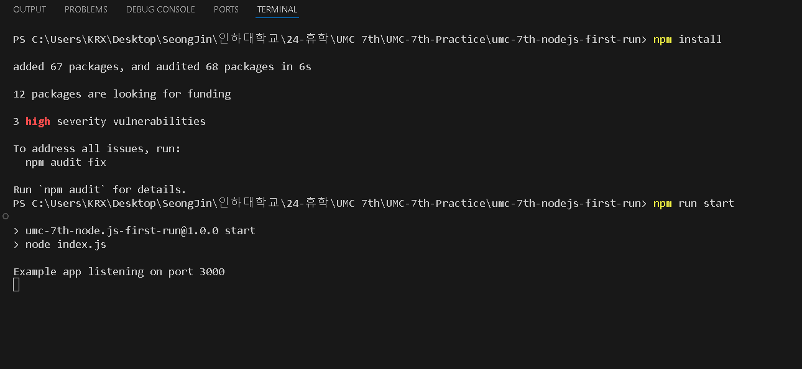
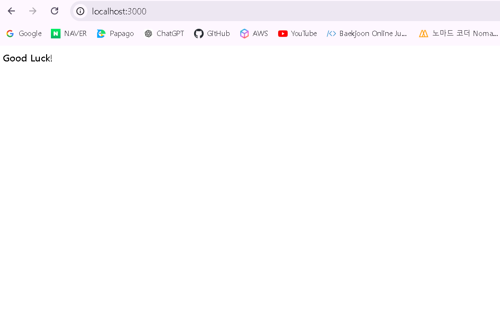

#### 🎯핵심 키워드
***
1. IP
	- Internet Protocol
	- Network Layer에서 작용한다.
	- **컴퓨터가 네트워크 상에서 통신하기 위해 수많은 데이터에서 유일하게 식별 가능한 수단**
	- 쉽게 말해 인터넷 상의 주소
	- router는 패킷 안에 있는 IP를 보고 패킷을 알맞은 위치의 router로 보낸다. 
2. port
	- **같은 IP 내에서 프로세스를 구분하는 데 사용하는 번호**
	- 데이터를 보낼 프로세스를 식별할 수 있는 값
	- 대표적인 예시: http - 80, https - 443
	- (IP 주소):(port 번호) 이런 식의 주소로 데이터를 보낸다. 
		- IP주소는 우리가 보기 쉬운 문자 등으로 이루어진 도메인 주소로 바뀌어서 보내진다. 
3. CIDR
	- Classless Inter-Domain Routing
	- **클래스 없는 도메인 간 라우팅 기법**
	- IP를 나누고 합치는 기법으로, 서브네팅, 슈퍼네팅 모두 CIDR에 속한다. 
	- CIDR 표기법: A.B.C.D/N
		- 네트워크 정보를 여러 개로 나누어진 Sub-Net work들을 모두 나타낼 수 있는 하나의 Network로 통합해서 보여주는 방법
		- 네트워크 범위를 추측, 측정할 수 있다. 
	- CIDR 계산법 
		ex. 50개의 IP가 사용되는데 IP 주소가 192.168.10.7이다. IP를 다른 번호로 할당 받고 싶은 경우 IP 할당 범위는?
		- 192 -> C 클래스
		- 서브넷 마스크: 255.255.255.0 -> IP의 범위: 192.168.10.0 ~ 192.168.10.255 (256개)
		- 50개의 IP가 -> 적절히 분배 가능한 범위: 64 = 2^6 (호스트 ID가 6개의 비트를 사용한다.)
		- 256 / 64 = 4 -> 4개의 네트워크
		- 64 <= 70 <= 127 이므로 네트워크 2에 속한다. 
		- 즉, IP의 범위는 192.168.10.70/26
4. TCP vs UDP
	- TCP
		- Transmission Control Protocol
		- **3 way-handshake가 완성이 되며 서로 받을 수 있는 상태라는 것이 보증된다.** 
			- 3 way-handshake: 클라이언트는 서버에게 syn을 보낸다. -> 그것을 받은 서버는 ack와 syn를 보낸다. -> 클라이언트가 syn을 받고 서버에 ack를 보낸다. (ack, syn: 서로 받을 수 있는 상태인지 묻고 답하는 것)
		- **받는 입장에서 패킷이 정상적으로 도착했으면 ack 패킷을 보냄으로써 받았음을 알려준다.**
			- TCP 연결을 설정할 때 3-way handshake에서 마지막에 클라이언트가 ACK를 보내지만, 데이터 전송 중에도 패킷이 정상적으로 도착했는지 확인하기 위해 서버가 클라이언트에게 ACK를 계속해서 보낸다.
		- **TCP는 패킷에 sequence number라는 순서를 붙임으로써 패킷 전송의 순서를 보장한다.** 도착한 패킷의 sequence number를 분석했는데 순서가 이상하다면 서버 측에서 ack 패킷을 보내 누락된 sequence number의 패킷을 요청한다. 
	- UDP
		- User Datagram Protocol
		- **3 way handshake, 데이터 전달 보증, 순서 보장이 없다!** 
		- 기존의 IP에 port와 체크섬(데이터가 맞는 지만 확인)만 추가한 프로토콜
5. Web Server vs WAS
	- Web Server
		- 정적 리소스(ex. HTML, CSS, 이미지 등)를 처리한다.
	- WAS
		- 동적 리소스(DB 조회나 다양한 로직 처리)를 처리한다. 
		- Web Server에 비해 더 비싸고 에러가 많이 난다. 

#### 📦 Node.js 실습
***

