### 🎯핵심 키워드
---
- AWS
    - Amazon Web Service    
    - 아마존이 제공하는 종합적인 클라우드 컴퓨팅 플랫폼    
    - 인프라 기술(컴퓨팅, 스토리지, 데이터베이스 등)부터 새로운 기술(기계학습 및 인공지능, 사물 인터넷 등)까지 많은 서비스와 서비스 내 기능을 제공한다.     
    - 기업 및 개발자가 애플리케이션을 보다 빠르고 효율적으로 개발하고 배포할 수 있도록 한다.    
	    - 인프라 구축 비용을 절감하고 유연성을 높일 수 있다.     
    - 기존 애플리케이션을 클라우드로 이동하고 상상할 수 있는 거의 모든 것들을 구축할 수 있다.    
- 리전과 가용영역
    - 리전
        - AWS에서 수많은 컴퓨팅 서비스를 하려면 대규모의 서버 컴퓨터를 모아 둔 곳이 필요한데, 한 곳에 전부 다 몰아두면 발생하는 문제점들을 해결하고자 서비스 하기 위한 자원들을 여러 곳에 분산해서 배치를 해둔 것이다.
    - 가용영역
        - 리전을 한번 더 분산해서 배치한 것
        - 하나의 리전 내에서 독립적으로 운영되는 하나 이상의 데이터 센터 그룹
- 서브네팅
    - IP 주소 낭비를 방지하기 위해 원본 네트워크를 여러 개의 서브넷으로 분리하는 과정    
    - 즉, 서브넷 마스크의 bit 수를 증가시키는 것     
        - 서브넷 마스크의 bit수를 1씩 증가시키면 할당할 수 있는 네트워크가 2배수로 증가하고 호스트 수는 2배수로 감소한다.  
        - ex. 192.168.32.0/24
            - 할당 가능 네트워크 수 = 1, 할당 가능 호스트 수 = $2^8 - 2$
            - 192 ≤ 192 ≤ 223 → C 클래스
            - 24 + 1 bit 증가시켜 서브네팅하면 2(= $2^1$)개의 서브넷으로 분할된다.
                - 192.168.32.0/25 → 11111111.1111111.11111111.00000000
                - 192.168.32.128/25 → 11111111.1111111.11111111.10000000
                - 할당 가능 네트워크 수 = 2
                - 할당 가능 호수트 수 = $2^7 - 2$
            - 만약 2-bit를 증가시켜 서브네팅하면 4(= $2^2$)개의 서브넷으로 분할된다.
                - 192.168.32.0/27 → 11111111.1111111.11111111.00000000
                - 192.168.32.64/27 → 11111111.1111111.11111111.01000000
	            - 192.168.32.128/27 → 11111111.1111111.11111111.10000000
                - 192.168.32.192/27 → 11111111.1111111.11111111.11000000
- 라우팅
    - 패킷에 포함된 주소 정보를 보고 패킷을 목적지까지 체계적으로 다른 네트워크에 전달하는 경로 선택 및 스위칭을 하는 과정
    - 여러 네트워크들의 연결을 담당하는 라우터 장비가 패킷이 특정 방향으로 가는 빠르고 정확한 길을 찾아 전달해준다.
    - (1) 라우터는 전달 받은 패킷에서 가장 먼저 목적지가 어디인지 IP 주소를 확인한다. → (2) 가장 빠른 경로가 어디인지 확인하고 그 경로로 가기 위해 자신의 어느 인터페이스로 패킷을 내보내야 하는 지 결정한다. → (3) 결정한 인터페이스로 전달된 패킷은 또 다른 라우터로 전달되어 (1), (2)의 과정을 목적지 네트워크에 도착할 때까지 반복한다.
    - 패킷의 목적지 주소를 라우팅 테이블과 비교하여 어느 라우터에게 넘겨줄 지 판단한다.
        - 라우팅 테이블
            - 라우팅 프로토콜의 가장 중요한 목적
            - 목적지까지 갈 수 있는 모든 경로들 중 가장 효율적이라고 판단되는 경로 정보를 모아둔 공간
            - 패킷의 목적지와 목적지를 가려면 어느 인터페이스로 가야 하는 지에 대한 정보를 가지고 있다.
- VPC
    - Virtual Private Cloud    
    - AWS에서 제공하는 논리적으로 격리된 네트워크 환경    
    - VPC는 기본적으로 가상의 네트워크 영역이기에 사설 아이피 주소를 가진다.    
        - 10.0.0.0/8, 172.16.0.0/12, 192.168.0.0/24        
            → 이 3개의 대역을 가지며, 하나의 VPC에는 이 네트워크 대역, 혹은 서브넷 대역이 할당 가능하다.
    - VPC 내에서 여러 서브넷을 생성하여 퍼블릭 또는 프라이빗으로 설정할 수 있다.
    - 패킷이 이동할 경로를 설정하거나 인터넷 게이트웨이를 통해 퍼블릭 인터넷에 연결할 수 있습니다.
- 사설 IP주소
    - 어떤 네트워크 안에서만 내부적으로 사용되는 고유한 주소
    - 공유기에 연결되어 있는 가정이나 회사의 각 네트워크 기기에 할당된다.
    - 하나의 네트워크 안에서 유일하며 네트워크 내부에서만 접근이 가능하다.
    - 같은 대역의 IP를 할당 받은 모든 기기에 접속이 가능하다. 같은 대역의 사설 IP에 붙어있지 않은 경우(같은 와이파이에 붙어있지 않은 경우) 접속이 불가능하다.
- 포트포워딩
    - 하나의 공용 아이피 주소를 가진 공유기가 자신의 포트를 통해 올바른 사설 아이피 주소를 가진 디바이스에게 데이터를 주는 것
    - 외부에서 특정 포트로 들어오는 트래픽을 내부의 특정 장치로 전달해 외부에서 내부 서비스에 접근할 수 있게 한다(NAT의 확장).
    - NAT는 포트포워딩을 통해 필요한 서비스에 대한 접근을 허용함으로써 유연한 네트워크를 구성한다.
    - ex. 원격 데스크톱 연결
        - 내부 PC의 IP: 192.168.1.100 / 원격 데스크톱 포트: 3389  
        - 라우터의 공인 IP의 포트 3389로 들어오는 트래픽을 192.168.1.100의 포트 3389로 전달          
            → 외부에서 공인 IP 주소와 포트 3389로 접속하면 NAT 라우터가 해당 트래픽을 내부 PC로 전달해 원격 접속이 가능해진다.        
- NAT 프로토콜
    - Network Adress Translation
    - 사설 IP와 공인 IP 간의 주소 변환을 통해 내부 네트워크의 장치들이 인터넷에 접속할 수 있게 한다.
    - 사설 네트워크 내부에서 사설 IP 주소를 사용하고 외부 인터넷과의 통신을 위해선 하나의 공인 IP 주소를 통해 트래픽을 주고 받는다.
    - ex. WIFI 공유기
        - WIFI 공유기는 내부 네트워크의 장치들에게 사설 IP 주소를 할당하고 외부 인터넷과의 통신 시 NAT 기능을 통해 공인 IP 주소로 변환한다.
        - 공유기의 물리적 포트는 장치들을 네트워크에 연결해주고 각 포트에 연결된 장치들에게 IP 주소를 부여한다.
- _포트번호_
    - 0주차 워크북 참고

### 📦 실습
---
#### 실습 1 - VPC를 이용한 EC2 구축

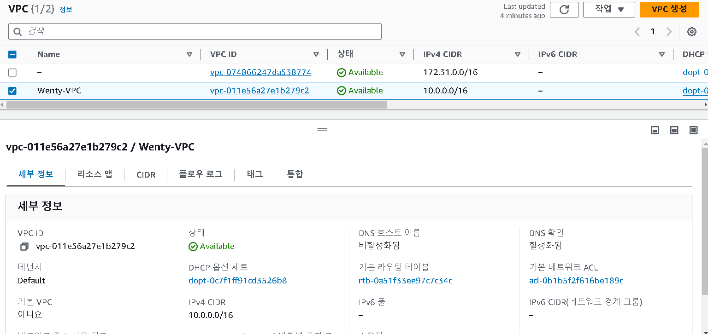
- “Wenty-VPC” VPC 생성
	- 사설 IP 대역 - 10.0.0.0/16

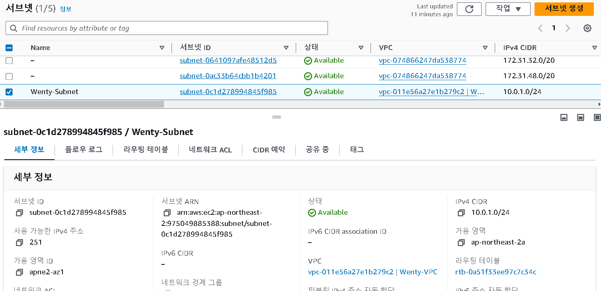
- Wenty-VPC 내에 “Wenty-Subnet” 서브넷 생성
	- IP 대역: 10.0.1.0/24

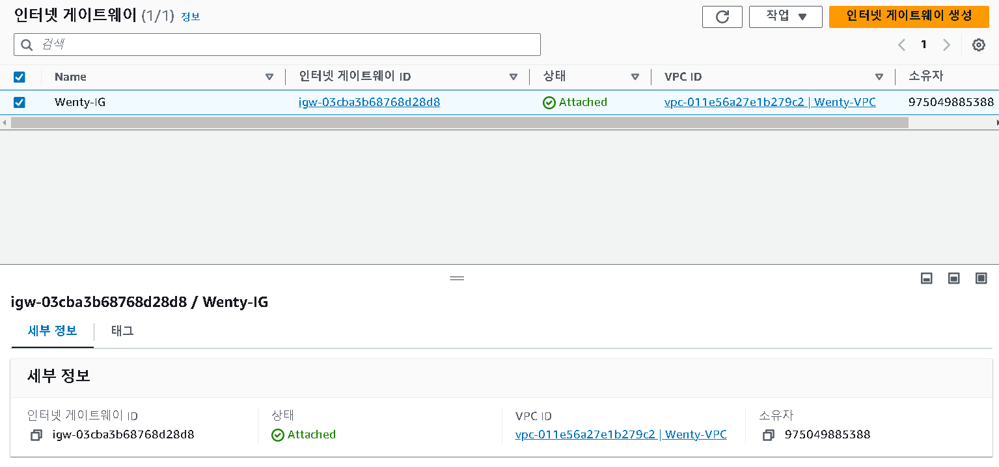
- “Wenty-IG” 인터넷 게이트웨이 생성 및 Wenty-VPC 연결

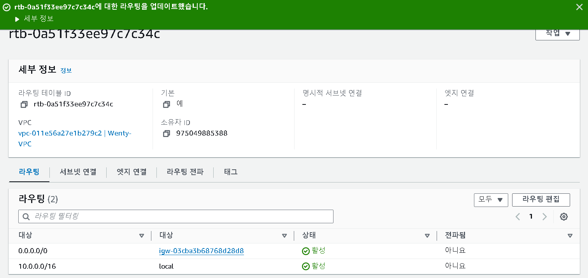
- Wenty-VPC 라우팅 테이블 편집

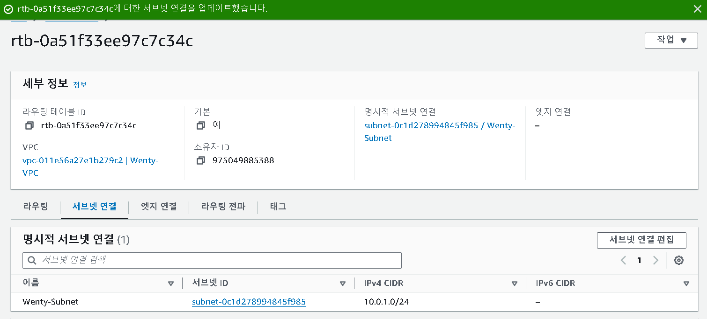
- Wenty-IG를 거쳐 외부와 통신하도록 설정된 라우팅을 Wenty-Subnet에 연결한다.
	- Wenty-Subnet은 퍼블릭 서브넷이 된다.

#### 실습 2 - 보안 그룹 생성하기

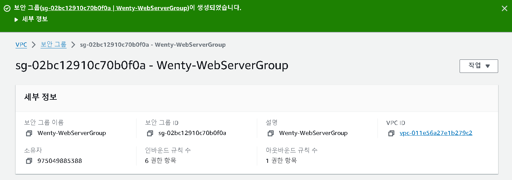
- 보안 그룹 "Wenty-WebServerGroup" 생성

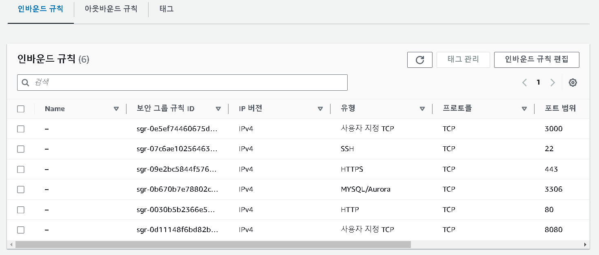
- Wenty-WebServerGroup 인바운드 규칙 설정
	- 인바운드 규칙: 클라이언트가 자신의 서버 데이터에 들어올 수 있는 규칙
	1. 사용자 지정 TCP(port: 3000) - Node.js 서버에서 사용된다. 
	2. SSH(port: 22) - 원격 서버에 접속할 때 사용된다. 
	3. HTTPS(port: 443) - 웹 브라우저와 서버 간에 암호화된 통신을 할 때 사용된다. 
	4. MySQL/Aurora(port: 3306) - MySQL 데이터베이스에서 사용된다. 
	5. HTTP(port: 80) - 비암호화된 웹 트래픽을 처리한다. 
	6. 사용자 지정 TCP(port: 8080) - 테스트 및 개발 서버에 사용된다. 

#### 실습 3 - EC2 생성하기

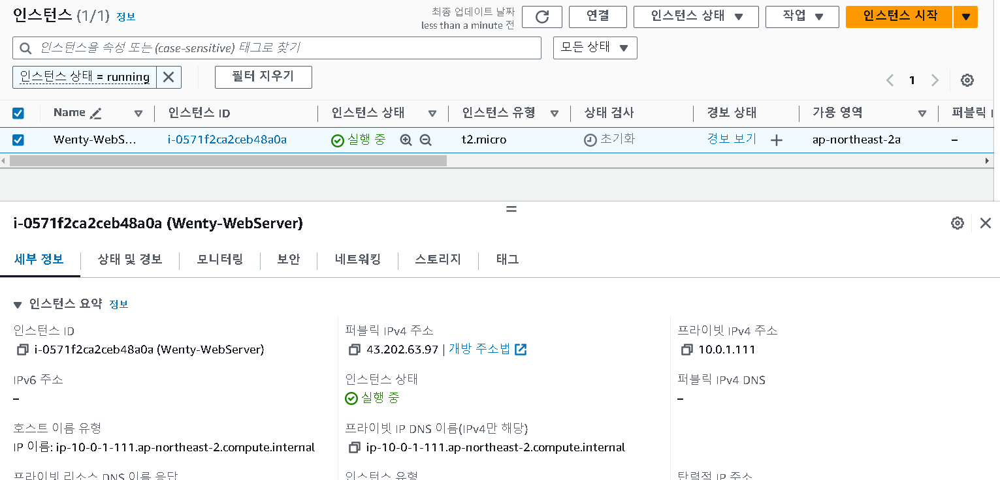
- "Wenty-WebServer" 인스턴스 생성
	- VPC - Wenty-VPC 설정
	- 서브넷 - Wenty-Subnet 설정
	- 퍼블릭 IP 자동 할당 활성화
	- "Wenty-KeyPair" 키 페어 생성
	- 보안 그룸 - Wenty-WebServerGroup 설정

#### 실습 4 - 탄력적 IP 설정하기

과금 때문에 PASS 🥲
탄력적 IP를 설정하면 인스턴스의 인터넷 게이트웨이를 거쳐 통신 시 부여 받을 IP 주소를 고정시키기 때문에 EC2 인스턴스를 중지 후 재실행해도 IP 주소가 바뀌지 않는다.
하지만 지금은 탄력적 IP를 설정하지 않아 인스턴스를 중지 후 재실행하면 IP 주소가 바뀔 것이다. 

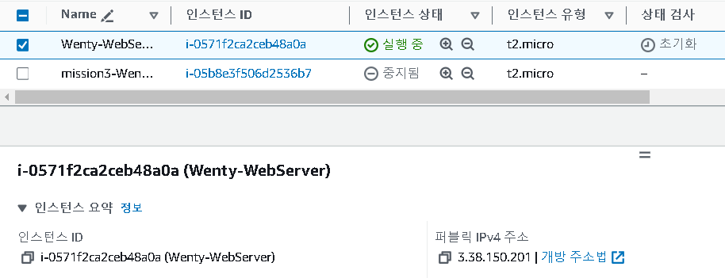
 ↑ 중지 후 재실행 ↓
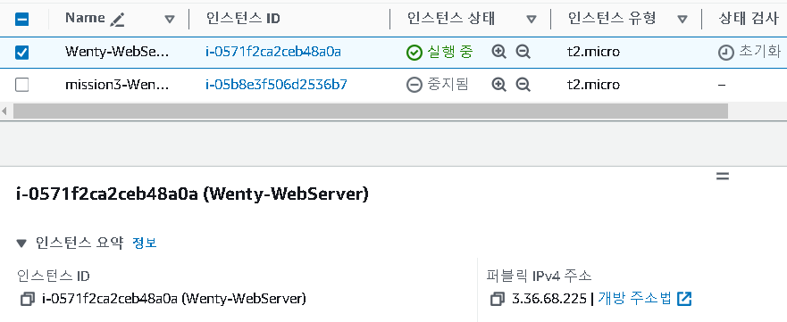
- 퍼블릭 IP 주소가 바뀌어져 있다. 

#### 실습 4-2 - 원격 접속 - VSCode (Node.js)

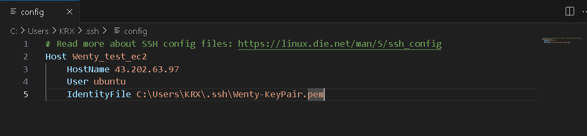
- config 파일에 호스트 별명, 호스트 이름(EC2 퍼블릭 IP 주소), 접속할 사용자 이름(ubuntu), EC2 접속 시 필요한 .pem 키의 위치(키 페어 생성 시 download 폴더에 저장된다)를 작성한다. 

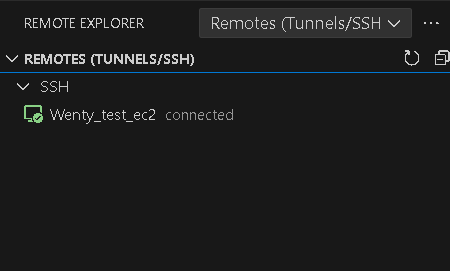
- connected -> "Wenty-test-ec2" EC2 원격 접속 완료!

#### 실습 5(fin) NGINX 설치하고 브라우저에서 접속하기
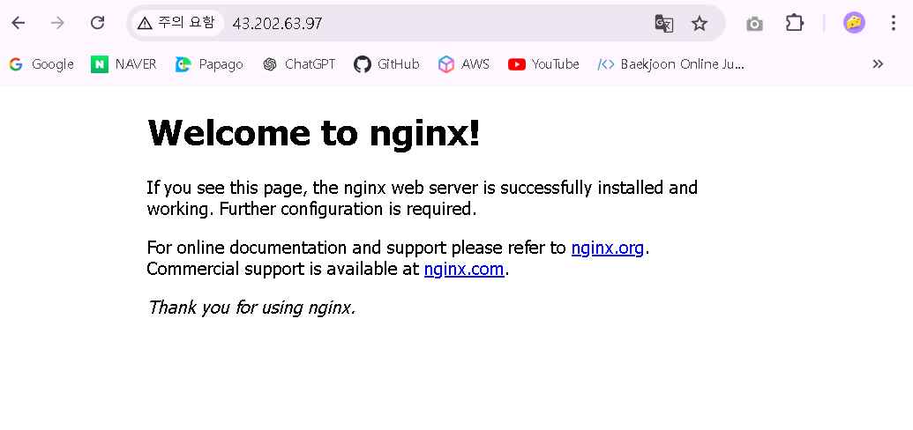
- 브라우저에 EC2 퍼블릭 IP 주소로 접속 시 해당 화면이 뜬다 🤩