### 🎯핵심 키워드
---
- Web Server
    - 정적 리소스를 처리하는 서버
    - 사용자(클라이언트)가 브라우저 주소창에 url을 입력하여 어떤 페이지를 요청하면 http 요청을 받아들여 HTML 문서와 같은 정적인 콘텐츠를 사용자에게 전달해준다.
    - 저장된 웹 리소스들을 클라이언트로 전달하고 클라이언트로부터 콘텐츠를 전달 받아 저장하거나 처리한다.
    - 사용자로부터 동적인 요청이 들어왔을 때 해당 요청을 Web Server 자체적으로 처리하기 어렵기 때문에 WAS에게 요청한다.
    - WAS는 Web Server에 비해 비싸고 에러가 많이 나기 때문에 많은 정적 리소스 사용 시 Web Server만 늘려서 절약할 수 있다.
    - Web Server에서 보안 처리를 할 수 있는 등 많은 장점이 있어 주로 Web Server를 WAS 앞단에서 사용한다.
    - ex. Nginx, Apache, IIS(windows 전용) 등
- Web Application Server
    - 동적 리소스를 처리하는 서버
    - Web Server가 할 수 있는 기능 대부분이 WAS에서도 처리가 가능하며 비지니스 로직을 처리할 수 있어 사용자에게 동적인 컨텐츠를 전달할 수 있다.
        - 비지니스 로직: 애플리케이션이 실세계의 요구사항에 따라 데이터를 처리하고 작업을 수행하는 규칙과 흐름. 어떤 비즈니스 문제를 해결할 수 있도록 코드를 작성한다.
    - ex. Tomcat, JBoss, Jeus, Web Sphere
- Reverse Proxy
    - 클라이언트와 서버 간의 통신을 중계하고 보안, 성능 개선 등의 목적을 위해 중간에 위치하는 서버
    - 프록시 서버 자체는 대리자로써 클라이언트의 요청을 받고 본 서버로 보내준다.
    - 요청을 받는 것 뿐만 아니라 서버 프로세스가 내부적으로 connect() 시스템 콜과 같은 요청을 보내는 시스템 콜을 통해 다른 서버 프로세스에게 다시 요청을 보낼 수 있다.
    - 또 다른 외부 서버로 요청을 보내주는 포워드 프록시와는 달리, 리버스 프록시는 내부의 다른 서버로 요청을 보내준다.
    - Web Server에서 WAS로 넘어갈 때 Web Server가 직접 WAS와 상호작용하지 않고 리버스 프록시가 중간에서 요청을 처리하고 분배해준다.
        - ex. 사용자가 https://example.com/product에 접속해 상품 목록을 요청할 경우
            1. Nginx이 이 요청을 받아 리버스 프록시 역할을 수행해 Tomcat에 전달한다.
            2. Tomcat은 데이터베이스와 상호작용하며 상품 목록을 가져오고 이를 JSON 형식으로 반환 후 Nginx에 전달한다.

### 📦 실습
---
#### Web Server 정적 콘텐츠 호스팅

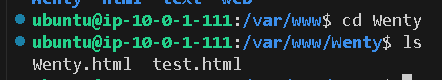
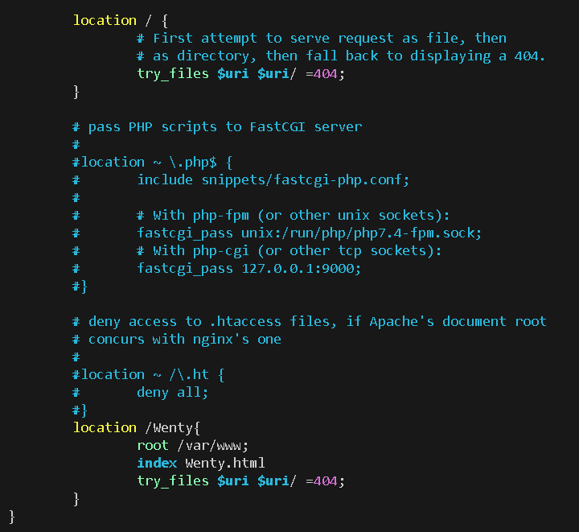
- location /Wenty { ... } -> /Wenty로 요청이 올 경우의 처리
- root /var/www; -> 시작 디렉토리를 /var/www 로 설정한다. 
- index Wenty.html -> 기본 요청이 올 경우 Wenty.html 파일을 준다.
- ==**즉, /Wenty로 요청이 오면 /var/www/Wenty에서 Wenty.html 파일을 찾아 응답을 준다.** ==
- try_files $uri $uri/ =404; -> 요청한 파일 또는 디렉토리가 없으면 502 에러를 반환한다. 
	- try_files: Nginx 설정에서 요청된 파일이나 디렉터리가 있는지 확인
	- $uri: 요청한 파일의 경로 확인
	- $uri/: 해당 경로가 디렉토리인지 확인
	- ='404': 위의 두 경우에 모두 해당하지 않으면 502 에러 반환

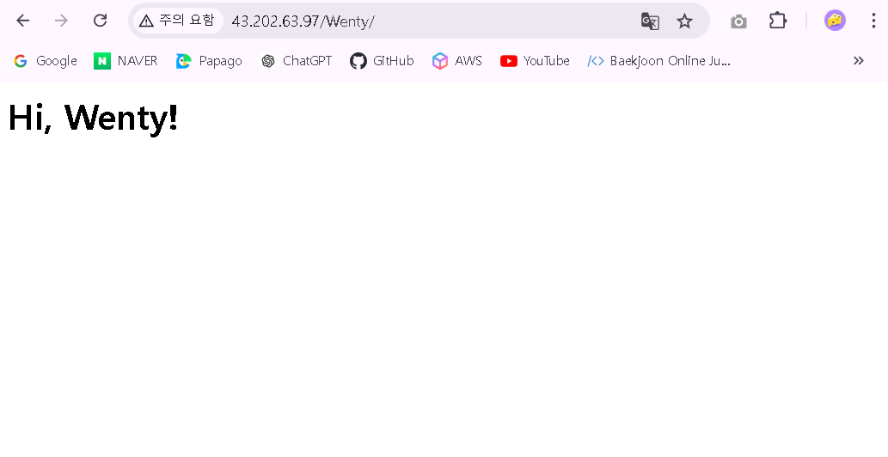
- [EC2 퍼블릭 IP 주소]/Wenty 접속 시 해당 화면이 뜬다. 

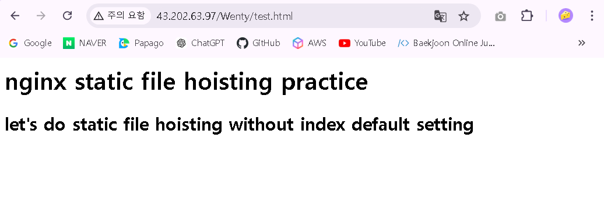
- /var/www/Wenty에서 test.html 생성 후 [EC2 퍼블릭 IP 주소]/Wenty/test.html을 접속하면 해당 화면이 뜬다. 

#### location block으로 여러 경우 다르게 호스팅 해보기

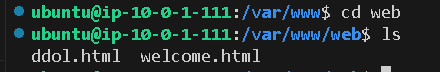
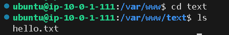
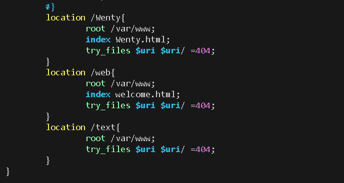
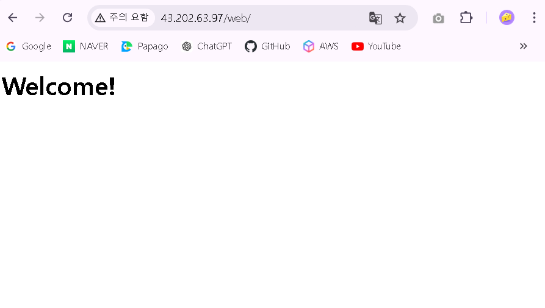
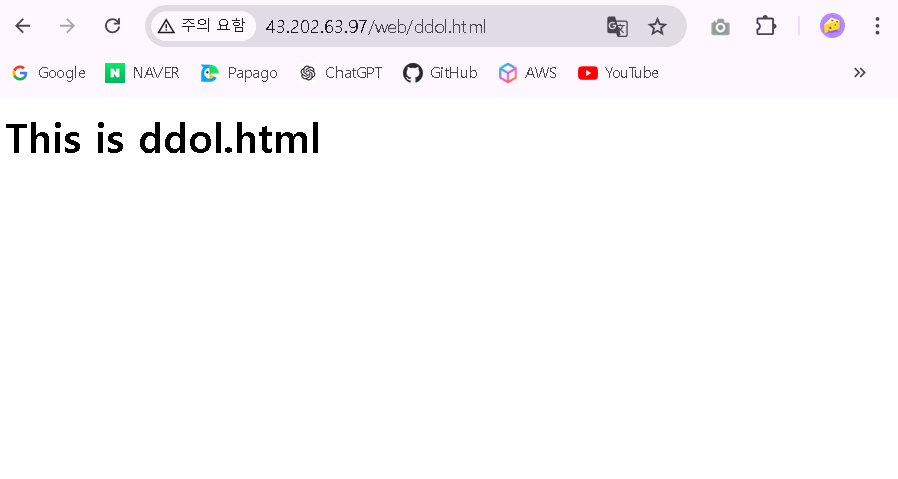
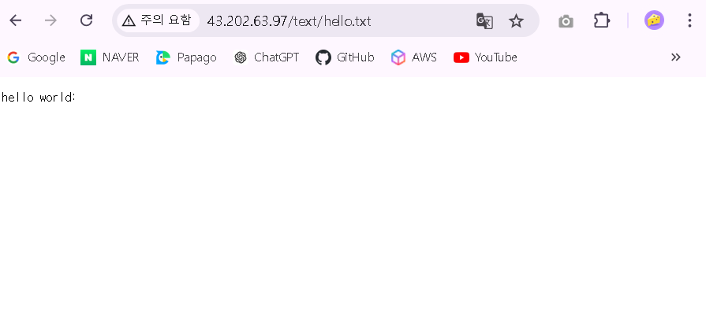

#### (fin) NGINX에서 리버스 프록시 설정하기

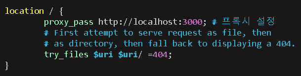
- proxy_pass http://localhost:3000; -> /로 들어오는 모든 요청을 Nginx가 http://localhost:3000로 프록시한다.
- 즉, 클라이언트가 Nginx 서버에 요청을 보내면 Nginx는 그 요청을 내부적으로 http://localhost:3000에 있는 다른 서버로 전달하고 그 서버의 응답을 다시 클라이언트에게 전달하는 "리버스 프록시"가 발생한다. 

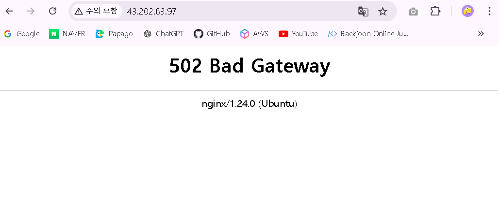
- 그러나 3000번 포트의 프로세스가 없어 502 에러가 발생한다. 