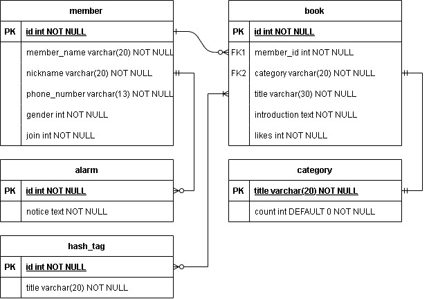
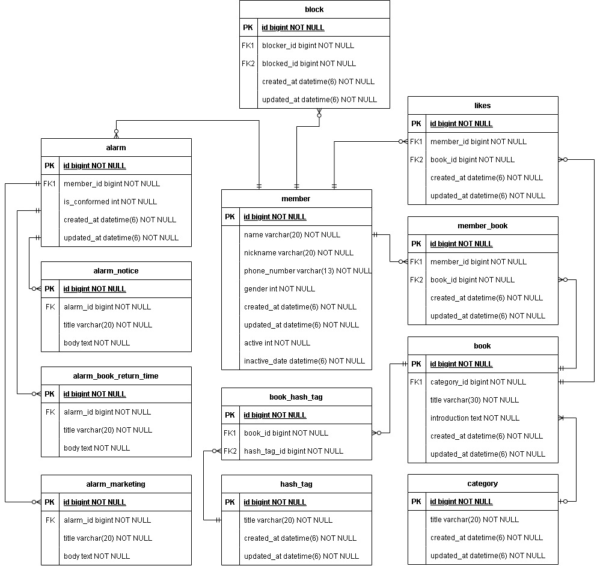
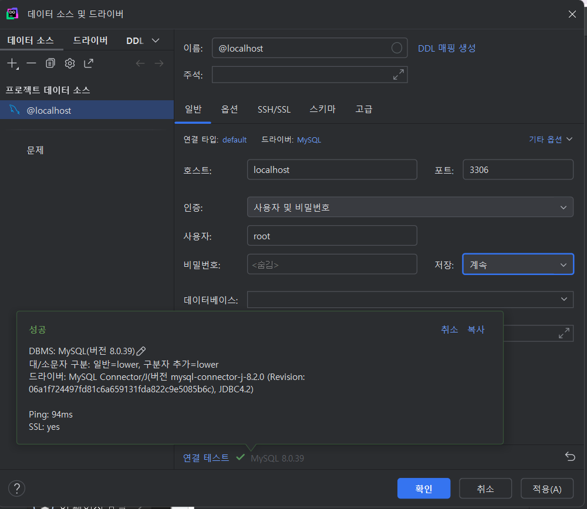
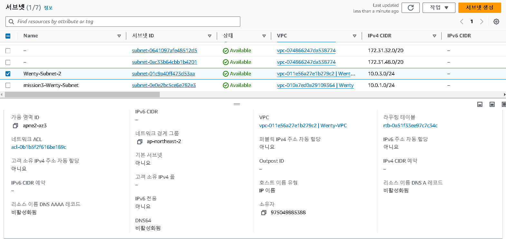
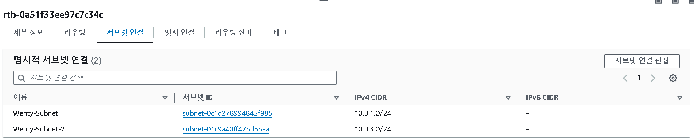
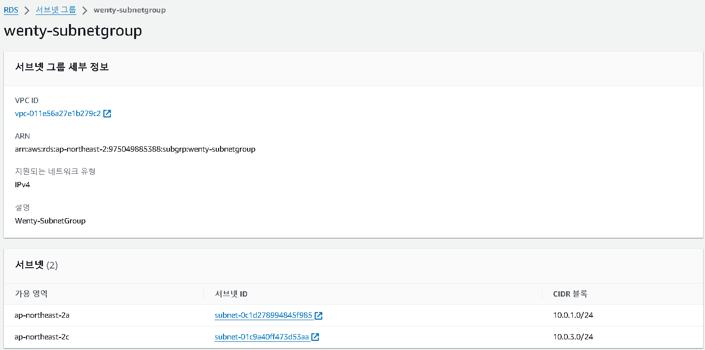
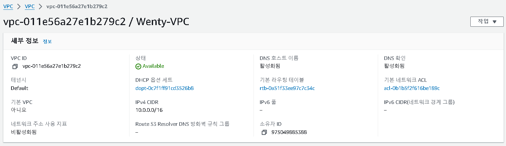
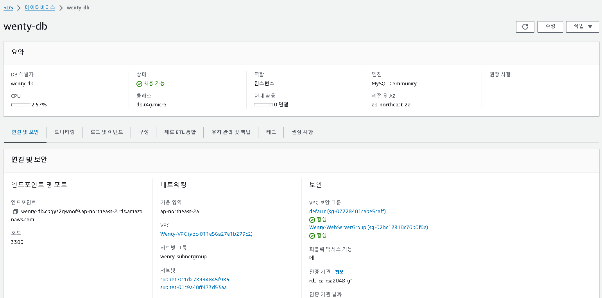
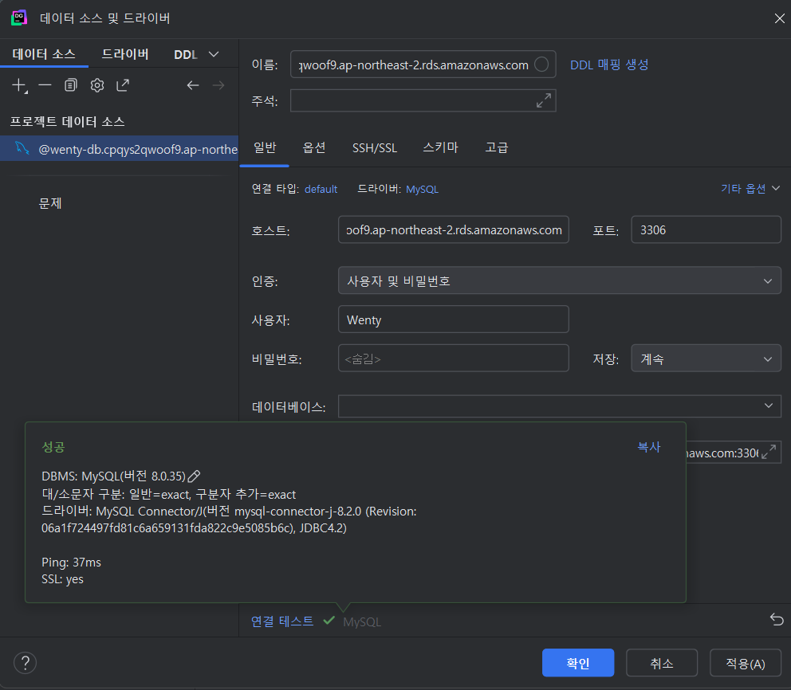

### 🎯핵심 키워드
***
- **외래키(foreign key)**
    - 한 테이블의 열이 다른 테이블의 기본키나 고유키(Unique Key)를 참조하는 데 사용되는 제약 조건
    - 한 속성 집합을 릴레이션 스키마로부터 다른 릴레이션 스키마를 참조한다.
    - **foreign key constraint(외래 키 제약 조건)**
        - 부모 테이블(참조하는 테이블)의 값이 자식 테이블(참조되는 테이블)에만 존재할 수 있다. (두 테이블 간의 데이터 일관성 보장)
        - 부모 테이블에서 유효하지 않은 값을 자식 테이블에 삽입하거나 참조할 수 없다.
- **기본키(primary key)**
    - 각 테이블의 행을 고유하게 식별할 수 는 이상의 속성들의 집합
    - 테이블의 각 행을 구별할 수 있는 유일한 값을 가지며 그 값은 절대로 중복도거나 NULL 값을 가질 수 없다.
    - 기본키는 한 번 설정되면 거의 변경되지 않는다.
    - 릴레이션 안에서 튜플을 구별하기 위해 후보 키 중 하나가 기본키로 선택된다.
        - 후보키(Candidate Key): 슈퍼키 중 불필요한 것을 제외하여 최소로 줄인 키
            - 슈퍼키(Super key): 테이블의 행을 고유하게 식별할 수 있는 하나 이상의 속성들의 집합. 기본키와 달리 추가적인 불필요한 속성을 포함할 수 있다.
    - **primary key constraint(주 키 제약 조건)**
        - 모든 속성은 NULL 값을 가질 수 없다.
        - 모든 튜플은 고유한 값을 포함해야 한다. (중복된 값을 가지면 안된다)
- **ER 다이어그램 (Entity-Relation Diagram)**
    - 개체 관계 다이어그램
    - 데이터베이스 설계에서 사용되는 중요한 도구로, 데이터베이스에 저장될 데이터의 구조를 시간적으로 표현한 것
    - 프로젝트 시작과 동시에 설계하는 것이 좋다.
- **복합 키**
    - 2개 이상의 속성을 결합하여 하나의 고유한 식별자로 사용하는 키
    - 기본키로 설정될 수 있다.
- **연관관계**
    - 2개 이상의 엔티티 사이의 관계 정의
    - 연관관계의 종류
        - 1:1(One-to-One): 한 엔티티가 다른 엔티티와 서로 하나의 고유한 관계를 맺는 경우
        - 1:N(One-to-Many): 한 엔티티가 다른 엔티티와 여러 개의 관계를 맺을 수 있는 경우
        - N:N(Many-to-Many): 두 엔티티가 서로 여러 개의 관계를 맺을 수 있는 경우
    - 표기법
        - ｜: 1개 / ∈: 2개 이상 (다수) / ○: 0개
- **정규화**
    - 데이터의 중복을 최소화하고 일관성을 유지하기 위해 테이블을 구조적으로 분리하고 각 테이블 간의 관계를 설정하는 과정
    - 데이터의 무결성과 일관성을 유지하고 중복 데이터로 인한 저장 공간 낭비와 이상 현상을 방지한다.
    - 각각의 단계를 정규형이라고 한다.
        1. 제 1 정규형 (1NF)
            - 테이블의 모든 속성이 더 이상 분리할 수 없는 원자값을 가져야 하며 하나의 셀에는 하나의 값만 있어야 한다.
            - 중복 데이터가 없어야 한다.
        2. 제 2 정규형 (2NF)
            - 1NF를 만족하면서 부분 함수 종속을 제거한다. 즉, 기본키의 일부가 아닌 속성은 기본키 전체에 종속되어야 한다.
            - 기본키의 일부에만 종속된 속성은 다른 테이블로 분리한다.
        3. 제 3 정규형 (3NF)
            - 제2정규형을 만족하면서 이행적 함수 종속(A → B → C)을 제거하는 것이다. 즉, 기본키에 의해 결정되지 않는 다른 속성에 종속된 속성이 없어야 한다.
        4. Boyce-Codd 정규형 (**BCNF)**
            - 3NF를 만족하면서 모든 결정자가 후보키여야 한다. 즉, 후보키가 아닌 속성이 결정자가 되어선 안 됩니다.
- **반 정규화**
    - 데이터의 조회 성능을 향상시키기 위해 데이터의 중복을 허용하거나 데이터를 그룹핑하는 과정
    - 정규화는 지나치게 분리된 테이블 간의 조인(Join)이 많아질 경우 쿼리 성능이 저하될 수 있다. → 이러한 성능 문제를 해결하기 위해 정규화된 구조를 완화하는 전략이다.
    - 정규화를 시도한 후에 성능 상의 이슈가 발생할 때 데이터베이스의 성능을 향상시키기 위해 사용된다.
    - 반정규화 방법에는 테이블 병합/추가/분할이 있다.

### 📦 실습
---
#### 도서 대여 관리 app 데이터베이스 설계

**워크북 공부하기 전의 DB 설계** (*~~엉망이다~~*)

- 놓친 점
	- N:M(다대다) 관계를 설계할 때는 직접적으로 두 테이블을 연결하지 않고, 중간 테이블(매핑 테이블)을 사용하여 1:N 관계로 분리해야 한다. 
	- 사용자와 책은 N:M 관계이다. 
		- 나는 이를 시간 개념은 무시하고 한 권의 책을 여러 사용자가 대여한 것으로 이해했다. 한 권의 책에 대한 대여 내역을 기록하듯이 말이다. 
	- 사용자와 책은 likes 라는 관계(사용자가 책에 좋아요를 누를 수도 있는 관계)가 존재한다.
	- 공지사항에 대한 알림 처리와 마케팅에 대한 알림 처리가 각각 다를 수 있다.
		- 알림에 대한 성질은 동일하니 슈퍼타입-서브타입을 이용하여 공통된 속성을 상속 받는다. 
    - 추가적으로, "사용자 간 차단 기능이 생기게 되어 차단 한 사용자가 누른 좋아요는 집계를 하지 않는다."라는 요구사항을 반영해 block 테이블을 생성하고 member 테이블과 1:N 관계로 연결해주었다.

**워크북 공부한 후의 최종 DB 설계**


**MySQL 테이블 생성**
```
CREATE TABLE member (
    id INT NOT NULL AUTO_INCREMENT,
    member_name VARCHAR(20) NOT NULL,
    nickname VARCHAR(20) NOT NULL,
    phone_number varchar(13) NOT NULL,
    gender int NOT NULL,
    created_at datetime(6) NOT NULL,
    updated_at datetime(6) NOT NULL,
    active int NOT NULL,
    inactive_date datetime(6) NOT NULL,
    PRIMARY KEY (id)
) ENGINE=InnoDB DEFAULT CHARSET=utf8mb3;

CREATE TABLE category (
    id INT NOT NULL AUTO_INCREMENT,
    title varchar(20) NOT NULL,
    created_at datetime(6) NOT NULL,
    updated_at datetime(6) NOT NULL,
    PRIMARY KEY (id)
) ENGINE=InnoDB DEFAULT CHARSET=utf8mb3;

CREATE TABLE book (
    id INT NOT NULL AUTO_INCREMENT,
    category_id int NOT NULL,
    title varchar(30) NOT NULL,
    introduction text NOT NULL,
    created_at datetime(6) NOT NULL,
    updated_at datetime(6) NOT NULL,
    PRIMARY KEY (id),
    FOREIGN KEY (category_id) REFERENCES member(id) ON DELETE CASCADE
) ENGINE=InnoDB DEFAULT CHARSET=utf8mb3;

CREATE TABLE likes (
    id INT NOT NULL AUTO_INCREMENT,
    member_id int NOT NULL,
    book_id int NOT NULL,
    created_at datetime(6) NOT NULL,
    updated_at datetime(6) NOT NULL,
    PRIMARY KEY (id),
    FOREIGN KEY (member_id) REFERENCES member(id) ON DELETE CASCADE,
    FOREIGN KEY (book_id) REFERENCES book(id) ON DELETE CASCADE
) ENGINE=InnoDB DEFAULT CHARSET=utf8mb3;

CREATE TABLE member_book (
    id INT NOT NULL AUTO_INCREMENT,
    member_id int NOT NULL,
    book_id int NOT NULL,
    created_at datetime(6) NOT NULL,
    updated_at datetime(6) NOT NULL,
    PRIMARY KEY (id),
    FOREIGN KEY (member_id) REFERENCES member(id) ON DELETE CASCADE,
    FOREIGN KEY (book_id) REFERENCES book(id) ON DELETE CASCADE
) ENGINE=InnoDB DEFAULT CHARSET=utf8mb3;

CREATE TABLE alarm (
    id INT NOT NULL AUTO_INCREMENT,
    member_id int NOT NULL,
    is_conformed int NOT NULL,
    created_at datetime(6) NOT NULL,
    updated_at datetime(6) NOT NULL,
    PRIMARY KEY (id),
    FOREIGN KEY (member_id) REFERENCES member(id) ON DELETE CASCADE
) ENGINE=InnoDB DEFAULT CHARSET=utf8mb3;

CREATE TABLE alarm_notice (
    id INT NOT NULL AUTO_INCREMENT,
    alarm_id int NOT NULL,
    title varchar(20) NOT NULL,
    body TEXT NOT NULL,
    PRIMARY KEY (id),
    FOREIGN KEY (alarm_id) REFERENCES alarm(id) ON DELETE CASCADE
) ENGINE=InnoDB DEFAULT CHARSET=utf8mb3;

CREATE TABLE alarm_book_return_time (
    id INT NOT NULL AUTO_INCREMENT,
    alarm_id int NOT NULL,
    title varchar(20) NOT NULL,
    body TEXT NOT NULL,
    PRIMARY KEY (id),
    FOREIGN KEY (alarm_id) REFERENCES alarm(id) ON DELETE CASCADE
) ENGINE=InnoDB DEFAULT CHARSET=utf8mb3;

CREATE TABLE alarm_marketing (
    id INT NOT NULL AUTO_INCREMENT,
    alarm_id int NOT NULL,
    title varchar(20) NOT NULL,
    body TEXT NOT NULL,
    PRIMARY KEY (id),
    FOREIGN KEY (alarm_id) REFERENCES alarm(id) ON DELETE CASCADE
) ENGINE=InnoDB DEFAULT CHARSET=utf8mb3;

CREATE TABLE hash_tag (
    id INT NOT NULL AUTO_INCREMENT,
    title varchar(20) NOT NULL,
    created_at datetime(6) NOT NULL,
    updated_at datetime(6) NOT NULL,
    PRIMARY KEY (id)
) ENGINE=InnoDB DEFAULT CHARSET=utf8mb3;

CREATE TABLE book_hash_tag (
    id INT NOT NULL AUTO_INCREMENT,
    book_id INT NOT NULL,
    hash_tag_id int NOT NULL,
    PRIMARY KEY (id),
    FOREIGN KEY (book_id) REFERENCES book(id) ON DELETE CASCADE,
    FOREIGN KEY (hash_tag_id) REFERENCES hash_tag(id) ON DELETE CASCADE
) ENGINE=InnoDB DEFAULT CHARSET=utf8mb3;

CREATE TABLE block (
    id INT NOT NULL AUTO_INCREMENT,
    blocker_id INT NOT NULL,
    blocked_id INT NOT NULL,
    created_at datetime(6) NOT NULL,
    updated_at datetime(6) NOT NULL,
    PRIMARY KEY (id),
    FOREIGN KEY (blocker_id) REFERENCES member(id) ON DELETE CASCADE,
    FOREIGN KEY (blocked_id) REFERENCES member(id) ON DELETE CASCADE
) ENGINE=InnoDB DEFAULT CHARSET=utf8mb3;

```
- ENGINE=InnoDB DEFAULT CHARSET=utf8mb3
	- MySQL에서 테이블을 생성할 때 사용하는 옵션으로, 스토리지 엔진과 문자 인코딩 방식을 정의한다.
	- ENGINE=InnoDB: MySQL에서 가장 많이 사용되는 스토리지 엔진
	- DEFAULT CHARSET: 테이블에서 사용할 문자 인코딩 방식

#### 로컬 DB 세팅 및 접속


로컬 DB 접속
- (사용자 설정하지 않았으면 root)
- Test Connection 성공! 😀

#### 클라우드 환경(AWS)에서의 DB 접속


서브넷 추가 생성
- Wenty-VPC의 퍼블릭 서브넷에 RDS를 배치한다.
- “Wenty-Subnet-2” 서브넷을 추가 생성한다.
    - IP 대역: 10.0.3.0/24
    - RDS는 만약을 대비해 서브넷 2개를 요구하기 때문에 2개의 서브넷을 지정해주어야 한다.


라우팅 테이블에 연결
- Wenty-Subnet-2 서브넷을 퍼블릭 서브넷으로 만들기 위해 외부와 연결된 라우팅 테이블에 연결해준다.


DB 서브넷 그룹 생성
- “Wenty-SubnetGroup” 서브넷 그룹 생성
    - VPC - Wenty-VPC 설정
    - 퍼블릭 서브넷 - 2개의 퍼블릭 서브넷 Wenty-Subnet, Wenty-Subnet-2 설정


DNS 호스트 이름 활성화
- Wenty-VPC의 DNS 호스트 이름을 활성화해준다.


RDS 생성
- “Wenth-DB” 데이터베이스 생성
    - 마스터 사용자 이름 “Wenty” 설정
    - VPC - Wenty-VPC 설정
    - 서브넷 그룹 - Wenty-SubnetGroup 설정


RDS 원격 접속
- 호스트 - Wenty-DB의 앤드포인트
- 사용자 - Wenty
- Test Connection 성공! 😀