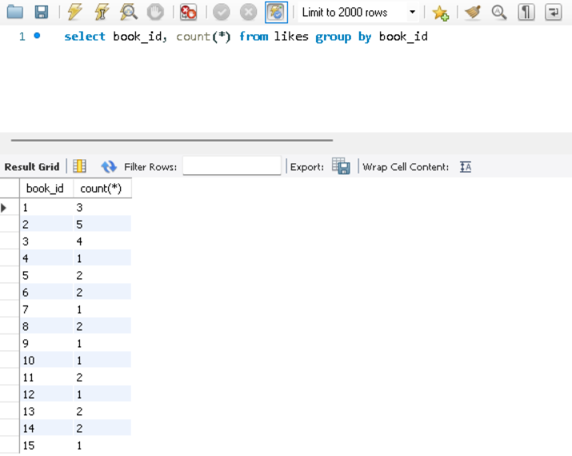
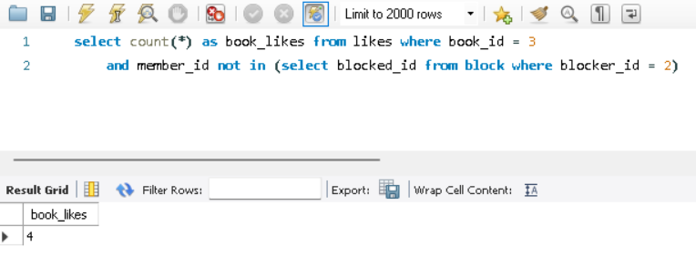
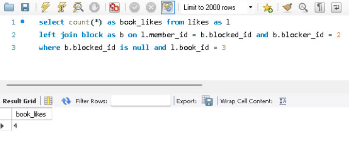
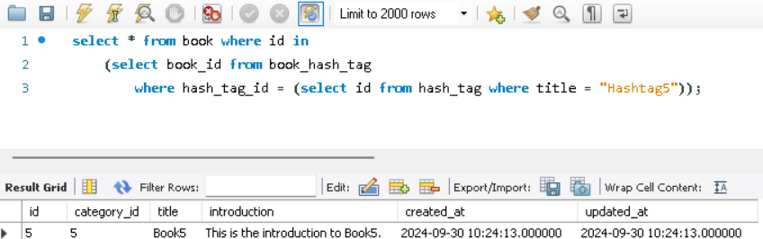
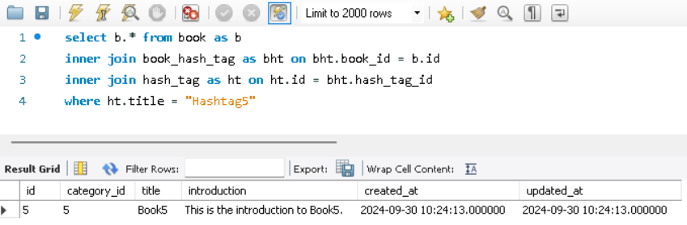
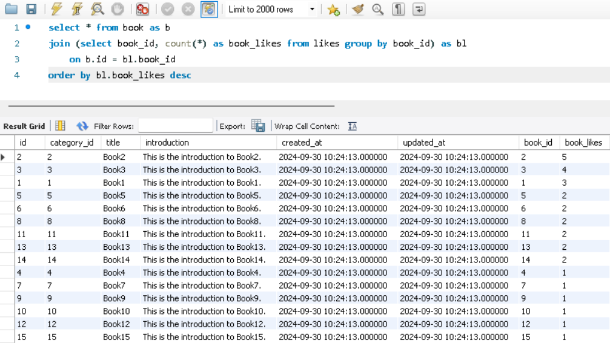
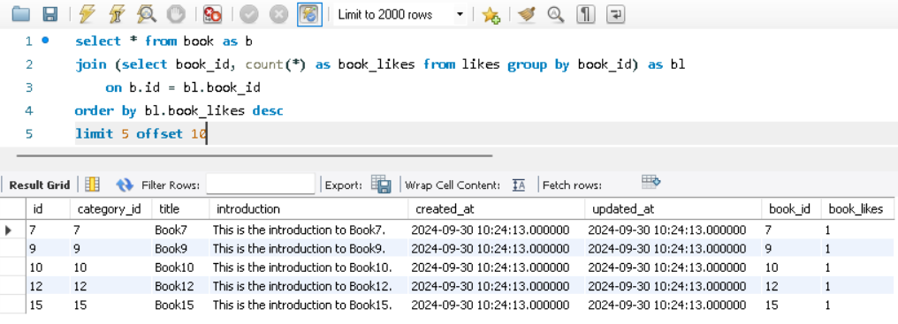
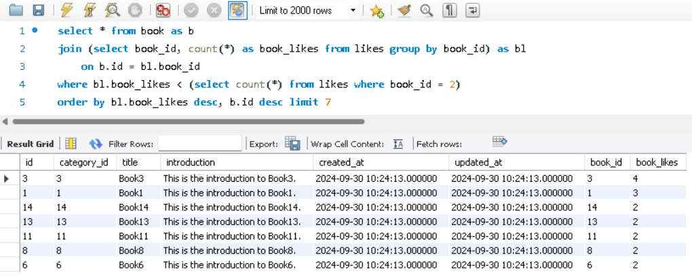
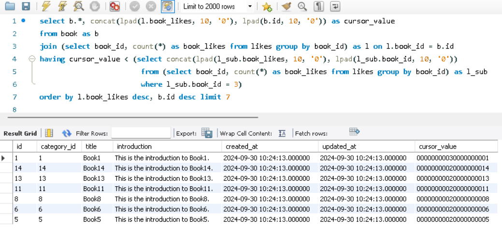
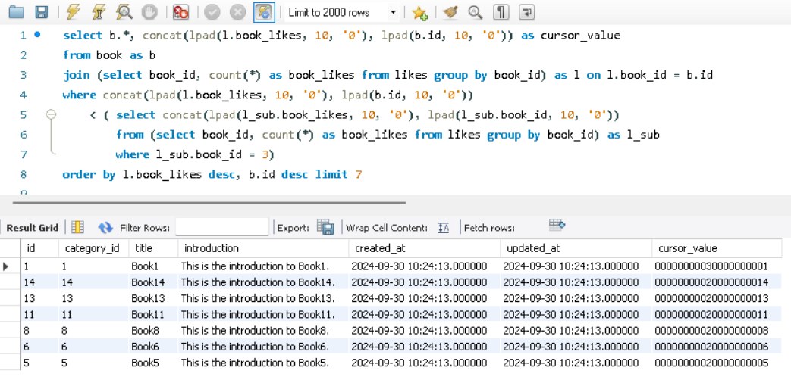

### **📦 실습**
---
(생성한 테이블에 임의의 데이터들을 삽입하여 테스트해보았다.)

**각 책의 좋아요 개수를 보여주는 쿼리**
```sql
select book_id, count(*) from likes group by book_id
```


**내가 차단한 사용자의 좋아요는 집계하지 않은, 책의 좋아요 개수를 보여주는 쿼리**
1. 서브쿼리 사용
    ```sql
    select count(*) as book_likes from likes where book_id = 3 
    	and member_id not in (select blocked_id from block where blocker_id = 2)
    ```
    
2. left join 사용
    ```sql
    select count(*) as book_likes from likes as l
    left join block as b on l.member_id = b.blocked_id and b.blocker_id = 2
    where b.blocked_id is null and l.book_id = 3 
    ```
    
- id가 2인 사용자가 id가 3인 책에 대해 자신이 차단한 사용자가 누른 좋아요를 제외한 좋아요 개수를 조회한다.

**해시태그를 통해 책을 검색하는 쿼리**
1. 서브쿼리 사용
    ```sql
    select * from book where id in 
    	(select book_id from book_hash_tag 
    		where hash_tag_id = (select id from hash_tag where title = "Hashtag5"));
    ```
    
    
2. inner join 2번 사용
    ```sql
    select b.* from book as b
    inner join book_hash_tag as bht on bht.book_id = b.id
    inner join hash_tag as ht on ht.id = bht.hash_tag_id
    where ht.title = "Hashtag5"
    ```
    
    
- Hashtag5라는 태그의 책을 조회한다.

**좋아요 개수 순(인기순)으로 책을 조회하는 쿼리**
```sql
select * from book as b
join (select book_id, count(*) as book_likes from likes group by book_id) as bl
	on b.id = bl.book_id
order by bl.book_likes desc
```


**좋아요 개수 순(인기순)으로 책을 페이징하여 조회하는 쿼리**
```sql
select * from book as b
join (select book_id, count(*) as book_likes from likes group by book_id) as bl
	on b.id = bl.book_id
order by bl.book_likes desc
limit 5 offset 10
```

- 데이터 10개를 건너뛴 4개의 데이터를 보여준다. (10 = 5 * 2 → 페이지 2번에 대해 한 페이지에 5개를 보여준다)

**좋아요 개수 순으로 나열된 책 중 마지막으로 조회한 책 다음의 책들을 조회하는 쿼리**
```sql
select * from book as b
join (select book_id, count(*) as book_likes from likes group by book_id) as bl
	on b.id = bl.book_id
where bl.book_likes < (select count(*) from likes where book_id = 2)
order by bl.book_likes desc, b.id desc limit 7
```

- 마지막으로 조회한, id가 2인 책 다음의 책(좋아요 개수가 더 적은 책)들을 7개 조회한다.

**cursor 값을 좋아요 개수와 책 id로 엮은 고유한 값으로 만들어 조회하는 쿼리**
1. having 사용
    ```sql
    select b.*, concat(lpad(l.book_likes, 10, '0'), lpad(b.id, 10, '0')) as cursor_value
    from book as b 
    join (select book_id, count(*) as book_likes from likes group by book_id) as l on l.book_id = b.id
    having cursor_value < (select concat(lpad(l_sub.book_likes, 10, '0'), lpad(l_sub.book_id, 10, '0'))
    						from (select book_id, count(*) as book_likes from likes group by book_id) as l_sub
                            where l_sub.book_id = 3)
    order by l.book_likes desc, b.id desc limit 7
    ```
    
2. where 사용
    ```sql
    select b.*, concat(lpad(l.book_likes, 10, '0'), lpad(b.id, 10, '0')) as cursor_value
    from book as b 
    join (select book_id, count(*) as book_likes from likes group by book_id) as l on l.book_id = b.id
    where concat(lpad(l.book_likes, 10, '0'), lpad(b.id, 10, '0')) 
    	< (	select concat(lpad(l_sub.book_likes, 10, '0'), lpad(l_sub.book_id, 10, '0'))
    		from (select book_id, count(*) as book_likes from likes group by book_id) as l_sub
    		where l_sub.book_id = 3)
    order by l.book_likes desc, b.id desc limit 7
    ```
    
- id가 3인 책보다 좋아요 개수가 더 적고 id 값이 더 작은 책들을 7개 조회한다.
- LPAD(문자열, 전체 길이, 채울 문자)
    - 문자열의 길이를 일정하게 맞추기 위해, 부족한 부분을 특정 문자로 채워주는 함수
    - likes.like_count 값을 문자열로 변환한 후, 길이를 10자리로 맞추고, 빈 자리는 '0'으로 채운다.
    - ex. like_count = 5일 때, LPAD(like_count, 10, '0') → '0000000005'
- CONCAT(문자열 1, 문자열 2)
    - 2개 이상의 문자열을 결합하는 함수
    - ex. like_count = 5, [b.id](http://b.id) = 12일 때
        CONCAT('0000000005', '0000000012') → '00000000050000000012'
- HAVING vs. WHERE
    - WHERE: 그룹화 이전에 각 행에 대해 조건을 적용한다.
    - HAVING: 그룹화 이후에 그룹화된 결과에 대해 조건을 적용한다.