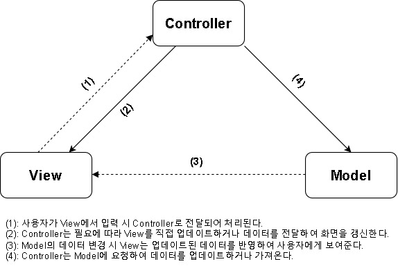

### 🎯 핵심 키워드
---
1. **ES(Elasticsearch)**
    - 분산형 검색 엔진 및 데이터 분석 엔진으로, 대용량 데이터의 빠른 검색과 실시간 분석을 위해 사용된다.
    - RESTful API을 지원하여 검색 및 데이터를 관리한다. 사용자는 HTTP 요청으로 데이터를 쉽게 조회할 수 있습니다.
    - 데이터는 JSON 형식으로 색인된다. 이로 인해 구조화된 데이터와 반구조화된 데이터를 모두 쉽게 저장하고 검색할 수 있다.
    - **색인(indexing)**
        - 검색 엔진에서 데이터를 검색이 용이하도록 구조화해 저장하는 과정
        - index: 데이터가 저장되는 기본 단위 (데이터베이스에서의 테이블과 비슷하다)
            - 하나의 인덱스에 여러 개의 문서가 여러 개 저장된다.
    - **문서(Documents)**: JSON 형식의 데이터 단위
        - ex.
            ```json
            {
              "field1": "value1",
              "field2": "value2",
              ...
            }
            ```
    - **ES에서 데이터를 문서 형태로 인덱스에 저장할 경우 (데이터 입력(색인))**
        - 기본 형식
            ```json
            POST /{index}/_doc/{id}
            {
              "field1": "value1",
              "field2": "value2",
              ...
            }
            ```
            - POST: 새로운 데이터 생성(색인)
            - {index}: 데이터를 저장할 인덱스 이름
            - _doc: 문서 타입 (ES 7.x 이상에서 _doc만 사용한다)
            - {id}: 문서의 ID (생략 가능, 생략 시 ES가 자동 생성)
                - ID는 보통 서버에서 자동으로 생성되도록 하는 것이 좋다
    - **쿼리를 통해 문서를 조회할 경우 (데이터 검색(쿼리))**
        - 기본 형식
            ```json
            POST /{index}/_search
            {
              "query": {
                "match": {
                  "{field}": "{value}"
                }
              }
            }
            ```
            - {index}: 데이터를 조회할 인덱스 이름
            - _search: 검색을 수행하는 엔드포인트
            - query: 쿼리 조건을 정의하는 필드
            - match: 특정 필드의 값과 일치하는 문서를 찾는다.
        - 모든 문서를 조회할 경우
            ```json
            POST /{index}/_search
            {
              "query": {
                "match_all": {}
              }
            }
            ```
            - match_all: 조건 없이 인덱스에 있는 모든 문서 반환
        - 복합 조건 검색
            ```json
            POST /{index}/_search
            {
              "query": {
                "bool": {
                  "must": [
                    { "match": { "{field1}": "{value1}" } },
                    { "term": { "{field2}": "{value2}" } }
                  ],
                  "filter": [
                    { "range": { "{field3}": { "gte": 30 } } }
                  ]
                }
              }
            }
            ```
            - bool: AND, OR, NOT과 같은 논리 연산을 수행하여 복잡한 조건을 처리할 수 있다.
            - must: 모든 조건이 만족해야 문서가 반환된다. (AND 조건)
            - filter: 필터링 조건 (예: 나이가 30 이상인 문서)
            - range: 숫자나 날짜와 같은 범위 조건을 지정한다.
            - term: 소문자 대소문자를 구분하고 정확히 일치하는 값만 찾는다.
            - gte: greater than or equal to (이상)
            - **must vs filter** (헷갈림)
                - must
                    - 조건이 일치해야만 검색 결과에 포함되며, _score(검색 점수)를 계산한다.
                        - _score: ES가 문서의 검색 결과 관련성 점수를 나타내는 값. 사용자가 입력한 쿼리와 문서의 내용이 얼마나 잘 일치하는지를 평가한 점수이며 이를 통해 ES는 가장 관련성 높은 문서를 상위에 표시한다.
                    - 검색 점수를 통해 가장 관련성 높은 문서가 상위에 표시된다.
                - filter
                    - 조건에 맞는 문서만 필터링한다.
                    - _score에 영향을 주지 않으며, 단순히 조건에 맞는 문서만 포함한다.
    - **데이터 검색인데 GET이 아닌 POST를 사용하는 이유**
        - ES에서는 데이터 검색 요청에도 POST를 사용하는 것이 일반적이다. POST 요청이 더 유연한 쿼리 전달 방식을 제공하기 때문이다.
        - GET 요청은 주로 쿼리 파라미터를 URL에 포함하여 데이터를 조회한다.
            ```json
            GET /{index}/_search?q=field1:value1 AND field2:value2 AND field3:>=30
            ```
            - 이 방식은 단순한 쿼리에 적합하며 복잡한 bool 쿼리를 모두 표현하기는 어렵다. 조건이 여러 개인 쿼리의 경우 URL로 표현할 수 없거나 URL의 길이 제한에 걸릴 수 있다.
        - 위의 복합 조건 검색과 같이 구조화된 쿼리는 POST 요청의 바디(Request Body)에 담아야 한다.
        - GET 요청은 바디를 허용하지 않거나 대부분의 서버 구현에서 무시되기 때문에 이런 경우에는 POST를 사용하는 것이 적합하다.
    - **ES는 일반적으로 데이터를 인덱스에 저장할 때 중첩된 경로 구조를 사용하지 않는다.**
        - RESTful API에선 적절할 수 있으나 ES에서는 적절하지 않다.
        - ex. POST /members/{member-id}/restaurants/{restaurant-id}/reviews_doc → 적절하지 않은 구조 in ES
        - ES에 맞는 구조 (ex)
            ```json
            POST /reviews/_doc
            {
              "member_id": 1,
              "restaurant_id": 1,
              "rating": 0.0,
              "content": "string",
              "status": 1
            }
            ```
            - 모든 리뷰는 단일 인덱스(reviews)에 문서로 저장되며 관련 ID들은 문서의 필드로 포함된다.
2. **ES6**
    1. **ES6의 주요 변화 및 특징**
        1. **템플릿 리터럴**
            - 백틱을 사용하며 문자열 안에 변수를 ${}로 감싸 쉽게 삽입할 수 있다.
            - 여러 줄 문자열을 자연스럽게 작성할 수 있다.
            - 싱글 쿼트(작은 따옴표, ')나 더블 쿼트(큰 따옴표, ")를 마음대로 사용할 수 있다.
            - HTML 템플릿을 동적으로 생성할 때 유용하다.
            ```javascript
            const name = 'Wenty';
            const age = 25;
            const html = `
            <div>
            	<h1>Hello, I am ${name} and ${age} years old.</h1>
            	<p>My favorite movie is "Inception"</p>
            </div>`;
            console.log(html);
            // 출력
            // <div>
            //  <h1>Hello, I am Wenty and 25 years old.</h1>
            //  <p>My favorite movie is "Inception".</p>
            // </div>
            ```
        2. **화살표 함수**
            - function 키워드를 사용하지 않으며 파라미터가 하나이면 괄호를 생략할 수 있고 함수의 본문이 한 줄이면 중괄호 {}와 return 키워드도 생략할 수 있다.  
                ```javascript
                const hello = name => `Hello, ${name}!`;
                console.log(hello('Wenty')); // 출력: Hello, Wenty!
                ``` 
            - this가 없다. 자신이 정의된 위치의 상위 스코프에 this를 상속한다.
                ```javascript
                function Student(){
                	this.age = 0; // 화살표 함수에서 this는 상위 스코프를 참조한다.
                	setInterval(() => {
                		this.age++;
                		console.log(this.age);
                	}, 1000);
                }
                const student = new Student(); // 1초마다 age가 증가하며 출력된다.
                ```
                - 화살표 함수 내부의 this는 student 생성자의 this와 동일하다.
                - 일반 함수의 경우 setInterval 내부에서 this가 전역 객체(window)를 참조했을 것이다.
                    - window 객체: 브라우저 환경에서의 전역 객체로, 모든 전역 변수와 함수는 기본적으로 window 객체의 속성으로 저장된다
            - new 연산자로 호출할 수 없다.
                - 화살표 함수는 생성자 함수로 사용할 수 없다.
                - this가 없기 때문에 객체 인스턴스를 생성하는 데 적합하지 않다.
                ```javascript
                const Student = (name) => {
                	this.name = name;
                }; // 오류 발생: 화살표 함수는 생성자 함수로 사용할 수 없다.
                const Wenty = new Student('Wenty');
                ```
            - 화살표 함수는 arguments 객체를 지원하지 않는다.
                - arguments 객체: 함수에 전달된 모든 인수에 접근할 수 있는 유사 배열
                - 대신 Rest Parameter(가변 파라미터)를 사용한다.
                    - Rest Parameter(가변 파라미터): 개수가 정해지지 않은 여러 인자를 배열 형태로 받을 때 사용한다. 세 개의 점(...)으로 함수가 호출될 때 전달된 인자들을 하나의 배열로 묶어준다.
                ```javascript
                // arguments 객체 사용 -> 에러 발생
                const showArgs = () => {
                	console.log(arguments); // 오류: 화살표 함수는 arguments를 지원하지 않는다.
                };
                showArgs(1, 2, 3);

                // Rest Parameter 사용
                const showArgs = (...args) => {
                	console.log(args); // 출력: [1, 2, 3]
                };
                showArgs(1, 2, 3);
                ```
            - super 키워드를 사용할 수 없다.
                - super: 클래스 상속에서 부모 클래스의 메서드를 호출할 때 사용한다.
                - 화살표 함수에는 this와 super가 없기 때문에 부모 클래스의 메서드를 호출할 수 없다.
        3. **객체 리터럴**
            - 객체를 생성할 때 속성명과 변수명이 동일하다면 생략할 수 있다.
            - 함수를 객체의 메소드로 사용할 때도 function 키워드 없이 간략한 메서드 정의가 가능하다.
            - 대괄호 []를 사용해 동적으로 속성명을 생성할 수 있다. (Computed Property Names)
                ```javascript
                const name = "Wenty";
                const key = "university";
                const value = "Inha"
                const student = {
                	name, // name: name 생략
                	hello(){ // function 키워드 생략
                		console.log(`Hello, my name is ${this.name}.`);
                	},
                	[key]: value // key 변수의 값이 속성명이 된다. { university: 'Inha' }
                };
                console.log(student); 
                // 출력: { name: 'Wenty', hello: [Function: hello], university: 'Inha' }
                ```
        4. **구조 분해**
            1. **배열 구조 분해**
                - 배열의 각 요소를 한 번에 여러 변수에 할당할 수 있다.  
                    ```javascript
                    const fruits = ['apple', 'banana', 'cherry']; 
                    const [first, second, third] = fruits; // fruits 배열의 요소를 차례대로 변수에 할당한다.
                    console.log(first); // 출력: apple
                    ```
                - 배열에 값이 없는 경우에는 기본값을 설정할 수 있다.
                    ```jsx
                    const colors = ['red']; 
                    const [primary, secondary = 'blue'] = colors; // 배열의 두 번째 요소가 없기 때문에 기본값 'blue'가 할당된다.
                    console.log(primary); // 출력: red
                    console.log(secondary); // 출력: blue
                    ```
            2. **객체 구조 분해**
                - 객체의 속성을 변수로 추출할 수 있다. 객체의 구조를 해체하여 변수에 쉽게 할당할 수 있게 한다.
                    ```javascript
                    const person = { name: 'Wenty', age: 25 };
                    const { name, age } = person; // 객체 person의 속성 name, age를 각각 변수로 추출한다.
                    console.log(name); // 출력: Wenty
                    console.log(age); // 출력: 25
                    ```
                - 구조 분해를 할 때 변수의 이름을 변경할 수 있다.
                    ```javascript
                    const person = { name: 'Wenty', age: 25 };
                    const { name: firstName, age } = person; // 객체의 name 속성을 firstName이라는 변수로 추출한다.
                    console.log(firstName); // 출력: Wenty
                    ```
                - 기본값 설정
                    ```javascript
                    const person = { name: 'Wenty' };
                    const { name, age = 25 } = person; // person 객체에 age 속성이 없어 기본값 25가 할당된다.
                    console.log(name); // 출력: Wenty
                    console.log(age); // 출력: 25
                    ```
            3. **중첩된 구조 분해**
                - 객체나 배열이 중첩된 경우에 구조 분해 할당을 사용할 수 있다.
                    ```javascript
                    // 중첩된 객체에서 속성 추출
                    const user = { id: 1, profile: { name: 'Wenty', age: 25 } }; 
                    const { profile: { name, age } } = user; // profile 객체의 name과 age를 한 번에 추출한다. 
                    console.log(name); // 출력: Wenty
                    
                    // 중첩된 배열의 요소 추출
                    const fruits = ['apple', ['banana', 'mango']];
                    const [primary, [secondary, tertiary]] = fruits;
                    console.log(primary); // 출력: apple
                    console.log(secondary); // 출력: banana
                    ```
            4. **함수 매개변수에서 구조 분해 사용**
                ```javascript
                function hello({ name, age }) {
                	console.log(`Hello, I'm ${name} and ${age} years old.`);
                }
                const person = { name: 'Wenty', age: 25 };
                hello(person); // 출력: Hello, I'm Wenty and 25 years old.
                ```
            5. **모듈 시스템에서의 구조 분해의 활용**
                - import와 구조 분해의 활용
                    ```javascript
                    // utils.js 파일
                    export const name = 'Wenty'; // named export: name 변수를 내보낸다.
                    export function hello (){
                    	console.log(`Hello, ${name}.`);
                    }
                    
                    // 다른 파일
                    // utils.js에서 named export된 항목 가져오기
                    import { name, hello } from './utils.js';
                    console.log(name); // 출력: Wenty
                    hello(); // 출력: Hello, Wenty.
                    ```
        5. **var(ES6 이전) vs let, const(ES6 이후)**
            - 자바스크립트에서 변수를 선언할 때 사용하는 var, let, const는 각각 스코프(변수가 유효한 범위)와 재할당 가능 여부가 다르다.
            1. var
                - 같은 이름으로 변수를 여러 번 선언해도 오류가 발생하지 않는다. (중복 선언 가능)
                - 함수 스코프(Function Scope) -> 변수가 선언된 함수 내에서만 유효하다.
                - 호이스팅 -> 선언이 코드 상단으로 끌어올려진다.
                    - 호이스팅(Hoisting): 변수와 함수 선언이 코드 실행 전에 스코프의 최상단으로 끌어올려지는 것처럼 동작하는 특징
            2. let, const
                1. let
                    - 블록 스코프(Block Scope) -> 변수가 선언된 블록({}) 내에서만 유효하다.
                    - 같은 이름의 변수를 여러 번 선언하면 오류가 발생한다. (중복 선언 불가능)
                2. const
                    - 블록 스코프 -> 변수가 선언된 블록 내에서만 유효하다.
                    - 선언과 동시에 초기화 -> 선언할 때 초기값을 반드시 할당해야 한다.
                    - const로 선언된 객체와 배열의 참조는 변경할 수 없지만 내부 값은 수정할 수 있다.
                        ```javascript
                        const person = { name: 'Wenty' };
                        person.name = 'SeongJin';  // 객체의 속성은 수정 가능
                        console.log(person);  // 출력: { name: 'SeongJin' }
                        ```
                - 호이스팅 -> 선언이 끌어올려지지만 초기화되지 않아서 사용할 수 없다. 참조 오류(Reference Error)가 발생한다.
                    ```javascript
                    console.log(a);  // 출력: undefined (var는 호이스팅됨)
                    var a = 10;
                    console.log(b);  // 오류: Cannot access 'b' before initialization
                    let b = 20;
                    ```
        6. **Spread Operator(전개 연산자)**
            - 배열 또는 객체를 개별 요소로 분해하여 다른 배열이나 객체에 복사할 때 사용한다.
            - 배열이나 객체를 전개해 새로운 배열이나 객체를 쉽게 생성할 수 있다.
            - 객체 리터럴이나 배열 리터럴 내부에서 주로 사용된다.
                ```javascript
                let obj1 = { name: 'Wenty', age: 25 };
                let obj2 = { ...obj1 }; // 객체 obj1의 모든 속성을 새 객체로 복사한다.
                let obj3 = { ...obj1, nationality: 'KR' }; // obj1의 모든 속성 복사 후, nationality: 'KR' 속성 추가
                console.log(obj1 === obj2);  // false
                console.log(obj2);  // { name: 'Wenty', age: 25 }
                console.log(obj3);  // { name: 'Wenty', age: 25, nationality: 'KR' }
                ```
                - obj1 === obj2가 false인 이유
                    - 객체는 참조 타입이므로 obj2는 obj1의 복사본일 뿐 서로 같은 객체가 아니다.
            - **배열에서의 Spread Operator 사용**
                ```javascript
                let arr1 = [1, 2, 3];
                let arr2 = ['apple', ...arr1, 'pineapple']; // 배열 arr1의 모든 요소를 전개해 arr2 배열에 추가한다.
                console.log(arr2);  // ['apple', 1, 2, 3, 'pineapple']
                ```
        7. **ESM(ECMAScript Modules)**
            - export: 모듈에서 외부로 노출하려는 변수, 함수, 클래스 등을 내보낸다.
                1. named export: 여러 항목을 각각 이름을 명시하여 내보낸다.
                2. export default: 모듈당 단일 항목을 기본으로 내보낸다. 하나의 모듈에서 하나의 기본(default) 값을 설정할 수 있다.
                    - export default는 모듈에서 단일 기본 값을 내보낼 때 사용된다.
                    - 기본 값은 주로 모듈 전체에서 가장 중요한 기능을 나타낼 때 사용한다.
                ```javascript
                // utils.js 파일
                // named export
                export const name = "Wenty"; // name 변수를 named export로 내보낸다.
                export function hello(){ // hello 함수를 named export로 내보낸다.
                	console.log("Hello, " + name);
                }
                // default export
                export default function sayGoodbye(){ // sayGoodbye 함수를 default export로 내보낸다.
                	console.log("Goodbye");
                }
                ```
            - import: 다른 모듈에서 내보낸(export 된) 변수를 가져와 사용할 수 있다.
                - import 구문에서 기본 값이나 named export를 가져올 때 as 키워드를 사용해 이름을 변경할 수 있다.
                ```javascript
                // main.js 파일
                // named export 가져오기
                import { name as username, hello } from './utils.js'; // (1)
                console.log(username); // 출력: Wenty
                hello(); // 출력: Hello, Wenty

                // default export 가져오기
                import sayGoodByt from './utils.js'; // (2)
                sayGoodbye(); // 출력: Goodbye
                ```
                - (1): named export로 내보낸 항목을 구조 분해 할당 형태로 가져온다.
                - (2): default export는 구조 분해 없이 단일 객체로 가져온다.
        8. **Promise**
            - 비동기 처리의 콜백 헬 문제를 해결하기 위해 도입되었다.
                - **콜백 헬(Callback Hell)**: 콜백 함수가 중첩될 때 코드가 복잡해지고 가독성이 떨어지는 문제
            - **promise**: 비동기 작업의 성공 또는 실패를 약속(예측)하는 객체
                1. **이행(Fulfilled)**: 작업이 성공적으로 완료됨.
                2. **거부(Rejected)**: 작업이 실패함.
            - new Promise() 생성자 함수는 resolve와 reject 두 개의 함수를 매개변수로 받는다.
                ```javascript
                const myPromise = new Promise((resolve, reject) => {
                	const success = true; // 작업이 성공했다고 가정
                	if (success) {
                		resolve('작업이 성공했습니다.'); // 작업 성공 시 호출된다. 
                	}
                	else {
                		reject('작업이 실패했습니다.'); // 작업 실패 시 호출된다. 
                	}
                });
                ```
            - Promise 객체의 then과 catch 메서드를 사용해 비동기 작업의 성공 또는 실패를 처리한다.
                ```javascript
                myPromise.then((result) => {
                		console.log(result); // 출력: 작업이 성공했습니다. 
                	}).catch((error) => {
                		console.error(error); 
                	});
                ```
                - then(): 작업이 성공(fulfilled)했을 때 실행된다.
                - catch(): 작업이 실패(rejected)했을 때 실행된다.
            - **여러 비동기 작업 처리 (Promise 체이닝)**
                - Promise는 체이닝을 통해 **여러 비동기 작업을 순차적으로 처리**할 수 있다. 이로 인해 콜백 헬을 피할 수 있다.
                ```javascript
                const task1 = () => new Promise(
                	(resolve) => setTimeout(() => resolve('Task 1 완료'), 1000)
                );
                const task2 = () => new Promise(
                	(resolve) => setTimeout(() => resolve('Task 2 완료'), 1000)
                );
                const task3 = () => new Promise(
                	(resolve) => setTimeout(() => resolve('Task 3 완료'), 1000)
                );
                task1().then((result1) => {
                	console.log(result1); // 출력: Task 1 완료
                	return task2();
                }).then((result2) => {
                	console.log(result2); // 출력: Task 2 완료
                	return task3();
                }).then((result3) => {
                	console.log(result3); // 출력: Task 3 완료
                }).catch((error) => {
                	console.error('작업 중 오류 발생:', error);
                });
                ```
                - then() 메서드를 체인으로 연결해 순차적으로 비동기 작업을 실행한다.
                - 각 작업의 결과를 다음 작업으로 전달할 수 있다.
                - 에러가 발생하면 catch()에서 한 번에 처리한다.
            - **여러 비동기 작업을 병렬로 처리한다. (Promise.all)**
                - 여러 비동기 작업을 병렬로 실행하고 모든 작업이 완료되면 하나의 Promise로 반환한다.
                ```javascript
                const task1 = () => new Promise(
                	(resolve) => setTimeout(() => resolve('Task 1 완료'), 1000)
                );
                const task2 = () => new Promise(
                	(resolve) => setTimeout(() => resolve('Task 2 완료'), 2000)
                );
                Promise.all([task1(), task2()]).then((results) => {
                	console.log(results); // 출력: ['Task 1 완료', 'Task 2 완료']
                }).catch((error) => {
                	console.error('작업 중 오류 발생:', error);
                });
                ```
                - Promise.all()은 모든 작업이 완료될 때까지 기다렸다가 결과를 배열로 반환한다.
                - 하나라도 실패하면 catch()로 이동해 에러를 처리한다.
        9. **Class**
            - 클래스는 객체를 생성하기 위한 템플릿(틀)로, 객체 지향 프로그래밍(OOP, Object-Oriented Programming) 패러다임을 지원한다.  
            - ES5 이전에는 클래스 개념이 없었고, 함수와 프로토타입(prototype)을 이용해 객체를 생성해야 했다.  
            - ES5의 클래스-like 구조 (프로토타입 사용)
                - ES6 이전에는 생성자 함수와 프로토타입을 사용해 객체를 생성하고 메서드를 정의했다.
                    ```javascript 
                    function Student(name, age) { // 생성자 함수
                        this.name = name;   
                        this.age = age; 
                    }  
                    Student.prototype.hello = function () { // 프로토타입에 메서드 정의 
                        console.log(`Hello, my name is ${this.name} and I am ${this.age} years old.`); 
                    };  
                    const wenty = new Student('Wenty', 25); // Student 객체 생성 
                    wenty.hello(); // 출력: Hello, my name is Wenty and I am 25 years old.
                    ```
                    - 메서드를 프로토타입에 명시적으로 추가해야 한다.
	                - 객체 생성 방식이 클래스 문법에 비해 직관적이지 않다.
            - ES6의 class
                - 클래스 문법은 내부적으로 프로토타입 기반으로 동작한다.
                    - ES6 클래스는 프로토타입을 감싸는 문법적 설탕(Syntactic Sugar)이다.
                ```javascript
                class Student {    
                    constructor(name, age) { // 생성자 함수
                        this.name = name;     
                        this.age = age;   
                    }   
                    hello() { // 메서드 정의      
                        console.log(`Hello, my name is ${this.name} and I am ${this.age} years old.`);   
                    } 
                }  
                const wenty = new Student('Wenty', 25); // Student 객체 생성
                wenty.hello(); // 출력: Hello, my name is Wenty and I am 25 years old.
                ```
                - class 키워드를 사용해 클래스를 정의한다.
		        - constructor 메서드: 클래스의 생성자 함수로, 객체가 생성될 때 호출된다.
		        - 메서드는 클래스 내부에 간단히 정의할 수 있다(프로토타입을 직접 수정할 필요가 없다).
		        - 객체는 new 키워드를 사용해 생성된다.
            - 클래스는 생성자 함수(constructor), 상속(extends), 정적 메서드(static), Getter/Setter 등의 기능을 제공한다.
                1. **상속(Inheritance)**
		            - extends 키워드를 사용해 부모 클래스의 기능을 자식 클래스에서 사용할 수 있다.
                    ```javascript
                    class Student {   
                        constructor(name) {     
                            this.name = name;   
                        }    
                        hello() {     
                            console.log(`${this.name} says hello.`);   
                        }
                    }  
                    class Wenty extends Student { // Student 자식 클래스 Wenty
                        hello() {     
                            console.log(`Hello, my name is ${this.name}.`);   
                        } 
                    }  
                    const wenty = new Wenty('Wenty'); 
                    wenty.hello(); // 출력: Hello, my name is Wenty.
                    ```
                    - Wenty 클래스는 Student 클래스를 상속받았다.
                    - hello() 메서드를 오버라이딩(재정의)해 고유한 동작을 구현한다.
                2. **정적 메서드 (Static Method)**
		            - static 키워드를 사용하면 객체가 아닌 클래스 자체에서 호출할 수 있는 메서드를 정의할 수 있다.
                    ```javascript
                    class cal {   
                        static add(a, b) {     
                            return a + b;   
                        } 
                    }  
                    console.log(cal.add(2, 3)); // 출력: 5
                    ```
                    - 정적 메서드는 클래스 이름으로 호출한다(객체 생성 없이 사용).
                3. **Getter와 Setter**
                    - 클래스에서는 getter와 setter를 사용해 속성에 접근하고 값을 설정할 수 있다.
                    ```javascript
                    class Student {   
                        constructor(name) {     
                            this._name = name; 
                            // name을 name 프라이빗 변수(_name, 클래스 내부에서만 접근 가능)로 저장   
                        }    
                        get name() { // getter 메서드      
                            return this._name;   
                        }    
                        set name(newName) { // setter 메서드    
                            this._name = newName;   
                        } 
                    }  
                    const wenty = new Student('Wenty'); // Student 객체 생성
                    console.log(wenty.name); // 출력: Wenty  
                    wenty.name = 'SeongJin'; 
                    console.log(wenty.name); // 출력: SeongJin
                    ```
                    - Getter는 속성 값을 가져올 때, Setter는 속성 값을 설정할 때 사용된다.
    2. **ES6를 중요시 하는 이유**
        - 간결한 문법과 기능들이 추가되어 코드를 더 명확하고 직관적으로 작성할 수 있다.
        - Promise와 async/await 도입으로 비동기 코드가 직관적으로 작성되고 에러 처리가 쉬워졌다.
        - 코드의 모듈화와 재사용성이 높아져 대규모 애플리케이션을 쉽게 관리할 수 있다.
        - 최신 웹 브라우저와 Node.js 환경에서 ES6 문법이 기본적으로 지원되며 대부분의 프로젝트에서 필수 표준으로 자리 잡았다.
3. **Babel(바벨)**
    1. **바벨이란?**
        - 자바스크립트 컴파일러로, 최신 자바스크립트 문법을 구형 브라우저에서도 동작할 수 있도록 과거 문법으로 변환해주는 도구
        - 자바스크립트의 새로운 기능이나 ECMAScript(ES)의 최신 표준을 지원하지 않는 환경에서도 코드를 실행할 수 있게 해준다.
    2. **바벨을 사용하는 이유**
        - **최신 문법 사용이 가능하다.** ES는 매년 새로운 문법과 기능을 추가하지만 모든 브라우저가 즉시 지원하지는 않는다. 바벨을 사용하면 최신 기능을 모든 브라우저에서 문제없이 사용할 수 있다.
            - ex. async/await, 화살표 함수 등 최신 문법을 구형 브라우저에서도 실행 가능하게 변환한다.
        - **브라우저 호환성 문제를 해결한다.** 구형 브라우저(ex. Internet Explorer)들은 최신 자바스크립트 문법을 지원하지 않는 경우가 많다. 바벨은 이런 호환성 문제를 해결해 코드가 더 넓은 범위의 브라우저에서 동작하도록 만든다.
        - **프레임워크 및 라이브러리를 지원한다.** 최신 프레임워크(ex. React, Vue)나 라이브러리들은 최신 문법을 사용하는데 바벨을 통해 이런 프레임워크를 쉽게 사용할 수 있다.
            - ex. JSX 문법을 사용하는 React 코드를 일반 자바스크립트로 변환한다.
        - **커스텀 플러그인 사용이 가능하다.** 바벨은 다양한 플러그인을 사용해 특정한 변환을 지원한다.
            - ex. @babel/preset-env 플러그인은 각 브라우저에 맞게 적절한 자바스크립트 문법으로 컴파일한다.
        - **코드 최적화 및 개발 생산성을 향상시킨다.** 최신 문법을 자유롭게 활용할 수 있어 코드의 가독성을 높이고 유지보수를 쉽게 한다. 개발자들은 브라우저 호환성보다 코드 작성에 집중할 수 있다.
4. **프로젝트 아키텍처**
    1. **프로젝트 아키텍처가 중요한 이유**
        - 프로젝트 아키텍처: 소프트웨어 시스템의 구조와 설계
        - 코드와 데이터를 어떻게 구성하고 각 구성 요소가 어떻게 상호작용할 지에 대한 설계 청사진을 제공한다.
        - 아키텍처는 유지보수성, 확장성, 성능, 테스트 용이성을 보장하는 데 중요한 역할을 한다.
        1. 유지보수성: 명확한 구조로 코드 변경 및 확장이 용이한다.
        2. 확장성: 새로운 기능을 추가하거나 확장하기 쉽다.
        3. 재사용성: 모듈화된 코드 덕분에 여러 프로젝트에서 재사용할 수 있다.
        4. 협업 용이: 아키텍처가 명확하면 여러 개발자들이 역할을 나눠 협업하기 좋다.
        5. 테스트 편의성: 명확히 구분된 컴포넌트로 테스트가 더 쉽고 체계적이다.
    2. **Service-Oriented Architecture(Service Layer Pattern)**
        - Controller Layer - Service Layer - Data Access Layer을 각각 물리적으로 독립된 모듈로 개발하고 유지하는 구조
        1. Controller Layer (Presentation Layer)
            - 클라이언트로부터 들어오는 요청(Request)을 받아 필요한 파라미터를 확인한 후 서비스에 보낸다.
            - 서비스에서 작업을 마치면 데이터를 받아 클라이언트에 적절한 응답(Response)을 반환한다.
            ```javascript
            // controllers/memberController.js
            const memberService = require('../services/memberService'); // Service Layer 모듈을 가져온다. 
            const registerMemberHandler = async (req, res) => {
              try {
                const memberData = req.body; //  회원 데이터 추출
                const newMember = await memberService.registerMember(memberData); // 회원가입 비지니스 로직 처리
                res.status(201).json(newMember); // 회원가입 성공 시 JSON 형식으로 변환 후 클라이언트에 반환
              } catch (error) {
                res.status(400).json({ message: error.message }); // 실패 시 에러 처리
              }
            };
            module.exports = { registerMemberHandler };
            ```
        2. Service Layer (Business Logic Layer)
            - 핵심 비지니스 로직을 담당한다. 여러 Controller에서 공통으로 사용될 수 있는 로직을 모아 관리한다.
            - 데이터가 필요할 경우 Repository Layer에 접근한다.
            - 사용자의 인증, 결제 처리, 데이터 검증과 같은 비지니스 규칙이 이에 포함된다.
            ```javascript
            // services/memberService.js
            const memberRepository = require('../repositories/memberRepository'); // repository 모듈을 가져온다. 
            const registerMember = async (memberData) => {
              if (!memberData.email || !memberData.member_name || !memberData.gender) {
                throw new Error('필수 입력 항목이 누락되었습니다.');
              } // 데이터의 유효성 검증
              const newMemberId = await memberRepository.createMember(memberData); 
              // 검증된 데이터를 Repository Layer로 전달하여 데이터베이스에 저장
              // 새로 생성된 회원의 ID 반환
              return { id: newMemberId, ...memberData }; // 새로운 회원의 ID와 memberData 객체 반환
            }; 
            module.exports = { registerMember }; // Controller Layer에서 불러와 사용할 수 있다. 
            ```
        3. Data Access Layer (Repository Layer)
            - 데이터베이스와 상호작용하는 계층으로, CRUD 작업을 처리한다. DB와 직접 통신하며 SQL 쿼리나 ORM을 이용해 데이터를 조회, 추가, 수정, 삭제한다.
            ```javascript
            // config/db.js -> 데이터베이스 설정
            const mysql = require('mysql2/promise'); // MySQL 데이터베이스와 연결
            const pool = mysql.createPool({ // 데이터베이스 연결 풀(connection pool) 생성
              host: 'localhost', // mysql의 hostname
              user: 'root', // 사용잘 이름
              port: 3306, // 포트번호
              password: 'password', // 비밀번호
              database: 'Wenty_DB', // 데이터베이스 이름
              waitForConnections: true, 
              // Pool에 획득할 수 있는 connection이 없을 때 
              // true면 요청을 queue에 넣고 connection을 사용할 수 있게 되면 요청을 실행한다.
              // false면 즉시 오류를 내보내고 다시 요청한다. 
              connectionLimit: 10, // 몇 개의 커넥션을 가지게끔 할 것인지 
              queueLimit: 0, // getConnection에서 오류가 발생하기 전에 Pool에 대기할 요청의 개수 한도
            });
            module.exports = pool;
            
            // repositories/memberRepository.js
            const db = require('../config/db'); 
            const createMember = async (member) => {
              const sql = `
                INSERT INTO member (
                  member_name, nickname, gender, birth, location_address, email, phone_number, points, created_at, updated_at, status
                ) VALUES (?, ?, ?, ?, ?, ?, ?, ?, NOW(), NOW(), ?)
              `; // ? -> 플레이스홀더, 나중에 실제 값으로 바뀌게 된다. 
              const [result] = await db.execute(sql, [ // 데이터베이스에 sql 쿼리 실행
                member.member_name, member.nickname, member.gender, member.birth, member.location_address, member.email, member.phone_number, member.points, member.status
              ]); // ?에 들어갈 값들을 배열 형태로 전달
              return result.insertId; // 새로 생성된 레코드의 ID(데이터베이스에서 자동 생성) 반환
            };
            module.exports = { createMember }; // Service Layer나 Controller Layer에서 불러와 사용될 수 있다. 
            ```
    3. **MVC 패턴**
        - MVC: Model(모델), View(뷰), Controller(컨트롤러) 이 3가지로 구분하여 응용 프로그램의 구조를 설계하는 패턴<br>
        
        1. **Model(모델)**
            - 데이터와 관련된 모든 로직을 담당한다.
            - 데이터베이스와 상호작용하며 비지니스 로직을 포함한다.
            - 다음과 같은 규칙을 가진다.
                1. 사용자가 편집하길 원하는 모든 데이터를 가지고 있어야 한다. 
                2. 뷰나 컨트롤러에 대해 어떤 정보도 알지 말아야 한다. (모델이 뷰나 컨트롤러에 의존 X)
                    - 모델과 뷰 간의 결합을 최소화함으로써 코드를 더 유연하고 유지보수하기 쉽게 한다.
                    - 모델이 뷰에 직접 접근하거나 뷰의 상태를 조작해서는 안된다. 모델은 데이터의 상태를 변경하는 역할만 하고 해당 변경 사항을 뷰가 알아서 처리해야 한다.
                        ```javascript
                        // 올바르지 못한 예
                        // 모델
                        class Modle {
                        	constructor(){
                        		this.data = 0;
                        		this.view = null; // 뷰를 직접 참조한다.
                        	}
                        	setView(view){
                        		this.view = view;  
                        	}
                        	updateData(newValue) {
                        		this.data = newValue; // 변경사항
                        		this.view.render(this.data); // 모델이 직접 뷰를 갱신한다. (결합도 ↑)
                        	}
                        }
                        ```
                3. 변경이 일어나면 변경 통지에 대한 처리 방법을 구현해야만 한다. 
                    - 모델 속성 중 변경 사항이 있다면 이벤트를 발생시켜 누군가에게 전달해야 하며 누군가 모델을 변경하도록 요청하는 이벤트를 보냈을 때 이를 수신할 수 있는 처리 방법을 구현해야 한다.
                    - 모델은 재사용가능해야 하며 다른 인터페이스에서도 변하지 않아야 한다.
            - ex. 데이터베이스의 엔티티 정의 및 상태 관리
        2. **View(뷰)**
            - 사용자에게 데이터를 시각적으로 표시하는 역할을 한다.
                - 사용자 인터페이스(UI) 요소를 나타낸다. 즉, 데이터를 기반으로 사용자들이 볼 수 있는 화면이다.
            - 모델의 데이터가 변경될 때 해당 데이터를 받아 화면에 렌더링한다.
            - 다음과 같은 규칙을 가진다.
                1. 모델이 가지고 있는 정보를 따로 저장해서는 안된다. 
                    - 모델이 변경되면 뷰는 모델의 최신 데이터를 직접 렌더링하여 데이터 일관성을 유지해야 한다.
                2. 모델이나 컨트롤러왕 같이 다른 구성 요소들을 알지 못해야 한다. 
                    - 뷰는 그저 데이터를 받으면 화면에 표시해주는 역할만 가진다.
                3. 변경이 일어나면 변경 통지에 대한 처리 방법을 구현해야 한다.
                    - 뷰에서는 화면에서 사용자가 화면에 표시된 내용을 변경하게 되면 이를 모델에게 전달해 모델을 변경하기 위해 변경 통지를 구현한다.
            - ex. HTML/CSS, 프론트엔드 프레임 워크(React, Vue)
        3. **Controller(컨트롤러)**
            - 사용자 입력을 처리하고 비지니스 로직에 전달하는 역할을 한다.
                - 데이터와 사용자 인터페이스 요소들을 잇는 다리 역할을 한다. 즉, 사용자가 데이터를 클릭하고 수정하는 것에 대한 이벤트들을 처리한다.
            - 다음과 같은 규칙을 가진다.
                1. 모델이나 뷰에 대해 알고 있어야 한다. 
                    - 모델과 뷰는 서로의 존재를 모르고 변경을 외부에 알리거나 수신하는 방법만 가지고 있는데 이를 컨트롤러가 중재하기 위해 모델과 그에 관련된 뷰에 대해 알아야 한다.
                2. 모델이나 뷰의 변경을 모니터링 해야 한다. 
                    - 모델이나 뷰의 변경 통지를 받으면 이를 해석해 각각 구성 요소에 통지를 해야 한다.
                    - 애플리케이션의 메인 로직은 컨트롤러가 담당하게 된다.
            - ex. Express.js와 같은 백엔드 컨트롤러
        - ex. 버튼 클릭 시 데이터 업데이트
            ```javascript
            // 모델
            class Model{
            	constructor(){
            		this.data = 0;
            		this.listeners = []; // 뷰를 직접 참조하지 않는다.
            	} // listeners: 특정 이벤트가 발생했을 때 실행되는 함수(또는 콜백 함수)
            	addListener(listener){ // 리스너 등록
            		this.listeners.push(listener);
            	}
            	updateData(newValue){  // 데이터 변경 메서드 (변경 발생 시 통지)
            		if (this.data !== newValue){
            			this.data = newValue; // 변경사항
            			this.notifyListeners(); // 변경사항을 알린다.
            		}
            	}
            	notifyListeners(){
            		this.listeners.forEach(listener => listener(this.data)); // 구독자들에게 알린다. 
            		// 해당 리스너 함수를 호출하면서 모델의 현재 데이터를 인수로 전달한다.
            	}
            }
            // 뷰 (뷰와 모델 간의 책임 분리)
            class View {
            	constructor(){
            		this.button = document.createElement('button'); // (사용자 입력 처리)
            		this.button.textContent = 'Update Data to 42';
            		document.body.appendChild(this.button);
            	}
            	render(data){ // 화면에 데이터 렌더링
            		console.log(`Rendering data: ${data}`);
            	}
            	bindButtonClick(handler){ // 버튼 클릭 이벤트를 처리하는 메서드
            		this.button.addEventListener('click', handler); // 버튼 클릭 시 핸들러 호출
            	}
            }
            // 컨트롤러
            class Controller {
            	constructor(model, view){
            		this.model = model;
            		this.view = view;
            		this.model.addListener(data => this.view.render(data)); // 뷰가 모델의 변경 사항을 구독한다.
            		this.view.bindButtonClick(this.handleButtonClick.bind(this)); // 뷰의 버튼 클릭 이벤트를 처리한다.	
            	}
            	handleButtonClick(){
            		this.model.updateData(42); // 모델의 데이터를 42로 갱신
            	}
            }
            // 모델과 뷰를 느슨하게 연결한다.
            const model = new Model();
            const view = new View();
            const controller = new Controller(model, view);
            ```
            1. 사용자가 뷰에서 버튼을 클릭하면 이벤트를 발생시킨다. 
            2. 뷰가 컨트롤러에 클릭 이벤트를 전달한다. 
            3. 컨트롤러가 모델의 데이터를 갱신하도록 요청한다. (데이터 변경 요청)
            4. 모델이 데이터 변경 후 데이터가 변경되었음을 뷰에 통지한다. 
            5. 뷰가 모델로부터 새로운(최신) 데이터를 받아 화면에 갱신한다. 
    4. **그 외의 프로젝트 구조**
        - **Microservices Architecture (마이크로서비스 아키텍처)**
            - 애플리케이션을 여러 개의 독립된 서비스로 나누는 구조
            - 각 서비스는 독립적으로 배포, 테스트, 확장 가능하며 서로 API를 통해 통신한다.
            - ex. 주문 서비스, 결제 서비스, 사용자 관리 서비스 등으로 분리된 구조
        - **Monolithic Architecture (모놀리식 아키텍처)**
            - 애플리케이션이 단일 코드베이스에서 실행되는 구조
            - 간단한 구조로 초기 개발이 빠르지만 확장성 및 유지보수에서 어려움이 생길 수 있다.
        - **Event-Driven Architecture (이벤트 중심 아키텍처)**
            - 시스템의 구성 요소들이 이벤트를 기반으로 상호작용하는 아키텍처
            - ex. Kafka, RabbitMQ를 이용해 비동기적으로 이벤트를 전달
        - **Serverless Architecture (서버리스 아키텍처)**
            - 서버를 직접 관리하지 않고 클라우드 서비스를 통해 애플리케이션을 실행하는 구조
            - ex. AWS Lambda, Google Cloud Functions
5. **비즈니스 로직**
    - 애플리케이션에서 핵심 기능과 비즈니스 규칙을 구현한 코드
    - 특정 서비스나 시스템이 업무 목표를 달성하기 위해 따라야 하는 규칙과 처리 절차를 코드로 표현한 부분
    - 단순히 데이터를 처리하는 것을 넘어, 어떻게 데이터를 다뤄야 하는지에 대한 비즈니스 규칙과 조건을 포함한다.
    - ex. 미션 완료 버튼을 클릭했을 때 해당 미션의 포인트가 사용자에게 적립되고 미션의 상태가 완료(2)로 변경되는 비즈니스 로직
        ```jsx
        const { Member, Mission } = require('./models'); // Sequelize 모델을 가져온다. 
        async function completeMission(memberId, missionId) {
            try {
                // 회원 및 미션 정보를 조회한다. (ID(PK)로 데이터 조회)
                const member = await Member.findByPk(memberId);
                const mission = await Mission.findByPk(missionId); 
                if (!member) {
                    throw new Error('회원을 찾을 수 없습니다.');
                }
                if (!mission) {
                    throw new Error('미션을 찾을 수 없습니다.');
                }
                // 미션의 상태가 진행 중(status: 1)인지 확인한다.
                if (mission.status !== 1) {
                    throw new Error('해당 미션을 아직 도전하시지 않았거나 이미 완료하셨습니다.');
                }
                // 해당 미션을 미션 완료 처리한다. (status: 2로 변경)
                mission.status = 2;
                await mission.save(); // 변경된 미션 상태를 저장한다. 
                // 회원 포인트에 미션 포인트를 적립한다.
                member.points += mission.points;
                await member.save(); // 변경된 회원 포인트를 저장한다.
                console.log(`포인트가 적립되었습니다. 현재 포인트는 ${member.points}P 입니다.`);
                return { success: true, message: '포인트가 적립되었습니다.', points: member.points };
            } catch (error) {
                console.error('미션 완료 처리 중 오류가 발생하였습니다: ', error.message);
                return { success: false, message: error.message };
            }
        }
        ```
        - Sequelize 모델
            - Sequelize: ****Node.js에서 사용하는 ORM(Object-Relational Mapping) 라이브러리
            - Sequelize 모델은 데이터베이스의 테이블을 코드 상에서 객체로 표현한 것이다. (데이터베이스의 테이블과 1:1로 매핑된다)
            - 이 모델을 통해 SQL 쿼리를 직접 작성하지 않고도 데이터베이스와 상호작용할 수 있다. CRUD 작업을 JavaScript 코드로 쉽게 수행할 수 있도록 해준다.
            - ex. Member 모델 정의
                ```javascript
                const { DataTypes, Model } = require('sequelize'); 
                // DataTypes: 데이터 타입 정의 모듈(string, integer 등)
                // Model: 모델 클래스를 확장하는 기본 클래스. 이를 상속받아 데이터베이스 테이블과 매핑되는 객체가 된다. 
                // Sequelize 라이브러리 사용
                const sequelize = require('../config/database'); 
                // 데이터베이스 설정 파일(database.js)에서 설정한 Sequelize 인스턴스를 가져온다. 
                class Member extends Model {} // Model 클래스를 상속받는다. 
                Member.init( // 모델을 초기화하고 테이블의 컬럼을 정의한다. 
                  {
                    id: {
                      type: DataTypes.BIGINT,
                      primaryKey: true,
                      autoIncrement: true,
                    },
                    locationAddress: {
                      type: DataTypes.TEXT,
                      allowNull: false,
                    },
                    email: {
                      type: DataTypes.STRING(50),
                      allowNull: false,
                      unique: true,
                    },
                    phoneNumber: {
                      type: DataTypes.STRING(15),
                      allowNull: true,
                    },
                    memberName: {
                      type: DataTypes.STRING(30),
                      allowNull: false,
                    },
                    nickname: {
                      type: DataTypes.STRING(30),
                      allowNull: false,
                    },
                    gender: {
                      type: DataTypes.INTEGER,
                      allowNull: false,
                    },
                    birth: {
                      type: DataTypes.STRING(10),
                      allowNull: false,
                    },
                    points: {
                      type: DataTypes.BIGINT,
                      defaultValue: 0,
                      allowNull: false,
                    },
                    createdAt: {
                      type: DataTypes.DATE(6),
                      allowNull: false,
                    },
                    updatedAt: {
                      type: DataTypes.DATE(6),
                      allowNull: false,
                    },
                    status: {
                      type: DataTypes.INTEGER,
                      allowNull: false,
                    },
                    inactiveAt: {
                      type: DataTypes.DATE(6),
                      allowNull: true,
                    },
                  },
                  {
                    sequelize, // Sequelize 인스턴스
                    modelName: 'Member', // 모델 이름 설정
                    tableName: 'member', // 매핑될 데이터베이스의 테이블 이름
                    timestamps: true, // createdAt, updatedAt 자동 관리 활성화
                  }
                );
                module.exports = Member; // Member 모델을 외부에서 사용하도록 내보낸다. 
                ```
        - findByPk()
            - 기본키(PK)로 단일 레코드를 조회하며 조회된 데이터가 없으면 NULL을 반환한다.
        - save()
            - 데이터베이스에 변경된 객체를 저장하거나 새 객체를 생성한다.
            - 객체가 수정된 경우 변경된 부분만 업데이트 한다.
6. **DTO(Data Transfer Object)**
    - 백엔드와 프론트엔드, 혹은 시스템 간 데이터를 주고 받을 때 사용하는 객체
    - 주로 데이터베이스의 엔티티와 분리된 형태로 필요한 정보만 담아 전송함으로써 성능을 최적화하고 보안을 강화한다.
        - 엔티티(Entity)
            - 데이터 베이스의 테이블과 1:1로 매핑되는(직접적으로 상호작용) 객체
            - 데이터를 조회, 추가, 수정, 삭제(CRUD)하는 데 사용된다.
            - 데이터베이스 테이블의 모든 컬럼을 포함한 형태로 정의된다. 즉, 데이터 조작 시 데이터베이스의 모든 필드를 한 번에 사용한다.
                ```javascript
                // Member 엔티티
                class Member {
                    constructor(id, locationAddress, email, phoneNumber, memberName, nickname, gender, birth, points = 0, createdAt, updateAt, status, inactivaAt = null) {
                        this.id = id;
                        this.locationAddress = locationAddress;
                        this.email = email;
                        this.phoneNumber = phoneNumber;
                        this.memberName = memberName;
                        this.nickname = nickname;
                        this.gender = gender;
                        this.birth = birth;
                        this.points = points;
                        this.createdAt = createdAt;
                        this.updatedAt = updatedAt;
                        this.status = status;
                        this.inactiveAt = inactiveAt;
                    }
                }
                ```
    - DTO의 주된 목적은 데이터를 전송하는 것이며 주로 서버와 클라이언트  간 통신(특히 API 응답)에서 사용된다. 서버에서 클라이언트로 데이터를 전송할 때 필요한 정보만을 포함한 응답을 제공한다.
    - DTO는 엔티티와 달리 데이터베이스의 모든 정보를 포함하지 않고 필요한 데이터만 선택적으로 담아 전송한다.
        ```javascript
         class MemberDTO {
            constructor(nickname, locationAddress, points) {
                this.nickname = nickname;
                this.locationAddress = locationAddress;
                this.points = points;
            }
        }
        ```
        - 엔티티를 DTO로 변환하는 함수
            ```javascript
            function toMemberDTO(member) {
                return new MemberDTO(
                    member.nickname,
                    member.locationAddress,
                    member.points
                );
            }
            ```
            - Member 객체에서 필요한 필드 nickname, locationAddress, points만 추출하여 MemberDTO 인스턴스를 생성한다. 이 정보들만을 담아 클라이언트에 응답으로 전송한다.  
