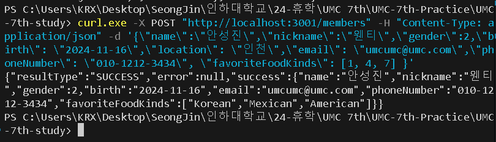
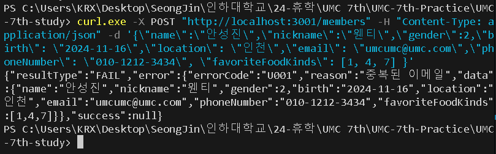

### **📦 실습**
---
- **회원가입 API 응답 통일 및 에러 핸들링**
    
    ```javascript
    // src/errors.js
    
    // 중복 데이터 에러 처리
    export class DuplicateError extends Error{
        errorCode = "U001"; // 인증 문제 또는 잘못된 사용자 요청 (권한 부족)
        constructor(reason, data){
            super(reason);
            this.reason = reason;
            this.data = data;
        }
    }
    ...
    ```
    - U001 에러 코드
        - U - 사용자가 정의한 커스텀 에러 코드 (코드에 대한 설명이 문서화되어 있어야 함)
        - 001 - 인증(Authorization) 관련 에러나 잘못된 사용자 요청
    - 생상자(constructor)를 통해 추가적인 오류 데이터(reason, data)를 담는다.
    ```javascript
    // src/index.js
    
    ...
    // 공통 응답을 사용할 수 있는 헬퍼 함수 등록
    app.use((req, res, next) => {
      // 성공 응답 헬퍼 함수
      res.success = (success) => {
        return res.json({
          resultType: "SUCCESS",
          error: null,
          success
        });
      };
      // 에러 응답 헬퍼 함수
      res.error = ({ errorCode = "unknown", reason = null, data = null}) => {
        return res.json({
          resultType: "FAIL",
          error: { errorCode, reason, data },
          success: null,
        });
      };
      next(); // 이후 다른 Controller, 미들웨어 등에서 res.jon, res.error 함수를 사용할 수 있게 한다. 
    })
    ...
    ```
    - 미들웨어를 설정하여 모든 요청에 대해 공통적인 처리한다.
    - 성공 응답을 위한 헬퍼 함수와 에러 응답을 위한 헬퍼 함수를 만든다.
    - next()를 통해 다른 미들웨어나 라우트에서 res.success와 res.error를 사용할 수 있다.
    ```javascript
    // src/index.js
    
    ...
    // 전역 오류를 처리하기 위한 미들웨어
    app.use((err, req, res, next) => {
      if (res.headersSent){ // 응답 헤더가 이미 클라이언트로 전송되었는지 확인
        return next(err); // 추가적인 응답을 보낼 수 없으므로 에러를 다음 미들웨어로 전달
      }
      res.status(err.statusCode || 500).error({
        errorCode: err.errorCode || "unknown",
        reason: err.reason || err.message || null,
        data: err.data || null,
      });
    });
    ...
    ```
    - 미들웨어로 모든 에러를 포착하여 처리한다.
    - 응답 헤더가 이미 클라이언트로 전송되었는지 확인한 후 전송되었다면 추가 응답을 보낼 수 없으므로 next(err)를 호출하여 다음 에러 핸들러로 에러를 전달한다.
    - 에러의 상태 코드를 설정한다. 정의한 에러 응답 헬퍼 함수를 사용하여 에러 정보(errorCode, reason, data)를 클라이언트에 전달한다.
    ```javascript
    // src/repositories/member.repository.js
    
    // 회원 데이터 삽입 (회원 등록) & 회원 ID 반환
    export const addMember = async(data) => {
    	const member = await prisma.member.findFirst({where: {email: data.email}}); // 해당 이메일로 등록된 회원(중복 회원)이 존재하는지 확인
    	if (member){ // 해당 이메일로 등록된 회원이 있을 경우
    	    return null;
    	}
    	...
    }
    ```
    - 이미 해당 이메일로 등록된 회원이 있다면 null을 반환한다.
    ```javascript
    // src/services/member.service.js
    
    export const memberSignUp = async(data) => {
        const joinMemberId = await addMember({ // 해당 데이터로 회원 생성 후 회원의 ID 반환
            name: data.name,
            nickname: data.nickname,
    				...
        });
        if (joinMemberId === null){ // 등록하려는 회원의 ID가 null일 경우 에러 처리
            throw new DuplicateError("중복된 이메일", data); // 동일한 이메일로 여러 계정을 만드는 것을 방지
        }
        ...
    }
    ```
    - addMember에서 반환 받은 ID가 null, 즉, 중복된 이메일로 인해 반환된 값이라면 DuplicateError를 던진다.
    ```javascript
    // src/controllers/member.controller.js
    
    // 회원 등록 핸들러
    export const handleMemberSignUp = async(req, res, next) => {
        ...
        const member = await memberSignUp(bodyToMember(req.body)); // 요청 데이터를 DTO로 변환 (member 객체 생성)
        res.status(StatusCodes.OK).success(member); // 성공 공통 응답 전달
    }  
    ```
    - 만약 이메일이 중복되지 않고 정상적으로 회원가입을 마쳤다면 통일된 성공 응답을 전달한다.
- 테스트 결과
    - 회원 등록에 성공했을 경우<br/>
        
    - 회원 등록에 실패했을 경우 (중복된 이메일로 등록할 경우)<br/>
                
    - 테스트 성공 여부와 에러 정보(에러가 났을 경우) 및 해당 데이터 정보(성공했을 경우)를 통일된 형식의 응답으로 보여준다.

### 🎯 핵심 키워드
---
- 미들웨어
    - Express.js와 같은 웹 프레임워크에서 요청(request)과 응답(response) 사이에 실행되는 함수
    - 애플리케이션의 요청-응답 사이클 동안 요청과 응답을 가로채고 수정하거나 로깅을 수행하거나 인증 및 한 부여를 처리할 수 있다.
    1. 요청(req) 객체 수정: 요청 객체에 데이터를 추가하거나 수정할 수 있다. 
    2. 응답(res) 객체 수정: 응답 객체에 데이터를 추가하거나 수정할 수 있다. 
    3. 요청-응답 사이클 종료: 요청을 완료하고 응답을 클라이언트로 보낼 수 있다. 
    4. 다음 미들웨어 함수 호출: 요청-응답 사이클에서 다음 미들웨어 함수로 제어를 전달할 수 있다. 
    - 미들웨어 구조
        ```javascript
        function middleware(req, res, next){
        	// 미들웨어 로직
        	next(); // 다음 미들웨어 함수 호출
        }
        ```
        - next()를 호출하지 않으면 현재 미들웨어에서 요청-응답 사이클이 종료된다. next()는 미들웨어 체인에서 다음 함수로 넘어가기 위해 꼭 필요하다.
    - ex. 요청에 대한 로그를 출력하는 로깅 미들웨어
        ```javascript
        import express from 'express'
        const app = express();
        // 로깅 미들웨어
        app.use((req, res, next) => {
        	console.log(`첫 번째 미들웨어`);
        	next(); // 다음 미들웨어로 제어 전달
        });
        app.use((req, res, next) => {
        	console.log(`두 번째 미들웨어`);
        	next(); // 다음 미들웨어로 제어 전달
        });
        app.get('/', (req, res) => { // GET 요청이 / 경로로 들어올 때 실행된다. 
        	res.send('Hello World');
        });
        app.listen(3000, () => { // 포트 3000에서 서버 시작
          console.log('Server is running on port 3000');
        });
        ```
        - app.use()를 사용했기 때문에 미들웨어는 라우터와 상관없이 모든 요청에 대해 실행된다.  → 이를 **글로벌 미들웨어**라고 한다.
        - 미들웨어는 요청이 들어올 때마다 URL을 콘솔에 출력한다.
        - next() 함수는 다음 미들웨어 또는 라우트 핸들러로 제어를 넘긴다.
        - 미들웨어는 등록된 순서대로 실행된다.
            ```
            첫 번째 미들웨어
            두 번째 미들웨어
            ```
            - 첫 번째 미들웨어가 끝난 뒤 다음 미들웨어로 요청이 넘어오면 실행된다.
        - 모든 요청에 대해 미들웨어가 실행되고 그 다음 / 경로의 핸들러가 응답을 반환한다.
            - 요청이 두 번째 미들웨어를 거쳐 라우트 핸들러에 도달하면 응답을 보낸다.
        >**💡정리**
        >1. 클라이언트가 서버의 / 경로에 GET 요청을 보낸다.
        >2. 첫 번째 미들웨어가 실행되어 “첫 번째 미들웨어” 메시지를 출력한다. 
        >3. 첫 번째 미들웨어가 next()를 호출해 두 번째 미들웨어로 제어가 넘어간다. 
        >4. 두 번째 미들웨어가 실행되고 “두 번째 미들웨어” 메시지가 출력된다. 
        >5. 두 번째 미들웨어가 next()를 호출해 라우트 핸들러로 제어가 넘어간다. 
        >6. 라우트 핸들러가 실행되면서 클라이언트에게 응답(”Hello World”)을 반환한다.  
    - **라우트 수준 미들웨어**
        - 특정 라우트에만 적용된다.
        ```javascript
        import express from 'express';
        const app = express();
        // 미들웨어 함수 정의
        function middleWare(req, res, next) {
        	console.log('미들웨어');
        	next();
        }
        // 특정 라우터에 미들웨어 적용
        app.get('/member', middleWare, (req, res) => {
        	res.send('My Page');
        });
        // 일반 라우트 (미들웨어 미적용)
        app.get('/', (req, res) => {
        	res.send('Hello World');
        });
        app.listen(3000, () => { // 포트 3000에서 서버 시작
          console.log('Server is running on port 3000');
        });
        ```
        - middleWare는 /member 경로로 들어오는 요청에 대해 “미들웨어”라는 메시지를 출력한 후, next()를 호출해 다음 라우트 핸들러로 제어를 넘긴다.
        - middleWare가 끝나면 클라이언트에 “My Page”라는 응답을 보낸다.
        - / 경로에는 미들웨어가 적용되지 않고 바로 “Hello World”라는 응답을 반환한다.
    - **에러 처리 미들웨어**
        - 4가지 인자를 받으며 에러가 발생했을 때 호출된다.
        ```javascript
        import express from 'express';
        const app = express();
        // 일반 라우트
        app.get('/', (req, res) => {
        	res.send('Hello World');
        });
        // 에러를 (고의로) 발생시키는 라우트
        app.get('/error', (req, res) => {
        	throw new Error('에러 발생');
        });
        // 에러 처리 미들웨어
        app.use((err, req, res, next) => { // 4개의 인자 -> Express 에러를 처리하는 표준 형식
        	console.error(err.stack); // 에러 스택을 콘솔에 출력한다. 
        	res.status(500).send('Internal Server Error'); // 500 상태 코드와 메시지 응답
        });
        app.listen(3000, () => { // 포트 3000에서 서버 시작
          console.log('Server is running on port 3000');
        });
        ```
        - /error 경로로 접근 시 강제로 에러가 발생시키고 에러 처리 미들웨어로 요청을 넘긴다.
        - 에러 처리 미들웨어는 발생한 에러의 스택 정보 출력 후 500 상태 코드와 메시지를 클라이언트에게 응답한다.
- HTTP 상태 코드: 클라이언트가 서버에 요청을 보낸 후, 서버가 클라이언트에게 응답할 때 그 상태를 나타내는 코드
  - 1XX (정보): 요청을 받고 작업을 계속 진행하고 있다.
    - 100 Continue: 클라이언트가 요청을 계속할 수 있다. 
      - ex. 클라이언트가 대용량 데이터를 업로드하는 도중 서버가 100 Continue를 반환하여 나머지 데이터를 업로드하도록 허용하는 경우
    - 101 Switching Protocols: 서버가 클라이언트가 요청한 프로토콜로 전환하고 있다. 
      - ex. 클라이언트가 HTTP에서 WebSocket으로 프로토콜을 변경할 경우
  - 2XX (성공): 요청이 성공적으로 처리되었다. 
    - 200 OK: 요청이 성공적으로 처리되었으며 응답 데이터가 포함될 수 있다.
      - ex. 클라이언트가 웹 페이지를 요청하고 서버가 페이지 데이터를 반환할 경우
    - 201 Created: 요청이 성공적으로 처리되었으며 새로운 리소스가 생성되었다. 
      - ex. 클라이언트가 새로운 회원 계정을 생성하였을 경우
    - 204 No Content: 요청이 성공적으로 처리되었으나 응답 데이터가 없다.
      - ex. 클라이언트가 리소스를 삭제(delete)한 후 성공 응답만 받는 경우
  - 3XX (리다이렉션): 클라이언트가 요청한 리소스가 다른 위치에 있다. 
    - 301 Moved Permanently: 요청한 리소스가 영구적으로 다른 URL로 이동되었다. 
      - ex. 웹 사이트의 페이지가 새 URL로 변경된 경우
    - 302 FOUND: 요청한 리소스가 임시로 다른 URL에 있다. 
      - ex. 로그인 후 리다이렉트 되는 경우
    - 304 Not Modified: 클라이언트가 캐시된 데이터를 사용할 수 있다. 
      - ex. 서버 리소스가 수정되지 않았을 경우
  - 4XX (클라이언트 오류): 클라이언트가 잘못된 요청을 보냈다. 
    - 400 Bad Request: 클라이언트의 요청이 잘못되거나 서버가 요청을 이해할 수 없다. 
      - ex. 필수 매개변수를 누락한 요청
    - 401 Unauthorized: 인증이 필요한 리소스에 대해 인증되지 않은 사용자가 접근을 시도하였다. 
      - ex. 로그인하지 않은 사용자가 보호된 페이지에 접근할 경우
    - 403 Forbidden: 서버가 요청을 이해했으나 권한이 없어 접근이 금지되었다. 
      - ex. 일반 사용자가 관리자 페이지에 접근할 경우
    - 404 Not Found: 클라이언트가 요청한 리소스를 찾을 수 없다. 
      - ex. 존재하지 않는 페이지를 요청할 경우
  - 5XX (서버 오류): 서버가 요청을 처리하는 동안 오류가 발생하였다. 
    - 500 Internal Server Error: 서버에서 예기치 못한 오류가 발생하였다.
      - ex. 서버의 코드에 문제가 있어 요청을 처리할 수 없을 경우
    - 502 Bad Gateway: 서버가 게이트웨이 또는 프록시 역할을 할 때 상위 서버에서 잘못된 응답을 받았다.
      - ex. 백엔드 서버가 다운되었을 때 프록시 서버가 반환되는 경우
    - 503 Service Unavailable: 서버가 과부하 상태이거나 유지보수 중이어서 요청을 처리할 수 없다.
      - 티켓 예약 사이트에 갑자기 많은 사용자가 몰려들어 서버가 감당할 수 없게 되었을 경우
    - 504 Gateway Timeout: 서버가 게이트웨이 또는 프록시 역할을 할 떄 상위 서버가 응답하지 않아 시간이 초과되었다.
      - ex. 백엔드 서버가 너무 오래 응답하지 않을 경우