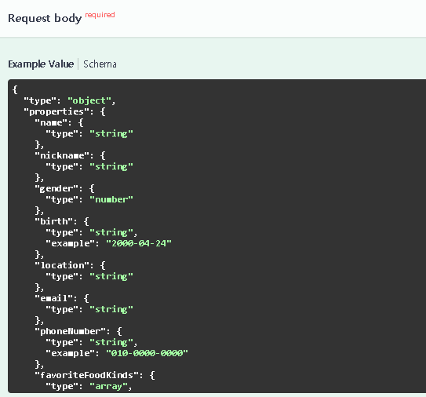
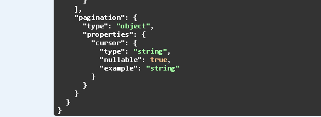
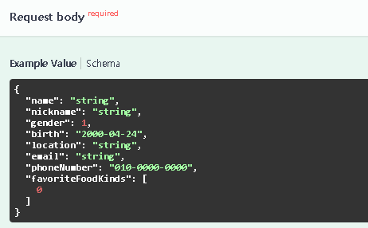
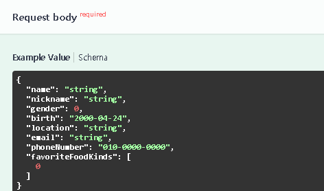

### 🎯 핵심 키워드
---
- Swagger
    - API를 설계하고 문서화하는 데 사용되는 도구
    - API의 구조를 시각적으로 이해하기 쉽고 개발자나 다른 서비스가 API를 보다 쉽게 사용할 수 있도록 한다.
    1. **Swagger Specification**
        - Swagger 파일은 JSON(또는 YAML) 형식으로 작성되며 API의 엔드포인트, 메서드(ex. GET, POST …), 요청 매개변수, 응답 형식 등을 설명한다.
        1. JSON 파일에 작성하는 방법
            ```json
            {
              "openapi": "3.0.0", // OpenAPI 버전
              "info": {
                "title": "Restaurant API",
                "version": "1.0.0"
              },
              "paths": { // API의 모든 엔드포인트 정의
                "/restaurants/{restaurantId}/reviews": {
                  "get": { // GET /restaurants
                    "summary": "식당의 리뷰 목록을 조회하는 API", // 기능 설명 
                    "responses": {
                      "200": { // 응답 상태 코드
                        "description": "식당의 리뷰 목록 조회 성공",
                        "content": { // 응답 본문 또는 요청 본문의 데이터 형식 정의
                          "application/json": { // 본문이 JSON 형식
                            "schema": { // 데이터 구조 정의
                              "type": "array", // type: 데이터 유형 -> 배열
                              "items": { // items: 배열의 각 항목에 대한 데이터 구조 정의
                                "type": "object",
                                "properties": { // properties: 객체의 속성
                                  "data": {
            	                      "type": "array",
            	                      "items": {
            	                        "type": "object",
            	                        "properties": {
            	                          "id": { "type": "string", "example": "1" },
            	                          "restaurant": { "type": "string" },
            	                          "writer": { "type": "string" },
            	                          "content": { "type": "string" },
            	                          "rating": { "type": "number", example: 4.5 },
            	                          "status": { "type": "number" },
            	                          "createdAt": { "type": "string", format: "date-time", example: "2024-11-18T14:23:45.123456Z" }
            	                        }  
            	                      }
            	                    },
            	                    "pagination": {
            	                      "type": "object",
            	                      "properties": {
            	                        "cursor": {
            	                          "type": "number",
            	                          "nullable": true
                                      }
                                    }
                                  }
                                }
                              }
                            }
                          }
                        }
                      },
                      "400" : {
            	          "description": "식당의 리뷰 목록 조회 실패",
            	          "content": { 
            		          "application/json": { 
            			          "schema": {
                              "type": "object", 
                                "properties": { 
                                  "resultType": { "type": "string", "example": "FAIL" },
                                  "error": {
                                    "type": "object",
                                    "properties": {
                                      "errorCode": { "type": "string", "example": "U404" },
                                        "reason": { "type": "string" },
                                        "data": { "type": "object" }
                                      }
                                  },
                                  "success": { "type": "object", "nullable": true, "example": null }
                                }
                              }
                            }
            		          }
            		        }
                      }
                    }
                  }
                }
                "/restaurant":{
                  "post": { // POST /restaurants
                    "summary": "식당을 등록하는 API",
                    ...  
              }
            }
            ```
        2. controller 함수 내부에 작성하는 방법
            ```javascript
            export const handleListRestaurantReviews = async(req, res, next) => {
                /*
                #swagger.ignore = false
                #swagger.tags = ['restaurant-controller']
                #swagger.summary = "식당의 리뷰 목록 조회 API";
                #swagger.description = '식당의 리뷰 목록 조회 API입니다.'
                #swagger.responses[200] = {
                    description: "식당의 리뷰 목록 조회 성공 응답",
                    content: {
                        "application/json": {
                            schema: {
                                type: "object",
                                properties: {
                                    resultType: { type: "string", example: "SUCCESS" },
                                    error: { type: "object", nullable: true, example: null },
                                    success: {
                                        type: "object",
                                        properties: {
                                            data: {
                                                type: "array",
                                                items: {
                                                    type: "object",
                                                    properties: {
                                                        id: { type: "string", example: "1" },
                                                        restaurant: { type: "string" },
                                                        writer: { type: "string" },
                                                        ...
                                                    }
                                                }
                                            },
                                            pagination: {
                                                type: "object",
                                                properties: {
                                                    cursor: {
                                                        type: "number",
                                                        nullable: true
                                                    }
                                                }
                                            }
                                        }
                                    }
                                }
                            }
                        }
                    }
                }
                #swagger.responses[400] = {
                    description: "식당의 리뷰 목록 조회 실패 응답",
                    ...
                }
                */
                ...
            }
            ```
            - #swagger.ignore: swagger가 해당 엔드포인트를 문서화할 지에 대한 여부 설정
                - false(기본값) → 해당 엔드포인트를 무시하지 않고 문서에 포함
                - true: 해당 엔드포인트를 swagger 문서에 제외
            - #swagger.tags: 엔드포인트를 특정 카테고리로 그룹화하기 위한 키워드
            - #swagger.summary: API 엔드포인트에 대한 간결한 설명 제공
            - #swagger.description: 엔드포인트에 대한 자세한 설명
            - #swagger.responses[200]: HTTP 200 응답 상태 코드
    2. Swagger UI
        - 작성된 문서를 시각적으로 표한하는 UI를 제공한다.
        - API의 엔드포인트를 탐색하고 예제 요청을 테스트할 수 있다.
        - ex. /restaurants/{restaurantId} 엔드포인트에 GET 요청을 보내면 특정 식당의 리뷰 목록이 반환된다.<br/>
            
        - swagger-ui-express
            - Swagger 문서를 표현하기 위한 UI 미들웨어로 Express.js와 통합하여 사용된다.
            - 작성된 Swagger(OpenAPI) 문서를 웹 브라우저에서 시각적으로 확인하고 테스트할 수 있는 Swagger UI를 제공한다.
            - API 엔드포인트를 테스트할 수 있는 인터페이스를 제공한다.
            - Swagger 문서를 JSON 또는 YAML 형식으로 작성하며, Express.js 애플리케이션에 swagger-ui-express를 미들웨어로 추가한다.
                ```javascript
                import express from 'express';
                import swaggerUiExpress from "swagger-ui-express"
                
                const app = express();
                app.use(
                  "/docs", // Swagger UI가 표시될 경로
                  swaggerUiExpress.serve, // Swagger UI의 정적 파일(HTML, CSS, JS)을 제공하는 미들웨어
                  swaggerUiExpress.setup({}, { // Swagger UI의 설정 초기화, Swagger 문서를 불러오는 방식 정의
                    swaggerOptions: { // Swagger UI의 동작 제어
                      url: "/openapi.json", // /openapi.json 경로에서 Swagger 문서를 가져오도록 설정
                    },
                  })
                );
                ```
                1. /docs 경로에 접근하면 swaggerUi.serve가 Swagger UI의 정적 파일을 제공한다. 
                2. swaggerUi.setup() 설정에 따라 /openapi.json에서 Swagger 문서를 동적으로 가져온다. 
                    - /openapi.json 파일: API의 정의를 포함하는 JSON 형식의 Swagger 문서
                3. Swagger 문서에 따라 인터페이스를 생성하고 표시한다. 
    3. swagger-autogen
        - 코드에서 주석을 분석하여 Swagger 문서를 자동으로 생성하는 도구
        - 기존 코드에 추가적인 문서 작업 없이 기본적인 Swagger 문서를 작성할 수 있다.
        - 주석으로 더 자세한 API 정보(ex. 요청/응답 스키마)를 작성할 수 있다.
        ```javascript
        import swaggerAutogen from 'swagger-autogen';
        
        pp.get("/openapi.json", async(req, res, next) => { // 클라이언트의 Swagger 문서 요청 시 /openapi.json 경로가 호출된다. 
          // #swagger.ignore = true
          ...
          const outputFile = "/dev/null"; // 생성된 Swagger 문서를 저장할 파일 경로 지정 (파일 출력은 사용하지 않는다.) 
          const routes = ["./src/index.js"]; // 문서화할 라우트가 정의된 파일 경로를 배열로 지정
          const doc = { // Swagger 문서의 메타데이터와 스키마 정의
            info: { // API의 제목과 설명 설정
              title: "UMC 7th",
              description: "UMC 7th Node.js 테스트 프로젝트"
            },
            host: "localhost:3001", // API가 실행되는 서버의 호스트 정보
            components: { // 공통적으로 사용되는 스키마 정의 
        	    ...
        	  }
        	  ...
        	} 
          const result = await swaggerAutogen(options)(outputFile, routes, doc);
          // swaggerAutogen(options): Swagger Autogen 모듈 초기화
          // outputFile: 문서를 출력할 파일 경로
          // routes: 라우트 파일 경로 배열
          // doc: 추가 메타데이터 및 스키마
          res.json(result ? result.data : null);
          // result 객체가 생성되었는지 확인
          // result.data: Swagger Autogen이 생성한 JSON 데이터 포함
        })	
        ```
        - 기존 코드에서 Swagger 문서를 별도로 작성하기 어려운 경우에 유용하다.
- OpenAPI
    - RESTful API를 기술하고 문서화하기 위한 표준 사양
    - API의 엔드포인트, 요청 및 응답 형식, 인증 방식 등을 명확하게 정의할 수 있다.
    - OpenAPI 사양을 기반으로 API 문서를 자동으로 생성할 수 있다. 개발자는 JSON이나 YAML 형식으로 API를 정의하고 도구를 사용해 시작적으로 상호작용 가능한 문서를 쉽게 만들 수 있다.
    - OpenAPI의 구성 요소
        - openapi: API가 특정 버전(ex. OpenAPI 3.0.0)을 준수하는지 명시한다.
        - info: API에 대한 메타데이터(ex. API의 제목, 버전, 설명)를 포함한다.
        - paths: API의 엔드포인트를 정의한다. 각 엔드포인트는 HTTP 메서드, 요청 및 응답 형식 등을 포함한다.
        - components: 재사용 가능한 스키마, 보안 정의, 응답 등을 포함하여 API를 간결하게 만든다.
        - security: API에 적용될 보안 스키마를 정의한다.
- OpenAPI 버전 별 특징 및 주요 차이점
    - **OpenAPI 2.0 (Swagger 2.0)**
      - Swagger에서 OpenAPI라는 명칭으로 변경되기 이전의 마지막 주요 버전
      - **경로(path)**: API 엔드포인트를 정의할 때 paths를 사용하며, 각 엔드포인트에 대해 지원되는 HTTP 메서드를 명시한다.
      - **데이터 타입(type)**: 스키마를 사용하여 응답 및 요청 본문의 데이터 구조를 설명할 수 있다.
      - **보안 스키마(securitySchemes)**: API 키, 기본 인증, OAuth 2.0과 같은 보안 옵션을 지원한다.
      - **디스크리미네이터(discriminator)**: 다형성(polymorphism) 지원이 제한적이다.
          - nullable 속성 지원이 부족하다.
          - 여러 개의 응답 본문 형식을 정의하기가 어렵다.
    - **OpenAPI 3.0.0**
      - **nullable 속성 지원**: 객체 속성이 null 값을 가질 수 있도록 명시할 수 있다.
      - **보강된 데이터 타입**: JSON 스키마에 기반한 더 강력하고 유연한 데이터 타입 정의를 제공한다.
      - **Content Negotiation**: content 속성을 사용하여 다양한 응답 본문 형식(JSON, XML 등)을 더 명확하게 정의할 수 있다.
      - **requestBody 지원**: requestBody라는 전용 속성을 추가하여 POST 및 PUT 요청에 포함된 데이터의 구조를 더 명확하게 설명할 수 있다. → OpenAPI 2.0에서의 요청 본문 정의를 더 명확히 하게 되었다.
      - **통합된 보안 스키마**: 보안 정의가 개선되어 보다 유연하게 보안 요구사항을 설정할 수 있다.
      - **components 추가**: 스키마, 응답, 보안 정의 등을 재사용 가능한 구성 요소(components)로 정리할 수 있다.
      - **디스크리미네이터 개선**: 다형성 처리를 더 잘 지원한다.
      - produces, consumes 키워드가 사라지고 content 속성이 도입되었다.
    - **OpenAPI 3.1.0**
      - **JSON Schema 표준화**: JSON Schema 2020-12 버전을 기반으로 하여 데이터 스키마를 정의할 수 있다.
      - **Webhooks 지원**: webhooks 개념이 도입되어 이벤트 기반 상호작용을 정의할 수 있다. 이를 통해 서버가 클라이언트로 이벤트 알림을 보내는 방식(API의 역방향 요청)을 문서화할 수 있다. → API와 클라이언트 간의 상호작용을 더 잘 지원한다.
      - **반복 가능(repeatable) 파라미터**: 배열 형식의 파라미터를 더 잘 지원한다.
      - **서버 URL의 개선**: 상대 경로 사용 및 서버의 변수 유형을 확장할 수 있다.
      - OpenAPI 3.0.0에서는 JSON Schema와 호환성이 제한적이었지만 3.1.0에서는 완전한 호환성을 제공한다.
- OpenAPI Component
    - OpenAPI 사양에서 재사용 가능한 스키마, 보안 스키마, 응답, 요청 본문 등을 정의하는 부분
    - API 문서 내에서 여러 곳에서 사용할 수 있는 공통 구조를 정의하고 중복 코드를 줄인다. → 간결하고 일관된 API 문서의 구조를 위함
    ```javascript
    app.get("/openapi.json", async(req, res, next) => { // 클라이언트의 Swagger 문서 요청 시 /openapi.json 경로가 호출된다. 
      // #swagger.ignore = true
      ...  
      const doc = { // Swagger 문서의 메타데이터와 스키마 정의
        ...
        host: "localhost:3001", // API가 실행되는 서버의 호스트 정보
        components: { // 공통적으로 사용되는 스키마 정의
          responses: { // swagger-autogen 렌더링을 무시하고 Swagger spec을 직접 넣는다.
            ErrorResponse: {
              type: "object",
              properties: {
                resultType: { type: "string", example: "FAIL" },
                error: { 
                  type: "object",
                  properties: {
                    errorCode: { type: "string", example: "U001" },
                    reason: { type: "string" },
                    data: { type: "object" }
                  } 
                },
                success: { type: "object", nullable: true, example: null }    
              }
            },
            ...
          },
          '@schemas': {
    	      MemberSchema: { // member 스키마
              type: "object",
              properties: {
                name: { type: "string" },
                nickname: { type: "string" },
                gender: { type: "number" },
                birth: { type: "string", example: "2000-04-24" },
                location: { type: "string" },
                email: { type: "string" },
                phoneNumber: { type: "string", example: "010-0000-0000" },
                favoriteFoodKinds: { type: "array", items: { type: "number" } }
              }
            },
            ...
          },
          parameters: {
    	      MemberIdParam: { // 회원 ID 파라미터
              name: "memberId",
              in: 'path',
              required: true,
              description: "회원의 ID 입력",
              schema: {
                type: "integer",
                format: "int64"
              }
            },
            ...
          }
        }
      };
      ...
    });
    ```
    - components: API에서 여러 번 사용할 수 있는 공통 요소들(스키마, 응답, 파라미터 등)을 정의한다.
    - schemas: 데이터 구조(모델)를 정의하는 데 사용된다.
    ```javascript
    // 특정 식당 모든 리뷰 조회 핸들러
    export const handleListRestaurantReviews = async(req, res, next) => {
        /*
        #swagger.ignore = false
        #swagger.tags = ['restaurant-controller']
        #swagger.summary = "식당의 리뷰 목록 조회 API";
        #swagger.description = '식당의 리뷰 목록 조회 API입니다.'
        #swagger.parameters['restaurantId'] = {
            $ref: "#/components/parameters/RestaurantIdParam"
        }
        #swagger.parameters['cursor'] = {
            $ref: "#/components/parameters/CursorParam"
        }
        #swagger.responses[200] = {
            description: "식당의 리뷰 목록 조회 성공 응답",
            content: {
                "application/json": {
                    schema: {
                        $ref: "#/components/responses/ReviewListSuccessResponse"
                    }
                }
            }
        }
        #swagger.responses[400] = {
            description: "식당의 리뷰 목록 조회 실패 응답",
            content: {
                "application/json": {
                    schema: {
                        $ref: "#/components/responses/ErrorResponse"
                    }
                }
            }
        }
        */
        ...
    }
    ```
    - $ref: "#/components/schemas/ErrorResponse"
        - #/components/responses/ErrorResponse을 참조하여 ErrorResponse를 사용한다.
        - 일관된 에러 메시지를 사용할 수 있다.
    - $ref: '#/components/parameters/RestaurantIdParam'
        - restaurantId 파라미터를 참조하여 여러 엔드포인트에서 동일한 경로 파라미터를 재사용할 수 있다.
    - $ref: '#/components/schemas/MemberSchema'
        - #/components/schemas/MemberSchema를 참조하여 Member 스키마를 사용한다.
        - 여러 엔드포인트에서 Member 스키마를 재사용할 수 있다.
<br/>
### ⚡ 트러블 슈팅
---

**`이슈`**
- component를 이용해 스키마를 $ref로 참조하였으나 Swagger UI에서 기대한 형태의 결과가 나오지 않았다.
    ```javascript
    components: { // 공통적으로 사용되는 스키마 정의
      schemas: { 
        MemberSchema: { // member 스키마
          type: "object",
          properties: {
            name: { type: "string" },
            nickname: { type: "string" },
            gender: { type: "number" },
            birth: { type: "string", example: "2000-04-24" },
            location: { type: "string" },
            email: { type: "string" },
            phoneNumber: { type: "string", example: "010-0000-0000" },
            favoriteFoodKinds: { type: "array", items: { type: "number" } }
          }
        },
        PaginationSchema: { // 페이징 스키마
          type: "object",
          properties: {
            cursor: {
              type: "string",
              nullable: true,
              example: null
            }
          }
        }
      }
    }
    ```
    - Swagger 결과<br/>
        <br/>
        
        - type, properties, example이 적용되지 않고 그대로 표시되었다.
        - 렌더링 과정에서 null을 null이 아닌 문자열로 인식하어 “string”으로 표시되었다.
- 그래서 type, example 따위를 지정하지 않고 직접 값을 넣어보았다.
    ```javascript
    components: { 
      schemas: { // swagger-autogen 렌더링을 무시하고 Swagger Spec에서 직접적으로 정의된 스키마 렌더링
        MemberSchema: { // member 스키마
          name: "string",
          nickname: "string",
          gender: 1,
          birth: "2000-04-24",
          location: "string",
          email: "string",
          phoneNumber: "010-0000-0000",
          favoriteFoodKinds: [ 0 ]
        },
        PaginationSchema: { // 페이징 응답 스키마
          cursor: null
        }
      }
    }
    ```
    - Swagger 결과<br/>
        <br/>
        
        - MemberSchema는 정상적으로 적용되는 듯 보이나 paginationSchema는 여전히 null을 문자열로 인식해 “string”으로 표시되어 있는 것이 거슬렸다.<br/>

**`문제`**
- Swagger(OpenAPI)은 null과 같이 Swagger 명세에서 독립적인 데이터 타입이 아니고 기본적으로 타입이 지정되지 않은 필드에 대해 문자열로 처리하려는 경향이 있다. 또한 swagger-autogen은 자동으로 Swagger 스키마를 생성할 때 코드에 명시적으로 type이 지정되지 않은 경우 기본값으로 데이터를 string ****타입으로 간주하는 경우가 많다고 한다(그렇지만 타입을 명시해주면 그 코드가 그대로 표시되어 버리는…).  때문에 nullable: true와 example: null이 있음에도 swagger-autogen 렌더링 과정에서 이를 잘못 처리한 것이다.<br/>

**`해결`**
- @schemas를 사용해 swagger-autogen의 자동 변환을 우회하였다.
    ```javascript
    '@schemas': { // swagger-autogen 렌더링을 무시하고 Swagger Spec에서 직접적으로 정의된 스키마 렌더링
      MemberSchema: { // member 스키마
        type: "object",
        properties: {
          name: { type: "string" },
          nickname: { type: "string" },
          gender: { type: "number" },
          birth: { type: "string", example: "2000-04-24" },
          location: { type: "string" },
          email: { type: "string" },
          phoneNumber: { type: "string", example: "010-0000-0000" },
          favoriteFoodKinds: { type: "array", items: { type: "number" } }
        }
      },
      PaginationSchema: { // 페이징 응답 스키마
        type: "object",
        properties: {
          cursor: {
            type: "string",
            nullable: true,
            example: null
          }
        }
      }
    },
    ```
    - Swagger 결과<br/>
        <br/>
        
        - ‘@schemas’는 Swagger Spec에서 정의된 스키마를 렌더링하겠다는 의미로, swagger-autogen의 자동 변환을 우회한다.
        - 이는 Swagger UI가 spec을 그대로 읽기 때문에 nullable: true, example: null이 올바르게 해석되고 정의한 스키마를 명확히 반영한다.<br/>

**`참고 레퍼런스`**
- https://swagger-autogen.github.io/docs/openapi-3/schemas-and-components/