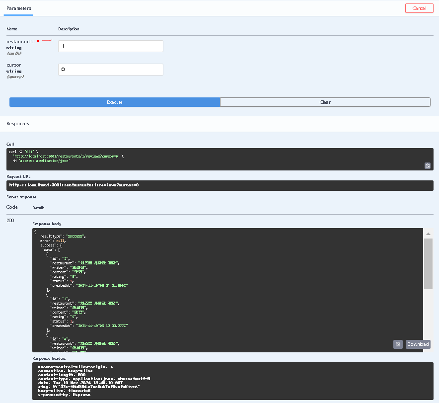

### 🎯 핵심 키워드
---
- Swagger
    - API를 설계하고 문서화하는 데 사용되는 도구
    - API의 구조를 시각적으로 이해하기 쉽고 개발자나 다른 서비스가 API를 보다 쉽게 사용할 수 있도록 한다.
    1. **Swagger Specification**
        - Swagger 파일은 JSON(또는 YAML) 형식으로 작성되며 API의 엔드포인트, 메서드(ex. GET, POST …), 요청 매개변수, 응답 형식 등을 설명한다.
        1. JSON 파일에 작성하는 방법
            
            ```json
            {
              "openapi": "3.0.0", // OpenAPI 버전
              "info": {
                "title": "Restaurant API",
                "version": "1.0.0"
              },
              "paths": { // API의 모든 엔드포인트 정의
                "/restaurants/{restaurantId}/reviews": {
                  "get": { // GET /restaurants
                    "summary": "식당의 리뷰 목록을 조회하는 API", // 기능 설명 
                    "responses": {
                      "200": { // 응답 상태 코드
                        "description": "식당의 리뷰 목록 조회 성공",
                        "content": { // 응답 본문 또는 요청 본문의 데이터 형식 정의
                          "application/json": { // 본문이 JSON 형식
                            "schema": { // 데이터 구조 정의
                              "type": "array", // type: 데이터 유형 -> 배열
                              "items": { // items: 배열의 각 항목에 대한 데이터 구조 정의
                                "type": "object",
                                "properties": { // properties: 객체의 속성
                                  "data": {
            	                      "type: "array",
            	                      "items": {
            	                        "type": "object",
            	                        "properties": {
            	                          "id": { "type": "string", "example": "1" },
            	                          "restaurant": { "type": "string" },
            	                          "writer": { "type": "string" },
            	                          "content": { "type": "string" },
            	                          "rating": { "type": "number", example: 4.5 },
            	                          "status": { "type": "number" },
            	                          "createdAt": { "type": "string", format: "date-time", example: "2024-11-18T14:23:45.123456Z" }
            	                        }  
            	                      }
            	                    },
            	                    "pagination": {
            	                      "type": "object",
            	                      "properties": {
            	                        "cursor": {
            	                          "type": "number",
            	                          "nullable": true
                                      }
                                    }
                                  }
                                }
                              }
                            }
                          }
                        }
                      },
                      "400" : {
            	          "description": "식당의 리뷰 목록 조회 실패",
            	          "content": { 
            		          "application/json": { 
            			          "schema": {
                              "type": "object", 
                                "properties": { 
                                  "resultType": { "type": "string", "example": "FAIL" },
                                  "error": {
                                    "type": "object",
                                    "properties": {
                                      "errorCode": { "type": "string", "example": "U404" },
                                        "reason": { "type": "string" },
                                        "data": { "type": "object" }
                                      }
                                  },
                                  "success": { "type": "object", "nullable": true, "example": null }
                                }
                              }
                            }
            		          }
            		        }
                      }
                    }
                  }
                }
                "/restaurant":{
                  "post": { // POST /restaurants
                    "summary": "식당을 등록하는 API",
                    ...  
              }
            }
            ```
            
        2. controller 함수 내부에 작성하는 방법
            
            ```jsx
            export const handleListRestaurantReviews = async(req, res, next) => {
                /*
                #swagger.ignore = false
                #swagger.tags = ['restaurant-controller']
                #swagger.summary = "식당의 리뷰 목록 조회 API";
                #swagger.description = '식당의 리뷰 목록 조회 API입니다.'
                #swagger.responses[200] = {
                    description: "식당의 리뷰 목록 조회 성공 응답",
                    content: {
                        "application/json": {
                            schema: {
                                type: "object",
                                properties: {
                                    resultType: { type: "string", example: "SUCCESS" },
                                    error: { type: "object", nullable: true, example: null },
                                    success: {
                                        type: "object",
                                        properties: {
                                            data: {
                                                type: "array",
                                                items: {
                                                    type: "object",
                                                    properties: {
                                                        id: { type: "string", example: "1" },
                                                        restaurant: { type: "string" },
                                                        writer: { type: "string" },
                                                        ...
                                                    }
                                                }
                                            },
                                            pagination: {
                                                type: "object",
                                                properties: {
                                                    cursor: {
                                                        type: "number",
                                                        nullable: true
                                                    }
                                                }
                                            }
                                        }
                                    }
                                }
                            }
                        }
                    }
                }
                #swagger.responses[400] = {
                    description: "식당의 리뷰 목록 조회 실패 응답",
                    ...
                }
                */
                ...
            }
            ```
            
            - #swagger.ignore: swagger가 해당 엔드포인트를 문서화할 지에 대한 여부 설정
                - false(기본값) → 해당 엔드포인트를 무시하지 않고 문서에 포함
                - true: 해당 엔드포인트를 swagger 문서에 제외
            - #swagger.tags: 엔드포인트를 특정 카테고리로 그룹화하기 위한 키워드
            - #swagger.summary: API 엔드포인트에 대한 간결한 설명 제공
            - #swagger.description: 엔드포인트에 대한 자세한 설명
            - #swagger.responses[200]: HTTP 200 응답 상태 코드
    2. Swagger UI
        - 작성된 문서를 시각적으로 표한하는 UI를 제공한다.
        - API의 엔드포인트를 탐색하고 예제 요청을 테스트할 수 있다.
        - ex. /restaurants/{restaurantId} 엔드포인트에 GET 요청을 보내면 특정 식당의 리뷰 목록이 반환된다.
            
            
            
- OpenAPI
    - RESTful API를 기술하고 문서화하기 위한 표준 사양
    - API의 엔드포인트, 요청 및 응답 형식, 인증 방식 등을 명확하게 정의할 수 있다.
    - OpenAPI 사양을 기반으로 API 문서를 자동으로 생성할 수 있다. 개발자는 JSON이나 YAML 형식으로 API를 정의하고 도구를 사용해 시작적으로 상호작용 가능한 문서를 쉽게 만들 수 있다.
    - OpenAPI의 구성 요소
        - openapi: API가 특정 버전(ex. OpenAPI 3.0.0)을 준수하는지 명시한다.
        - info: API에 대한 메타데이터(ex. API의 제목, 버전, 설명)를 포함한다.
        - paths: API의 엔드포인트를 정의한다. 각 엔드포인트는 HTTP 메서드, 요청 및 응답 형식 등을 포함한다.
        - components: 재사용 가능한 스키마, 보안 정의, 응답 등을 포함하여 API를 간결하게 만든다.
        - security: API에 적용될 보안 스키마를 정의한다.