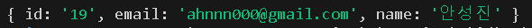

### 🎯 핵심 키워드
---
- OAuth 2.0
    - 인터넷 상에서 안전하게 사용자 인증과 권한을 처리하기 위한 권한 부여 프로토콜
    - 주로 사용자가 자신의 비밀번호를 직접 제공하지 않고도 특정 애플리케이션이 자신의 정보를 제한적으로 액세스하도록 허용하는 데 사용된다.
    - 구글, 페이스북, 카카오, 네이버 등에서 제공하는 간편 로그인 기능 또한 OAuth2 프로토콜 기반의 사용자 인증 기능을 제공하고 있다.
    1. Authentication(인증)
        - 접근 자격이 있는지 검증하는 단계, 즉, **사용자가 누구인지 확인**하는 과정이다.
        - ex. 로그인을 통해 사용자가 본인의 신원을 증명한다.
        - 인증이 완료되면 Session이나 JWT(JSON Web Token)과 같은 인증 토큰을 생성한다.
    2. Authorization (권한 부여, 인가)
        - **사용자가 특정 자원에 접근할 수 있는지 확인**하고 허용 범위를 결정하는 과정
        - 인가가 완료되면 리소스 접근 권한이 담긴 Access Token을 클라이언트에게 부여한다.
    - OAuth 2.0의 역할
        1. Resource Owner (리소스 소유자)
            - 자신의 데이터를 소유하고 있는 사용자 (또는 엔터티)
            - 보호된 자원에 접근할 수 있는 자격을 부여해주는(클라이언트를 인증하는) 주체
            - 인증이 완료되면 권한 획득 자격(Authorization Grant)을 클라이언트에게 부여한다.
            - ex. **Google 계정을 가진 사용자**가 특정 애플리케이션이 자신의 Google Drive 파일, 이메일 등의 데이터를 사용할 수 있도록 허가한다.
        2. Clienet (클라이언트 애플리케이션)
            - 리소스 소유자의 보호된 자원을 사용하려고 접근 요청을 하는 애플리케이션이나 서비스
            - 클라이언트는 권한 서버를 통해 권한을 얻은 후 리소스 소유자로부터 데이터를 요청한다.
            - 클라이언트는 데이터를 직접 소유하지 않고 데이터를 활용하기만 한다.
            - ex. Google Drive에 저장된 파일을 사용하는 **문서 편집기 앱**
        3. Resource Server (리소스 서버)
            - 리소스 소유자가 소유한 데이터를 실제로 저장하고 관리하는 서버
            - 클라이언트가 Access Token(유효성 확인)을 사용해 리소스 서버로부터 데이터를 요청하면 클라이언트에 데이터를 제공한다.
            - 리소스를 보호하고 인증된 요청만 처리한다.
            - ex. **Google Drive API 서버**는 사용자의 Google Drive 데이터를 관리한다.
        4. Authorization Server (권한 서버)
            - 리소스 소유자가 클라이언트에 특정 데이터에 대한 접근 권한을 부여할 수 있도록 처리한다.
            - 클라이언트의 요청을 받아 Access Token 또는 Refresh Token을 발급한다.
            - 사용자의 인증/인가를 처리하고 사용자가 특정 데이터에 대해 권한을 부여할지 결정한다.
    - Authorizaton Code Grant (권한 부여 승인 코드 방식)
        - 권한 부여 승인을 위해 자체 생성한 Authorization Code를 전달하는, 가장 기본적인 방식
        - 클라이언트(중개자 역할)가 사용자를 대신해 특정 자원에 접근을 요청할 때 사용된다.
        - Refresh Token의 사용이 가능하다.
        - 주요 흐름
            1. 권한 부여 승인 요청 시 response_type(권한 부여 방식에 대한 설정)을 code로 지정해 요청한다. 
            2. 클라이언트는 권한 서버에서 제공하는 로그인 페이지를 브라우저에 띄워 출력한다. 
            3. 사용자라 로그인을 하면 권한 서버는 권한 부여 승인 코드 요청 시 전달받은 redirect_url로 Authorization Code를 전달한다. 
            4. Authorization Code는 권한 서버에서 제공하는 API를 통해 Access Token으로 교환된다.
- HTTP Cookie
    - 브라우저 쿠키 혹은 웹 쿠키
    - HTTP 통신을 기반으로 하며 서버가 어떤 데이터를 브라우저 측에 저장한 후 다시 그 데이터를 받아오는 기술, 또는 그 데이터
    - HTTP 프로토콜: 브라우저가 원격의 서버와 네트워크를 통해 쿠키를 주고 받기 위한 일정한 약속
        - 쿠키는 `<cookie-name>=<cookie-value>` 형태의 문자열로, HTTP 메시지의 헤더 영역을 통해 송수신 된다.
    - 쿠키의 전달 과정은 서버가 클라이언트 요청에 응답할 때 일어난다.
        1. Set-Cookie는 응답 헤더에 브라우저가 수신해야 할 쿠키 정보를 명시되어 있다.
        2. 서버로부터 쿠키를 응답 받은 브라우저는 해당 쿠키를 클라이언트 컴퓨터의 하드 디스크에 저장하고, 브라우저가 동일한 서버에 요청할 때 저장해놓은 쿠키를 Cookie 요청 헤더에 실어서 돌려 보낸다.
        - Set-Cookie 헤더를 통해 브라우저로 쿠키를 보내는 것 → 일회성 작업<br/>
            브라우저가 Cookie 헤더를 통해 서버로 쿠키를 돌려보내는 것 → 일정 시간 동안 반복해서 수행되는 작업
    - ex. 서버에서 cookie-name1=cookie-value1, cookie-name2=cookie-value1라는 2개의 쿠키를 브라우저에 저장하려고 한다.
        1. www.umc.com 서버는 브라우저의 요청이 들어오면 각 쿠키를 Set-Cookie 헤더에 실어 응답한다.             
            ```javascript
            // HTTP 요청
            GET /index.html HTTP/1.1
            Host: www.umc.com
            
            // HTTP 응답
            HTTP/1.1 200 OK
            Content-Type: text/html
            Set-Cookie: cookie-name1=cookie-value1
            Set-Cookie: cookie-name2=cookie-value2
            ```
        2. 브라우저는 서버로부터 받은 2개의 쿠키를 클라이언트의 하드디스크에 저장해두고 이후 동일한 서버로 요청할 때마다 Cookie 헤더에 이전에 서버로부터 받았던 쿠키를 그대로 돌려보낸다. 
            ```javascript
            // HTTP 요청
            GET /index.html HTTP/1.1
            Host: www.umc.com
            Cookie: cookie-name1=cookie-value1; cookie-name2=cookie-value2
            ```
            - 해당 브라우저는 사용자가 www.umc.com 도메인에 머무는 한 어디를 방문하든 매번 같은 쿠키를 돌려준다.
- Session vs Cookie vs Token
    1. Session
        - **서버** 측에서 사용자 정보를 저장하는 방식으로, 클라이언트와 서버 간의 상태를 유지하기 위해 사용된다.
        - 동작 원리
            1. 사용자가 서버에 요청을 보내면 서버는 세션 ID를 생성하고 클라이언트에게 응답한다. 
            2. 클라이언트는 이 세션 ID를 쿠키에 저장하거나 요청마다 헤더에 포함시켜 서버에 전달한다. 
            3. 서버는 세션 ID를 기반으로 사용자 정보를 확인하고 상태를 유지한다. 
        - 서버에서 상태 정보를 유지하므로 클라이언트가 로그아웃하거나 세션이 만료되면 더 이상 유효하지 않다.
    2. Cookie
        - **클라이언트** 측에 데이터를 저장하는 방식으로, 클라이언트와 서버 간의 정보를 유지하거나 클라이언트 측에서 필요한 데이터를 저장하는 데 사용된다.
        - 동작 원리
            1. 서버가 응답 시 HTTP 헤더에 쿠키 데이터를 포함해 클라이언트로 보낸다. 
            2. 클라이언트는 이 데이터를 브라우저에 저장하고 이후 요청 시 해당 쿠키를 자동으로 서버에 포함시켜 보낸다. 
        - 제한된 저장 용량 및 만료 기간을 가진다.
    3. Token
        - 인증과 권한 부여를 위해 클라이언트와 서버 간에 교환되는 자가 포함형(토큰 자체가 신분증 역할을 해 따로 확인 과정 없이 사용할 수 있게 하는) 데이터
        - 주로 JWT(JSON Web Token)가 사용된다.
        - 동작 원리
            - 사용자가 로그인하면 서버가 토큰을 생성해 클라이언트에 반환한다.
            - **클라이언트**는 이 토큰을 저장하고 이후 요청에 포함해 서버에 보낸다.
            - 서버는 이 토큰을 검증해 사용자를 식별한다.
        - 토큰은 상태 비저장(stateless) 방식으로 서버에서 세션을 유지하지 않는다.
        - 인증 정보를 포함할 수 있으며 만료 시간과 권한이 토큰에 직접 내장된다.<br/>
        |  | Session | Cookie | Token |
        | --- | --- | --- | --- |
        | 저장 위치 | 서버 | 클라이언트 (브라우저) | 클라이언트 |
        | 사용 목적 | 사용자 상태 유지 | 간단한 데이터 저장 (ex. 세션 ID, 설정 정보) | 인증 정보 전달 |
        | 상태 관리 | Stateful (서버에 상태 저장) | 클라이언트 상태 관리 | Stateless (정보 자체 포함) |
        | 보안 | 상대적으로 안전, but 서버 부하 증가 | 쉽게 읽힐 수 있어 민감한 정보 저장엔 부적합 | 암호화 가능 (ex. JWT) |
        | 주요 사용 사례 | 로그인 세션 관리 | 사이트 설정, 세션 ID | API 인증, OAuth2 |
- Passport
    - passport.js는 Node.js에서 인증(authentication)을 처리하기 위해 사용되는 미들웨어
    - 이름처럼 여권 같은 역할의 모듈로, 클라이언트가 서버에 요청할 자격이 있는지(like 입/출국 심사) 인증할 때 사용된다.
    - 다양한 인증 전략(strategy)을 지원하며 로컬 인증(사용자 이름 및 비밀번호), 소셜 로그인 등 다양한 방식의 인증을 간단하게 구현할 수 있다.
    1. 전략(Strategy)
        - 특정 인증 방식을 구현한 모듈
        - ex.
            - passport-google-oauth20 ⇒ Google OAuth 2.0으로 인증한다.
            - passport-local ⇒ 사용자의 이름과 비밀번호로 인증한다.
            - passport-jwt ⇒ JWT 토큰으로 인증한다.
    2. 미들웨어
        - passport.intialize() ⇒ Passport를 Express 앱에 등록한다.
        - passport.session() ⇒ 세션 기반 인증을 활성화한다.
    3. Serialize & Deserialize
        - 세션 기반 인증에서 사용자 정보를 저장하고 복원하는 과정
        - serializeUser: 사용자 객체를 세션에 저장한다.
        - deserializeUser: 세션에서 사용자 데이터를 복원한다.
    - 인증 흐름
        1. 클라이언트가 인증 요청(로그인)을 한다.
        2. Passport가 특정 전략을 사용해 요청을 처리한다.
        3. 전략에서 인증 성공 여부를 결정한다. 성공 시 사용자 정보(user)를 반환한다.
        4. 인증 성공 시, serializeUser를 호출해 사용자 정보를 세션에 저장한다.
        5. 이후 요청마다 deserializeUser를 통해 세션 정보를 복원하여 사용자를 인증한다.
### **📦 실습**
---
1.  Google에 나의 서버를 등록하고 Key를 발급 받는다.<br/>
    
    - 프로젝트(UMC-7th-Nodejs-test) 생성 후 OAuth client ID를 만들려 했으나 그 전에 동의화면을 구성해야 된다고 한다. 그래서 대충 기본 설정을 유지하여 만들어주었다.<br/>
    
    - 웹 애플리케이션의 유형 및 OAuth 2.0 client의 이름과 리디렉션 URI를 지정해주어 서버를 등록한 후 Key(Client ID, Client secret)를 발급 받았다.
2. 인증을 위한 코드 작성
    ```javascript
    // src/auth.config.js
    
    import dotenv from "dotenv";
    import { Strategy as GoogleStrategy } from "passport-google-oauth20"; //  Google 로그인 Strategy 클래스 이용
    import { prisma } from "./db.config.js";
    
    dotenv.config();
    export const googleStrategy = new GoogleStrategy(
        // 옵션 객체
        {
            clientID: process.env.PASSPORT_GOOGLE_CLIENT_ID,
            clientSecret: process.env.PASSPORT_GOOGLE_CLIENT_SECRET, // .env에서 환경변수로 가져온다.
            callbackURL: "http://localhost:3001/oauth2/callback/google", // Google OAuth 2.0 인증 후 리디렉션될 URL
            scope: ["email", "profile"], // 인증 과정에서 요청할 사용자 정보의 범위: 이메일, 프로필 정보
            state: true, // CSRF 공격(Cross-Site Request Forgery, 사용자가 의도하지 않은 요청을 서버에 보내게 만드는 공격)을 방지하기 위함
        },
        // 검증 함수
        (accessToken, refreshToken, profile, cb) => {
            return googleVerify(profile) // Google의 사용자 프로필 정보를 받아 DB에서 해당 사용자를 확인하거나 (없으면) 생성한다.
            .then((member) => cb(null, member)) // 성공 시 사용자 정보를 Passport 세션으로 전달한다.
            .catch((err) => cb(err)); // 실패 시 에러를 전달한다. 
        }
    );
    
    // Google 프로필 정보 검증
    const googleVerify = async(profile) => {
        const email = profile.emails?.[0]?.value; // 프로필 정보에 이메일이 포함되어 있는지 확인
        console.log("email: ", email);
        console.log(profile);
        if (!email){ // 이메일 정보가 없다면 에러 처리
            throw new Error(`profile.email was not found: ${profile}`);
        }
        const member = await prisma.member.findFirst({where: { email }}); // 이메일로 사용자 조회
        if (member !== null){ // 이미 해당 이메일로 등록한 회원이 있다면 해당 회원의 정보 반환
            return { id: member.id.toString(), email: member.email, name: member.name };
        }
        const created = await prisma.member.create({ // 사용자가 존재하지 않을 시 기본값으로 사용자 정보를 자동 생성한다.
            data: {
                email,
                name: profile.displayName,
                nickname: "추후 수정",
                gender: 1,
                birth: new Date(2000, 4, 24),
                location: "추후 수정",
                phoneNumber: "추후 수정",
            },
        });
        console.log(created);
        return { id: created.id.toString(), email: created.email, name: created.name };
    };
    ```
    ```javascript
    # Google Cloud Platform에서 발급 받은 값
    PASSPORT_GOOGLE_CLIENT_ID="841447841237-c184bj34vncr3f4cr..."
    PASSPORT_GOOGLE_CLIENT_SECRET="GOCSPX-s50kwWAR..." 
    ```
    - GoogleStrategy는 2개의 주요 매개변수를 받는다.
        1. 옵션 객체: OAuth 2.0 흐름에서 필요한 설정값을 제공한다.
            - clientID, clientSecret, callbackURL, scope, state
        2. 검증 함수: 인증 성공 후 호출되며 사용자를 데이터베이스에서 확인하거나 생성하는 작업을 수행한다.
            - accessToken: Google에서 발급한 사용자 인증 액세스 토큰
            - refreshToken: 액세스 토큰이 만료되었을 때 재발급 받을 수 있는 토큰
            - profile: Google로부터 받은 사용자 프로필 정보
                - 프로필 정보에는 이메일, 이름, 이미지 URL 등의 데이터가 포함된다.
                - 직접 출력해서 확인해 본 profile 객체             
                    ```javascript
                    {
                      id: '101652391484059146094',
                      displayName: '안성진',
                      name: { familyName: '안', givenName: '성진' },
                      emails: [ { value: 'ahnnn000@gmail.com', verified: true } ],
                      photos: [
                        {
                          value: 'https://lh3.googleusercontent.com/a/ACg8ocI_HvLqDazkUFYppAylU5ztRqlEkab15FelUaXOReUBPb_6cQ=s96-c'
                        }
                      ],
                      provider: 'google',
                      _raw: '{\n' +
                        '  "sub": "101652391484059146094",\n' +
                        '  "name": "안성진",\n' +
                        '  "given_name": "성진",\n' +
                        '  "family_name": "안",\n' +
                        '  "picture": "https://lh3.googleusercontent.com/a/ACg8ocI_HvLqDazkUFYppAylU5ztRqlEkab15FelUaXOReUBPb_6cQ\\u003ds96-c",\n' +
                        '  "email": "ahnnn000@gmail.com",\n' +
                        '  "email_verified": true\n' +
                        '}',
                      _json: {
                        sub: '101652391484059146094',
                        name: '안성진',
                        given_name: '성진',
                        family_name: '안',
                        picture: 'https://lh3.googleusercontent.com/a/ACg8ocI_HvLqDazkUFYppAylU5ztRqlEkab15FelUaXOReUBPb_6cQ=s96-c',
                        email: 'ahnnn000@gmail.com',
                        email_verified: true
                      }
                    }
                    ```
                    - email 값은 profile 객체 > emails 배열 > value 값에 있음을 확인할 수 있다.
            - cb: Passport에서 제공하는 콜백 함수, 검증 결과를 Passport에 전달한다.
3. Passport 사용하기: Session
    - Session: 사용자의 로그인 정보(DB, Redis(캐시) 등)를 별도의 저장소(store)에 저장해두고 이를 지속적으로 조회해 사용하도록 한다.
        - 사용자가 한 번 로그인을 하고 나면 그 정보를 어딘가에 저장해두어 일정 기간 동안 다시 로그인하지 않고 사용할 수 있도록 유지해준다.
        - 세션이 없다면 사용자는 API를 한 번 호출할 때마다 로그인을 해야 할 수 있다.
    ```javascript
    // src/index.js
    
    app.use(
      session({ // 세션을 설정하고 관리하기 위해 사용하는 미들웨어
        cookie: { // client 브라우저에 저장되는 세션 쿠키의 설정
          maxAge: 7 * 24 * 60 * 60 * 1000, // ms, 쿠키의 유효기간 (7일)
        },
        resave: false, // 세션 데이터가 변경된 경우에만 저장한다.
        saveUninitialized: false, // 초기화되지 않은 세션은 저장되지 않는다.
        secret: process.env.EXPRESS_SESSION_SECRET, // 세션 쿠키 암호화에 사용되는 비밀 키
        store: new PrismaSessionStore(prisma, { // 세션 데이터를 저장하는 저장소
          checkPeriod: 2 * 60 * 1000, // ms, 세션 DB에서 오래된 세션을 정리하는 주기 (2일)
          dbRecordIdIsSessionId: true, // 세션 ID를 기본 키로 사용
          dbRecordIdFunction: undefined, // 세션 ID를 커스텀 방식으로 생성 시 함수로 제공 (undefined)
        }),
      })
    );
    
    app.use(passport.initialize()); // Passport의 기본적인 인증 로직 활성화
    app.use(passport.session()); // 세션 기반 인증 상태 유지, 세션에서 사용자 데이터를 복원하여 req.user에 할당
    ```
    1. 사용자가 로그인 시도하면 서버가 sid를 생성하고 DB에 사용자와 연결하여 저장한다. (sid를 쿠키로 클라이언트에 저장한다)
    2. 사용자가 다른 페이지에서 요청을 보내면 브라우저가 요청과 함께 sid 쿠키를 전송한다.
    3. 서버가 쿠키의 sid를 읽고 DB에서 해당 sid와 연결된 데이터를 조회한다.
    4. 데이터가 있다면 이를 req.user에 저장하고 이후 요청 처리에 사용한다.
    - prisma를 통해 세션을 저장하고 사용할 수 있도록 한다. (prisma-session-store)
        - PrismaSessionStore: 세션 데이터 데이터베이스에 저장한다.
    - 세션 쿠키의 유효기간을 7일로 설정하여 로그인을 하면 7일 간 그 회원의 정보를 유지할 수 있다.
    - 2일 주기로 세션 DB에서 오래된 세션을 주기적으로 정리(삭제)한다.
4. Session 모델 및 테이블 추가
    - Session 모델 
        ```javascript
        model Session {
          id String @id
          sid String @unique
          data String @db.VarChar(512)
          expiresAt DateTime @map("expires_at")
          @@map("session")
        }
        ```
    - Session 테이블<br/>
        
        - sid(session ID): Session 식별
        - data: 사용자의 정보 저장
        - expiresAt: Session의 만료 시간 (보통 일주일 설정)
    - 모델 및 테이블에 세션을 저장하여 사용자의 로그인 상태나 중요한 데이터를 여러 요청 간에 유지한다.
5. Passport 사용하기: Route
    ```javascript
    // src/index.js
    
    app.get("/oauth2/login/google", passport.authenticate("google")); // Google 로그인 시작 시 접근하는 엔드포인트, GoogleStrategy를 호출해 인증 프로세스 시작
    app.get( 
      "/oauth2/callback/google", // Google 인증 후 사용자 정보가 반환되는 콜백 URL
      passport.authenticate("google", { // Google에서 인증 결과를 받아 처리한다.
        failureRedirect: "/oauth2/login/google", // 인증 실패 시 로그인 페이지로 리디렉션 (로그인 재시도)
        failureMessage: true, // 인증 실패 시 실패 메시지를 세션에 저장한다.
      }),
      (req, res) => res.redirect("/") // 인증 성공 후엔 / 경로로 리디렉션
    );
    ```
    - 사용자가 “/oauth2/login/google” 경로로 요청하면 사용자는 Google의 인증 페이지로 리디렉션 된다. 사용자가 Google 계정으로 로그인하고 동의하면 Google는 사용자를 callbackURL(/oauth2/callback/google)로 리디렉션 한다.
    - 사용자가 인증에 성공하면 콜백 URL에서 Google에서 인증 결과(accessToken, profile)를 반환한다.
        - 인증 성공 시: 사용자 정보를 세션에 저장하고 후속 라우트(”/”)로 진행한다.
        - 인증 실패 시:  “/oauth2/login/google”로 리디렉션 된다.
    - “/oauth2/callback/google”에서는 쿼리 파라미터로 전달된 code 값을 이용해 Google API를 호출하여 사용자의 프로필 정보를 조회해오고 이를 Session에 저장한다.
6. Passport 사용하기: 미들웨어
    ```javascript
    // src/index.js
    
    import { naverStrategy } from './auth.config.js';
    ...
    passport.use(googleStrategy); // 정의한 google 로그인 전략을 passport에 등록
    passport.serializeUser((member, done) => done(null, member)); // 인증 성공 후 세션에 회원 정보(member) 저장, done(에러, 세션에 저장할 데이터)
    passport.deserializeUser((member, done) => done(null, member)); // 세션의 정보(member)를 가져와 req.user에 할당
    ```
    - Session에 사용자 정보를 저장하고 Session의 정보를 그대로 가져오도록 한다.
7. 테스트
    1. localhost:3001/oauth2/login/google 에 접속해 구글 로그인을 진행한다.<br/> 
        <br/>
        
    2. 로그인이 완료되면 아래와 같이 “localhost:3001/” 경로로 리디렉션 된다.<br/>
        
    3. 로그인(인증 성공)을 하고 “/” 경로로 리디렉션 될 때 개발자 도구에서 네트워크를 확인한다.<br/>
        <br/>
        
        - Google OAuth 인증의 콜백 엔드포인트(http://localhost:3001/oauth2/callback/google)와 state, code, scope과 같은 쿼리 파라미터를 확인할 수 있다. 이 URL을 거쳐 인증을 마치고 “/”로 돌아온 것이다.
            - state: 요청의 무결성을 보장하기 위해 서버에서 생성한 고유한 값
            - code: Google 인증 서버에서 발급한 인증 코드 (서버에서 Access Token을 교환하기 위해 사용된다)
                - 이 정보를 이용해 나(사용자)의 정보를 DB에서 조회하거나 (없으면) 생성한다.
            - scope: email, profile, openid(사용자 신원 확인을 위해 필수적으로 포함되는 요소)가 요청되었다.
        - 302 Found: 서버가 클라이언트를 다른 URL로 리다이렉트한다.
            - Google 인증 서버에서 성공적으로 인증을 완료하고 콜백 URL로 리다이렉트 한다.<br/>
        
        - Accesss-Control-Allow-Origin: * → 모든 출처에서의 요청을 허용하다.
        - Set-Cookie: 쿠키를 설정하는 헤더
            - 세션 ID(connect.sid=…)를 설정하여 HTTP Cookie로 전달해준다.
        - “/” 경로에서 req.user가 잘 설정되어 인증된 것을 확인할 수 있다.<br/>
            
8. session, member 테이블 확인
    - session 테이블<br/>
        
        - 로그인을 완료하면 세션을 생성하고 세션 ID를 발급하면 세션 관련 데이터는 session 테이블에 저장된다.
        - data
            ```javascript
            {
            	"cookie":{
            		"originalMaxAge":604800000,
            		"expires":"2024-12-04T06:01:59.031Z",
            		"httpOnly":true,
            		"path":"/"
            	},
            	"passport":{
            		"user":{
            			"id":"19",
            			"email":"ahnnn000@gmail.com",
            			"name":"안성진"
            		}
            	}
            }
            ```
            - data엔 사용자의 정보가 잘 들어가 있음을 확인할 수 있다.
    - member 테이블<br/>
        
        - 첫 로그인 후 추가된 사용자 데이터를 확인할 수 있다.