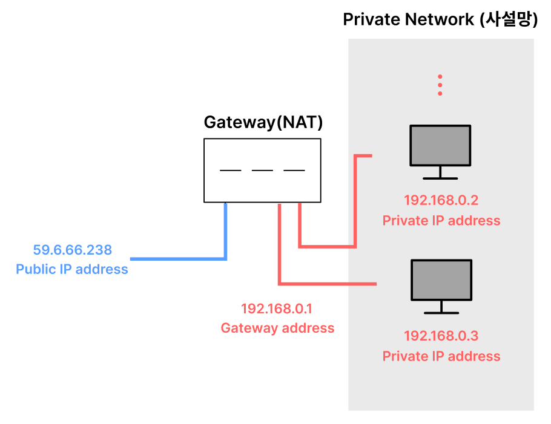
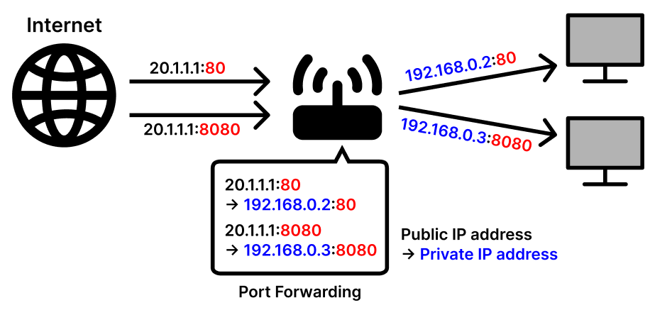

### 🎯 핵심 키워드
---
- AWS(Amazon Web Service)
    - 아마존이 제공하는 종합적인 클라우드 컴퓨팅 플랫폼
    - 인프라 기술(컴퓨팅, 스토리지, 데이터베이스 등)부터 새로운 기술(기계학습 및 인공지능, 사물 인터넷 등)까지 많은 서비스와 서비스 내 기능을 제공한다.
    - 기업 및 개발자가 애플리케이션을 보다 빠르고 효율적으로 개발하고 배포할 수 있도록 한다. 
        → 인프라 구축 비용을 절감하고 유연성을 높일 수 있다. 
    - 기존 애플리케이션을 클라우드로 이동하고 상상할 수 있는 거의 모든 것들을 구축할 수 있다.
- 리전과 가용영역
    - 리전
        - AWS에서 수많은 컴퓨팅 서비스를 하려면 대규모의 서버 컴퓨터를 모아 둔 곳이 필요한데, 한 곳에 전부 다 몰아두면 발생하는 문제점들을 해결하고자 서비스 하기 위한 자원들을 여러 곳에 분산해서 배치를 해둔 것이다.
    - 가용영역
        - 리전을 한번 더 분산해서 배치한 것
        - 하나의 리전 내에서 독립적으로 운영되는 하나 이상의 데이터 센터 그룹
- 서브네팅
    - 서브넷 (subnet)
        - IP 주소에서 네트워크 영역을 부분적으로 나눈 부분 네트워크
        - 클래스를 나누어 IP를 할당하는 IPv4의 문제점: 비효율적
        - ex. 어떤 기관이 A 클래스에 할당할 경우
            - $2^{24} - 2$ = 16,777,214개의 호스트를 할당할 수 있는데 기관이 100개의 호스트를 할당할 경우 → 16,777, 114개의 호스트가 낭비된다.
            - 이러한 비효율성을 해결하기 위해 네트워크 장치들의 수에 따라 효율적으로 사용할 수 있도록 하자!
    - 서브넷 마스크 (subnet mask)
        - IP 주소 체계의 Network ID와 Host ID를 분리한다.
        - 서브넷 마스크를 이용하면 원본 네트워크를 여러 개의 네트워크로 분리할 수 있다. → 서브넷팅
            - ex. C 클래스: 앞의 24-bit → Network ID, 뒤의 8-bit → Host ID
        - IP 주소에 서브넷 마스크를 AND 연산하면 Network ID가 된다.
            - ex. 192.168.32.0 AND 255.255.255.0 → 192.168.32.0: Network ID
        - 192.168.32.0/24 → 24: 서브넷 마스크의 bit(1) 수
    - 서브넷팅 (subnetting)
        - IP 주소 낭비 방지를 위해 원본 네트워크를 여러 개의 세브넷으로 분리하는 과정 → 즉, 서브넷 마스크의 bit 수를 중가시키는 것
        - ex 1. 192.168.32.0/24를 서브넷 마스크의 bit 수를 1 증가시켜 192.168.32.0/25로 변경한다.
            - 192.168.32.0/25의 서브넷 마스크: 255.255.255.128
            - 256 - 128 = 128, 256 / 128 = 2 → 2개의 서브넷 네트워크를 가진다. (서로 다른 2개의 LAN)
            - 192.168.32.0/25의 할당 가능 host 수: $2^7 - 2$ = 126개
                - 서브넷 1
                    - 192.168.32.0/25: Network address
                    - 192.168.32.1/25 ~ 192.168.32.126/25: host 할당 가능
                    - 192.168.32.127/25: Broadcast address
                    ---
                - 서브넷 2
                    - 192.168.32.128/25: Network address
                    - 192.168.32.129/25 ~ 192.168.32.254/25: host 할당 가능
                    - 192.168.32.255/25: Broadcast address
        - ex 2. 211.100.10.0/24 네트워크를 각 서브넷 당 55개의 host를 할당할 수 있도록 서브넷팅 한다.
            - 55 ≤ $2^6$ - 2 = 62 → Host ID를 나타내는 비트가 6개라면 62개의 호스트를 할당할 수 있다.
            - 서브넷 마스크의 bit 개수는 26개(32 - 6)가 된다. 즉, 서브넷 마스크는 255.255.255.192가 된다.
            - 기존 Network ID를 나타내는 bit보다 2(26 - 24)개의 bit를 더 표현하므로 $2^2 = 4$개의 서브넷이 가능하다.
            - 211.100.10.0의 이진법: 11010011.01100100.00001010.00000000
                - 첫 번째 서브넷의 network address: 11010011.01100100.00001010.00000000 = 211.100.10.0
                - 첫 번째 서브넷의 broadcast address: 11010011.01100100.00001010.00111111 = 211.100.10.63
                - 마지막 서브넷의 network address: 11010011.01100100.00001010.11000000 = 211.100.10.192
                - 마지막 서브넷의 broadcast address: 11010011.01100100.00001010.11111111 = 211.100.10.255
                - 두번째 서브넷의 사용 가능한 IP 범위: 11010011.01100100.00001010.01000001 ~ 11010011.01100100.00001010.01111110 = 211.100.10.65 ~ 211.100.10.126
        - ex 3. 195.168.12.0/24 네트워크를 8개의 네트워크(서브넷)로 사용할 수 있도록 서브넷팅할 경우의 효율적인 서브넷 마스크
            - 서브넷 마스크 bit 개수를 3($2^3 = 8$)개 늘려야 한다.
            - 서브넷 마스크: 11111111.11111111.11111111.11100000 = 255.255.255.224
- 라우팅
    - 패킷에 포함된 주소 정보를 보고 패킷을 목적지까지 체계적으로 다른 네트워크에 전달하는 경로 선택 및 스위칭을 하는 과정
    - 여러 네트워크들의 연결을 담당하는 라우터 장비가 패킷이 특정 방향으로 가는 빠르고 정확한 길을 찾아 전달해준다.
    - (1) 라우터는 전달 받은 패킷에서 가장 먼저 목적지가 어디인지 IP 주소를 확인한다. → (2) 가장 빠른 경로가 어디인지 확인하고 그 경로로 가기 위해 자신의 어느 인터페이스로 패킷을 내보내야 하는 지 결정한다. → (3) 결정한 인터페이스로 전달된 패킷은 또 다른 라우터로 전달되어 (1), (2)의 과정을 목적지 네트워크에 도착할 때까지 반복한다.
    - 패킷의 목적지 주소를 라우팅 테이블과 비교하여 어느 라우터에게 넘겨줄 지 판단한다.
        - 라우팅 테이블
            - 라우팅 프로토콜의 가장 중요한 목적
            - 목적지까지 갈 수 있는 모든 경로들 중 가장 효율적이라고 판단되는 경로 정보를 모아둔 공간 - 패킷 전달 시 바로 참고해서 사용한다.
            - 패킷의 목적지와 목적지를 가려면 어느 인터페이스로 가야 하는 지에 대한 정보를 가지고 있다.
- VPC(Virtual Private Cloud)
    - AWS에서 제공하는 논리적으로 격리된 네트워크 환경
    - VPC는 기본적으로 가상의 네트워크 영역이기에 사설 아이피 주소를 가진다.
        - 10.0.0.0/8, 172.16.0.0/12, 192.168.0.0/24  
            → 이 3개의 대역을 가지며, 하나의 VPC에는 이 네트워크 대역, 혹은 서브넷 대역이 할당 가능하다.
    - VPC 내에서 여러 서브넷을 생성하여 퍼블릭 또는 프라이빗으로 설정할 수 있다.
    - 패킷이 이동할 경로를 설정하거나 인터넷 게이트웨이를 통해 퍼블릭 인터넷에 연결할 수 있다.
- 사설 IP 주소
    - 어떤 네트워크 안에서만 내부적으로 사용되는 고유한 주소 (로컬 IP)
    - 공유기에 연결되어 있는 가정이나 회사의 각 네트워크 기기에 할당된다.
    - 하나의 네트워크 안에서 유일하며 네트워크 내부에서만 접근이 가능하다.
        - 공인 IP는 전 세계에서 유일하며 네트워크의 외부, 내부 상관 없이 해당 IP에 접속할 수 있다.
    - 같은 대역의 IP를 할당 받은 모든 기기에 접속이 가능하다. 같은 대역의 사설 IP에 붙어있지 않은 경우(같은 와이파이에 붙어있지 않은 경우) 접속이 불가능하다.
    - 사설망(Private Network)
        - 사설 IP와 NAT를 사용해 내부 기기 간 통신을 가능하게 하고 게이트웨이를 통해 외부 인터넷과 간접적으로 연결되는 네트워크
            - 게이트웨이
                - 사용자가 위치한 네트워크에서 다른 네트워크로 이동하기 위해 반드시 거쳐야 하는 거점
                - 사설망 환경에서 공유기는 내부 네트워크(사설 IP)와 외부 인터넷(공인 IP)을 연결한다.
        - 공유기를 사용한 인터넷 접속 환경의 경우, 공유기까지는 공인 IP를 할당하나, 공유기에 연결되어 있는 가정이나 회사의 각 네트워크 기기엔 사설 IP를 할당해 그룹으로 묶는다.
        - 사설망은 지정된 대역의 IP만 사용한다.
            - 24-bit block: 10.0.0.0 ~ 10.255.255.255
            - 20-bit block: 172.16.0.0 ~ 172.31.255.255
            - 16-bit block: 192.168.0.0 ~ 192.168.255.255 
    
- 포트포워딩
    - 하나의 공용 아이피 주소를 가진 공유기가 자신의 포트를 통해 올바른 사설 아이피 주소를 가진 디바이스에게 데이터를 주는 것
    - 외부에서 특정 포트로 들어오는 트래픽을 내부의 특정 장치로 전달해 외부에서 내부 서비스에 접근할 수 있게 한다(NAT의 확장).
    - NAT는 포트포워딩을 통해 필요한 서비스에 대한 접근을 허용함으로써 유연한 네트워크를 구성한다.
    - ex. 원격 데스크톱 연결
        - 내부 PC의 IP: 192.168.1.100 / 원격 데스크톱 포트: 3389
        - 라우터의 공인 IP의 포트 3389로 들어오는 트래픽을 192.168.1.100의 포트 3389로 전달 
            → 외부에서 공인 IP 주소와 포트 3389로 접속하면 NAT 라우터가 해당 트래픽을 내부 PC로 전달해 원격 접속이 가능해진다. 
    
- NAT(Network Adress Translation) 프로토콜
    - IP 패킷의 TCP/UDP 포트 번호와 소스 및 목적지의IP 주소 등을 재기록하면서 라우터를 통해 네트워크 트래픽을 주고 받는 기술
    - 사설 IP와 공인 IP 간의 주소 변환을 통해 내부 네트워크의 장치들이 인터넷에 접속할 수 있게 한다.
    - WIFI 공유기
        - WIFI 공유기는 내부 네트워크의 장치들에게 사설 IP 주소를 할당하고 외부 인터넷과의 통신 시 NAT 기능을 통해 공인 IP 주소로 변환한다.
        - 공유기의 물리적 포트는 장치들을 네트워크에 연결해주고 각 포트에 연결된 장치들에게 IP 주소를 부여한다.
        - ex. 사설 IP뿐인 컴퓨터가 외부 서비스를 사용하고자 공유기로 나아가면 공유기는 사설 IP뿐인 컴퓨터의 IP를 공유기 자신의 공인 IP로 변환(Translation)한다. 즉, 공유기를 지나 외부 인터넷으로 나아갈 땐 공유기의 공인 IP로 변환되어 목적지 주소로 향하게 된다.
- 포트 번호
    - 같은 IP 내에서 프로세스를 구분하는 데 사용하는 번호
    - 데이터를 보낼 프로세스를 식별할 수 있는 값
    - 대표적인 예시: http - 80, https - 443
    - <IP 주소>:<port 번호> 이런 식의 주소로 데이터를 보낸다.
        - IP주소는 우리가 보기 쉬운 문자 등으로 이루어진 도메인 주소로 바뀌어서 보내진다.