### 🔥 미션
---
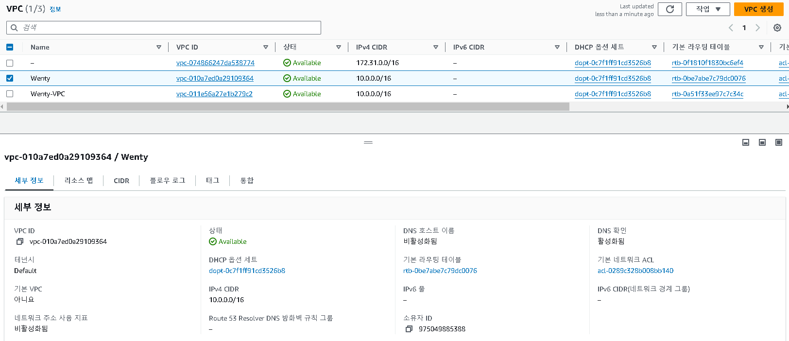
- “Wenty” VPC 생성
	- 사설 IP 대역 - 10.0.0.0/16

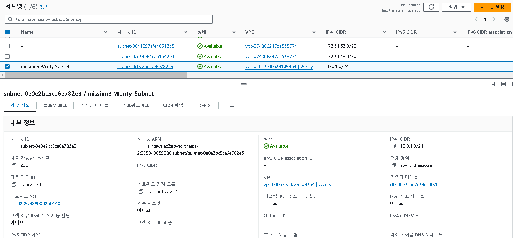
- Wenty 내에 “mission3-Wenty-Subnet” 서브넷 생성
	- IP 대역: 10.0.1.0/24

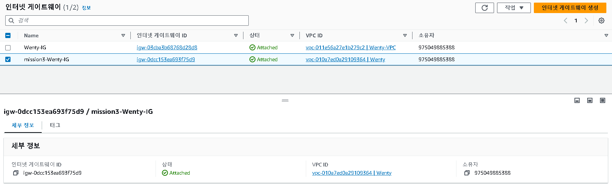
- “mission3-Wenty-IG” 인터넷 게이트웨이 생성 및 Wenty 연결

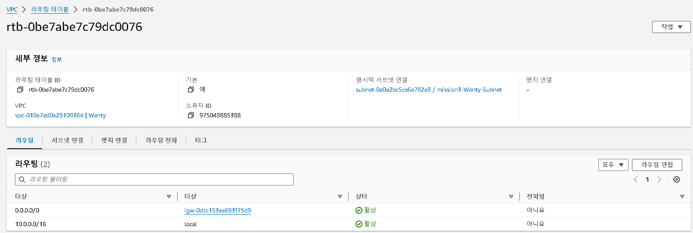
- Wenty 라우팅 테이블 편집

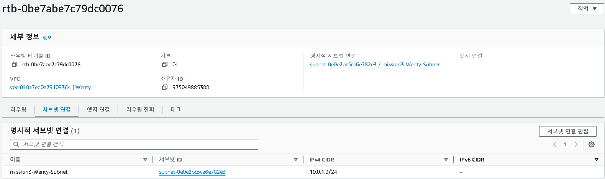
- mission3-Wenty-IG를 거쳐 외부와 통신하도록 설정된 라우팅을 mission3-Wenty-Subnet에 연결한다.
	- mission3-Wenty-Subnet은 퍼블릭 서브넷이 된다.

- 보안 그룹 "mission3-Wenty-WebServerGroup" 생성

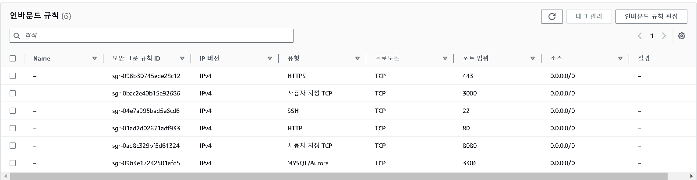
- mission3-Wenty-WebServerGroup 인바운드 규칙 설정
	1. 사용자 지정 TCP(port: 3000) - Node.js 서버에서 사용된다. 
	2. SSH(port: 22) - 원격 서버에 접속할 때 사용된다. 
	3. HTTPS(port: 443) - 웹 브라우저와 서버 간에 암호화된 통신을 할 때 사용된다. 
	4. MySQL/Aurora(port: 3306) - MySQL 데이터베이스에서 사용된다. 
	5. HTTP(port: 80) - 비암호화된 웹 트래픽을 처리한다. 
	6. 사용자 지정 TCP(port: 8080) - 테스트 및 개발 서버에 사용된다. 

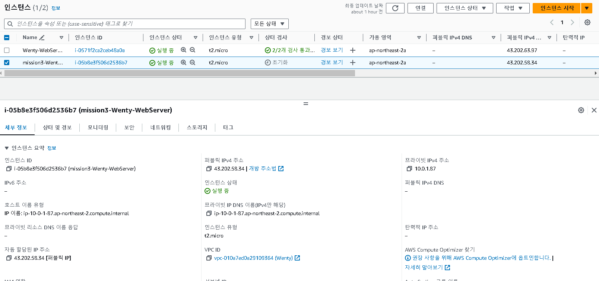
- "mission3-Wenty-WebServer" 인스턴스 생성
	- VPC - Wenty 설정
	- 서브넷 - mission3-Wenty-Subnet 설정
	- 퍼블릭 IP 자동 할당 활성화
	- "mission3-Wenty-KeyPair" 키 페어 생성
	- 보안 그룸 - mission3-Wenty-WebServerGroup 설정

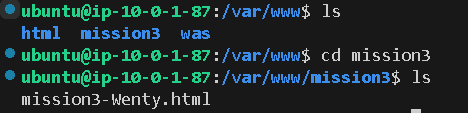
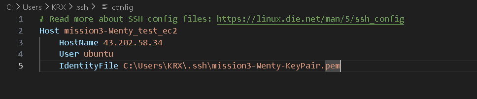
- config 파일에 호스트 별명, 호스트 이름(EC2 퍼블릭 IP 주소), 접속할 사용자 이름(ubuntu), EC2 접속 시 필요한 .pem 키의 위치를 작성한다. 

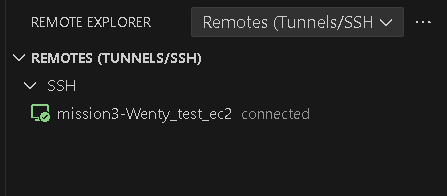
- connected -> "mission3-Wenty-test-ec2" EC2 원격 접속 완료!

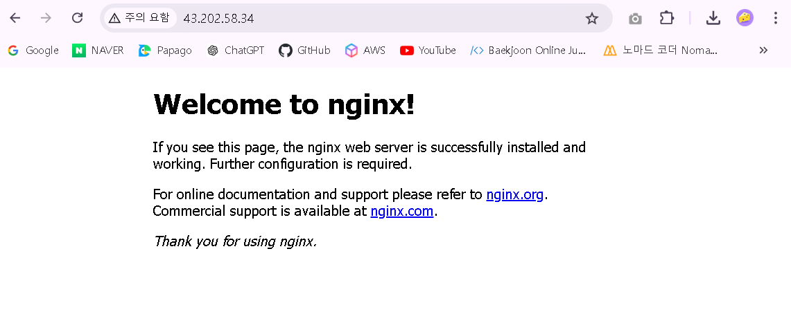
- 브라우저에 EC2 퍼블릭 IP 주소로 접속 시 해당 화면이 뜬다 

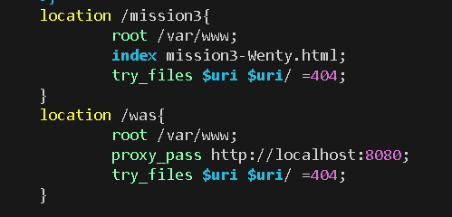
- /etc/nginx/sites-available/default 파일을 수정한다. 
	- /mission3으로 요청이 오면 /var/www/mission3에서 mission3-Wenty.html 파일을 찾아 응답을 준다. 
	- /로 요청이 들어오면 http://localhost:8080로 리버스 프록시된다.

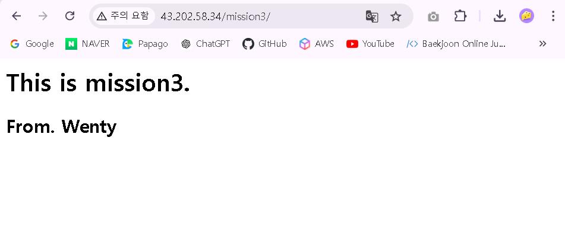
- [EC2 퍼블릭 IP 주소]/mission3 접속 시 해당 화면이 뜬다. 

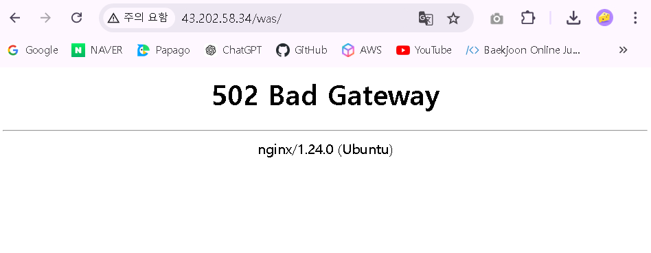
- 8080번 포트의 프로세스가 없어 502 에러가 발생한다. 