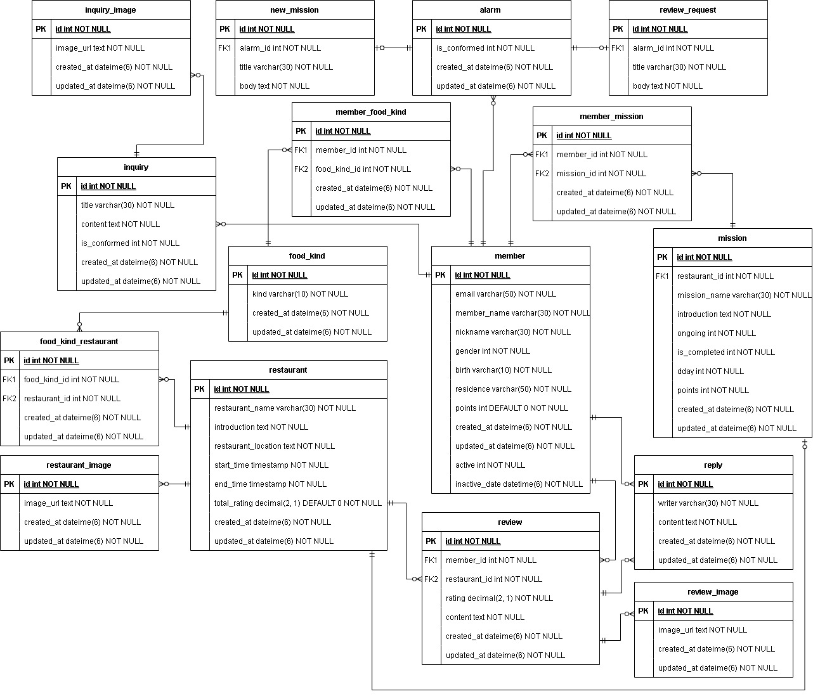
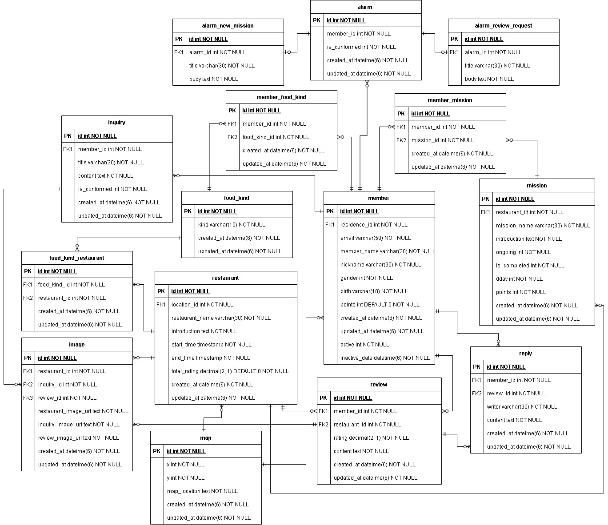

### 🔥 미션
***
#### 스터디 전의 DB 설계

**ERD 설계**


**MySQL 테이블 생성**
```
CREATE TABLE member (
    id INT NOT NULL AUTO_INCREMENT, 
    email VARCHAR(50) NOT NULL,
    member_name VARCHAR(30) NOT NULL,
    nickname VARCHAR(30) NOT NULL,
    gender INT NOT NULL, 
    birth varchar(10) NOT NULL,
    residence varchar(50) NOT NULL,
    points INT DEFAULT 0 NOT NULL,
    created_at datetime(6) NOT NULL,
    updated_at datetime(6) NOT NULL,
    active INT NOT NULL,
    inactive_at datetime(6) NOT NULL,
    PRIMARY KEY (id)
) ENGINE=InnoDB DEFAULT CHARSET=utf8mb3;

CREATE TABLE food_kind (
    id INT NOT NULL AUTO_INCREMENT, 
    kind VARCHAR(10) NOT NULL,
    created_at datetime(6) NOT NULL,
    updated_at datetime(6) NOT NULL,
    PRIMARY KEY (id)
) ENGINE=InnoDB DEFAULT CHARSET=utf8mb3;

CREATE TABLE member_food_kind (
    id INT NOT NULL AUTO_INCREMENT,
    member_id INT NOT NULL, 
    food_kind_id INT NOT NULL,
    created_at datetime(6) NOT NULL,
    updated_at datetime(6) NOT NULL,
    PRIMARY KEY (id),
    FOREIGN KEY (member_id) REFERENCES member(id) ON DELETE CASCADE,
    FOREIGN KEY (food_kind_id) REFERENCES food_kind(id) ON DELETE CASCADE
) ENGINE=InnoDB DEFAULT CHARSET=utf8mb3;

CREATE TABLE restaurant (
    id INT NOT NULL AUTO_INCREMENT,
    restaurant_name VARCHAR(30) NOT NULL, 
    introduction TEXT NOT NULL,
    restaurant_location TEXT NOT NULL,
    start_time TIMESTAMP NOT NULL,
    end_time TIMESTAMP NOT NULL,
    total_rating decimal(2, 1) DEFAULT 0 NOT NULL,
    created_at datetime(6) NOT NULL,
    updated_at datetime(6) NOT NULL,
    PRIMARY KEY (id)
) ENGINE=InnoDB DEFAULT CHARSET=utf8mb3;

CREATE TABLE mission (
    id INT NOT NULL AUTO_INCREMENT,
    restaurant_id INT NOT NULL,
    mission_name VARCHAR(30) NOT NULL, 
    introduction TEXT NOT NULL,
    ongoing int NOT NULL,
    is_completed int NOT NULL,
    dday int NOT NULL,
    points int NOT NULL, 
    created_at datetime(6) NOT NULL,
    updated_at datetime(6) NOT NULL,
    PRIMARY KEY (id),
    FOREIGN KEY (restaurant_id) REFERENCES restaurant(id) ON DELETE CASCADE
) ENGINE=InnoDB DEFAULT CHARSET=utf8mb3;

CREATE TABLE member_mission (
    id INT NOT NULL AUTO_INCREMENT,
    member_id INT NOT NULL, 
    mission_id INT NOT NULL,
    created_at datetime(6) NOT NULL,
    updated_at datetime(6) NOT NULL,
    PRIMARY KEY (id),
    FOREIGN KEY (member_id) REFERENCES member(id) ON DELETE CASCADE,
    FOREIGN KEY (mission_id) REFERENCES mission(id) ON DELETE CASCADE
) ENGINE=InnoDB DEFAULT CHARSET=utf8mb3;

CREATE TABLE review (
    id INT NOT NULL AUTO_INCREMENT,
    member_id INT NOT NULL, 
    restaurant_id INT NOT NULL,
    rating decimal(2, 1) NOT NULL,
    content TEXT NOT NULL,
    created_at datetime(6) NOT NULL,
    updated_at datetime(6) NOT NULL,
    PRIMARY KEY (id),
    FOREIGN KEY (member_id) REFERENCES member(id) ON DELETE CASCADE,
    FOREIGN KEY (restaurant_id) REFERENCES mission(id) ON DELETE CASCADE
) ENGINE=InnoDB DEFAULT CHARSET=utf8mb3;

CREATE TABLE reply (
    id INT NOT NULL AUTO_INCREMENT,
    member_id INT NOT NULL, 
    review_id INT NOT NULL,
    writer varchar(30) NOT NULL,
    content TEXT NOT NULL,
    created_at datetime(6) NOT NULL,
    updated_at datetime(6) NOT NULL,
    PRIMARY KEY (id),
    FOREIGN KEY (member_id) REFERENCES member(id) ON DELETE CASCADE,
    FOREIGN KEY (review_id) REFERENCES review(id) ON DELETE CASCADE
) ENGINE=InnoDB DEFAULT CHARSET=utf8mb3;

CREATE TABLE review_image (
    id INT NOT NULL AUTO_INCREMENT,
    review_id INT NOT NULL, 
    image_url TEXT NOT NULL,
    created_at datetime(6) NOT NULL,
    updated_at datetime(6) NOT NULL,
    PRIMARY KEY (id),
    FOREIGN KEY (review_id) REFERENCES review(id) ON DELETE CASCADE
) ENGINE=InnoDB DEFAULT CHARSET=utf8mb3;

CREATE TABLE inquiry (
    id INT NOT NULL AUTO_INCREMENT,
    member_id INT NOT NULL,
    title VARCHAR(30) NOT NULL, 
    content TEXT NOT NULL,
    is_conformed INT NOT NULL,
    created_at datetime(6) NOT NULL,
    updated_at datetime(6) NOT NULL,
    PRIMARY KEY (id),
    FOREIGN KEY (member_id) REFERENCES member(id) ON DELETE CASCADE
) ENGINE=InnoDB DEFAULT CHARSET=utf8mb3;

CREATE TABLE inquiry_image (
    id INT NOT NULL AUTO_INCREMENT,
    inquiry_id INT NOT NULL,
    image_url TEXT NOT NULL,
    created_at datetime(6) NOT NULL,
    updated_at datetime(6) NOT NULL,
    PRIMARY KEY (id),
    FOREIGN KEY (inquiry_id) REFERENCES inquiry(id) ON DELETE CASCADE
) ENGINE=InnoDB DEFAULT CHARSET=utf8mb3;

CREATE TABLE food_kind_restaurant (
    id INT NOT NULL AUTO_INCREMENT,
    food_kind_id INT NOT NULL,
    restaurant_id INT NOT NULL,
    created_at datetime(6) NOT NULL,
    updated_at datetime(6) NOT NULL,
    PRIMARY KEY (id),
    FOREIGN KEY (food_kind_id) REFERENCES food_kind(id) ON DELETE CASCADE,
    FOREIGN KEY (restaurant_id) REFERENCES restaurant(id) ON DELETE CASCADE
) ENGINE=InnoDB DEFAULT CHARSET=utf8mb3;

CREATE TABLE restaurant_image (
    id INT NOT NULL AUTO_INCREMENT,
    restaurant_id INT NOT NULL,
    image_url TEXT NOT NULL,
    created_at datetime(6) NOT NULL,
    updated_at datetime(6) NOT NULL,
    PRIMARY KEY (id),
    FOREIGN KEY (restaurant_id) REFERENCES restaurant(id) ON DELETE CASCADE
) ENGINE=InnoDB DEFAULT CHARSET=utf8mb3;

CREATE TABLE alarm (
    id INT NOT NULL AUTO_INCREMENT,
    member_id INT NOT NULL,
    is_conformed INT NOT NULL,
    created_at datetime(6) NOT NULL,
    updated_at datetime(6) NOT NULL,
    PRIMARY KEY (id),
    FOREIGN KEY (member_id) REFERENCES member(id) ON DELETE CASCADE
) ENGINE=InnoDB DEFAULT CHARSET=utf8mb3;

CREATE TABLE new_mission (
    id INT NOT NULL AUTO_INCREMENT,
    alarm_id INT NOT NULL,
    title VARCHAR(30) NOT NULL,
    body TEXT NOT NULL,
    PRIMARY KEY (id),
    FOREIGN KEY (alarm_id) REFERENCES alarm(id) ON DELETE CASCADE
) ENGINE=InnoDB DEFAULT CHARSET=utf8mb3;

CREATE TABLE review_request (
    id INT NOT NULL AUTO_INCREMENT,
    alarm_id INT NOT NULL,
    title VARCHAR(30) NOT NULL,
    body TEXT NOT NULL,
    PRIMARY KEY (id),
    FOREIGN KEY (alarm_id) REFERENCES alarm(id) ON DELETE CASCADE
) ENGINE=InnoDB DEFAULT CHARSET=utf8mb3;

```
#### 스터디 후의 DB 설계

**ERD 설계**

**MySQL 테이블 생성**
```
CREATE TABLE member (
    id INT NOT NULL AUTO_INCREMENT,
    email VARCHAR(50) NOT NULL,
    member_name VARCHAR(30) NOT NULL,
    nickname VARCHAR(30) NOT NULL,
    gender INT NOT NULL,
    birth varchar(10) NOT NULL,
    residence varchar(50) NOT NULL,
    points INT DEFAULT 0 NOT NULL,
    created_at datetime(6) NOT NULL,
    updated_at datetime(6) NOT NULL,
    active INT NOT NULL,
    inactive_at datetime(6) NOT NULL,
    PRIMARY KEY (id)
) ENGINE=InnoDB DEFAULT CHARSET=utf8mb3;

CREATE TABLE food_kind (
    id INT NOT NULL AUTO_INCREMENT,
    kind VARCHAR(10) NOT NULL,
    created_at datetime(6) NOT NULL,
    updated_at datetime(6) NOT NULL,
    PRIMARY KEY (id)
) ENGINE=InnoDB DEFAULT CHARSET=utf8mb3;
  
CREATE TABLE member_food_kind (
    id INT NOT NULL AUTO_INCREMENT,
    member_id INT NOT NULL,
    food_kind_id INT NOT NULL,
    created_at datetime(6) NOT NULL,
    updated_at datetime(6) NOT NULL,
    PRIMARY KEY (id),
    FOREIGN KEY (member_id) REFERENCES member(id) ON DELETE CASCADE,
    FOREIGN KEY (food_kind_id) REFERENCES food_kind(id) ON DELETE CASCADE
) ENGINE=InnoDB DEFAULT CHARSET=utf8mb3;

CREATE TABLE restaurant (
    id INT NOT NULL AUTO_INCREMENT,
    restaurant_name VARCHAR(30) NOT NULL,
    introduction TEXT NOT NULL,
    restaurant_location TEXT NOT NULL,
    start_time TIMESTAMP NOT NULL,
    end_time TIMESTAMP NOT NULL,
    total_rating decimal(2, 1) DEFAULT 0 NOT NULL,
    created_at datetime(6) NOT NULL,
    updated_at datetime(6) NOT NULL,
    PRIMARY KEY (id)
) ENGINE=InnoDB DEFAULT CHARSET=utf8mb3;

CREATE TABLE mission (
    id INT NOT NULL AUTO_INCREMENT,
    restaurant_id INT NOT NULL,
    mission_name VARCHAR(30) NOT NULL,
    introduction TEXT NOT NULL,
    ongoing int NOT NULL,
    is_completed int NOT NULL,
    dday int NOT NULL,
    points int NOT NULL,
    created_at datetime(6) NOT NULL,
    updated_at datetime(6) NOT NULL,
    PRIMARY KEY (id),
    FOREIGN KEY (restaurant_id) REFERENCES restaurant(id) ON DELETE CASCADE
) ENGINE=InnoDB DEFAULT CHARSET=utf8mb3;

CREATE TABLE member_mission (
    id INT NOT NULL AUTO_INCREMENT,
    member_id INT NOT NULL,
    mission_id INT NOT NULL,
    created_at datetime(6) NOT NULL,
    updated_at datetime(6) NOT NULL,
    PRIMARY KEY (id),
    FOREIGN KEY (member_id) REFERENCES member(id) ON DELETE CASCADE,
    FOREIGN KEY (mission_id) REFERENCES mission(id) ON DELETE CASCADE
) ENGINE=InnoDB DEFAULT CHARSET=utf8mb3;

CREATE TABLE review (
    id INT NOT NULL AUTO_INCREMENT,
    member_id INT NOT NULL,
    restaurant_id INT NOT NULL,
    rating decimal(2, 1) NOT NULL,
    content TEXT NOT NULL,
    created_at datetime(6) NOT NULL,
    updated_at datetime(6) NOT NULL,
    PRIMARY KEY (id),
    FOREIGN KEY (member_id) REFERENCES member(id) ON DELETE CASCADE,
    FOREIGN KEY (restaurant_id) REFERENCES mission(id) ON DELETE CASCADE
) ENGINE=InnoDB DEFAULT CHARSET=utf8mb3;

CREATE TABLE reply (
    id INT NOT NULL AUTO_INCREMENT,
    member_id INT NOT NULL,
    review_id INT NOT NULL,
    writer varchar(30) NOT NULL,
    content TEXT NOT NULL,
    created_at datetime(6) NOT NULL,
    updated_at datetime(6) NOT NULL,
    PRIMARY KEY (id),
    FOREIGN KEY (member_id) REFERENCES member(id) ON DELETE CASCADE,
    FOREIGN KEY (review_id) REFERENCES review(id) ON DELETE CASCADE
) ENGINE=InnoDB DEFAULT CHARSET=utf8mb3;

CREATE TABLE inquiry (
    id INT NOT NULL AUTO_INCREMENT,
    member_id INT NOT NULL,
    title VARCHAR(30) NOT NULL,
    content TEXT NOT NULL,
    is_conformed INT NOT NULL,
    created_at datetime(6) NOT NULL,
    updated_at datetime(6) NOT NULL,
    PRIMARY KEY (id),
    FOREIGN KEY (member_id) REFERENCES member(id) ON DELETE CASCADE
) ENGINE=InnoDB DEFAULT CHARSET=utf8mb3;

CREATE TABLE food_kind_restaurant (
    id INT NOT NULL AUTO_INCREMENT,
    food_kind_id INT NOT NULL,
    restaurant_id INT NOT NULL,
    created_at datetime(6) NOT NULL,
    updated_at datetime(6) NOT NULL,
    PRIMARY KEY (id),
    FOREIGN KEY (food_kind_id) REFERENCES food_kind(id) ON DELETE CASCADE,
    FOREIGN KEY (restaurant_id) REFERENCES restaurant(id) ON DELETE CASCADE
) ENGINE=InnoDB DEFAULT CHARSET=utf8mb3;

CREATE TABLE image (
    id INT NOT NULL AUTO_INCREMENT,
    restaurant_id INT NOT NULL,
    inquiry_id INT NOT NULL,
    review_id INT NOT NULL,
    image_url TEXT NOT NULL,
    created_at datetime(6) NOT NULL,
    updated_at datetime(6) NOT NULL,
    PRIMARY KEY (id),
    FOREIGN KEY (restaurant_id) REFERENCES restaurant(id) ON DELETE CASCADE,
    FOREIGN KEY (inquiry_id) REFERENCES inquiry(id) ON DELETE CASCADE,
    FOREIGN KEY (review_id) REFERENCES review(id) ON DELETE CASCADE
) ENGINE=InnoDB DEFAULT CHARSET=utf8mb3;

CREATE TABLE alarm (
    id INT NOT NULL AUTO_INCREMENT,
    member_id INT NOT NULL,
    is_conformed INT NOT NULL,
    created_at datetime(6) NOT NULL,
    updated_at datetime(6) NOT NULL,
    PRIMARY KEY (id),
    FOREIGN KEY (member_id) REFERENCES member(id) ON DELETE CASCADE
) ENGINE=InnoDB DEFAULT CHARSET=utf8mb3;

CREATE TABLE alarm_new_mission (
    id INT NOT NULL AUTO_INCREMENT,
    alarm_id INT NOT NULL,
    title VARCHAR(30) NOT NULL,
    body TEXT NOT NULL,
    PRIMARY KEY (id),
    FOREIGN KEY (alarm_id) REFERENCES alarm(id) ON DELETE CASCADE
) ENGINE=InnoDB DEFAULT CHARSET=utf8mb3;

CREATE TABLE alarm_review_request (
    id INT NOT NULL AUTO_INCREMENT,
    alarm_id INT NOT NULL,
    title VARCHAR(30) NOT NULL,
    body TEXT NOT NULL,
    PRIMARY KEY (id),
    FOREIGN KEY (alarm_id) REFERENCES alarm(id) ON DELETE CASCADE
) ENGINE=InnoDB DEFAULT CHARSET=utf8mb3;


CREATE TABLE block (
    id INT NOT NULL AUTO_INCREMENT,
    blocker_id INT NOT NULL,
    blocked_id INT NOT NULL,
    created_at datetime(6) NOT NULL,
    updated_at datetime(6) NOT NULL,
    PRIMARY KEY (id),
    FOREIGN KEY (blocker_id) REFERENCES member(id) ON DELETE CASCADE,
    FOREIGN KEY (blocked_id) REFERENCES member(id) ON DELETE CASCADE
) ENGINE=InnoDB DEFAULT CHARSET=utf8mb3;
```
- 무슨 이유에선지 모르겠지만 ER-다이어그램에서 1:N 관계일 경우엔 N에 해당하는 테이블에 외래키를 포함시키는 것으로 간주하고 테이블엔 따로 표시하지 않는(?) 것으로 착각하고 있었다. 
- 한 음식점에 여러 개의 미션이 주어질 수도 있다. 즉, 음식점:미션 = 1:N
	- ex. OO 중국집 -> 10000원 이상의 식사를 하세요!, 짜장면을 10분 안에 드세요! 등
- new_mission, review_request 테이블은 테이블 이름만 보면 alarm 테이블과 관계가 있는지 알기 어렵다. alarm_new_mission, alarm_review_requeat와 같이 alarm과 관계가 있는 테이블임을 알 수 있도록 표기하였다. 
- 리뷰, 문의하기, 음식점 소개란 등에서 여러 개의 사진을 첨부할 수 있어 review_image, restaurant_image, inquiry_image 테이블을 생성해 review, restaurant, inquiry 테이블들을 각각 참조하도록 하였다. 그러나 하나의 image 테이블을 만들어 속성으로 각각의 사진들을 저장할 수 있도록 설계하는 방법도 있다고 해서 반영해보았다. 
- "사용자 간 차단 기능이 생기게 되어 차단 한 사용자가 누른 좋아요는 집계를 하지 않는다."라는 요구사항을 반영해 block 테이블을 생성하고 member 테이블과 1:N 관계로 연결해주었다.