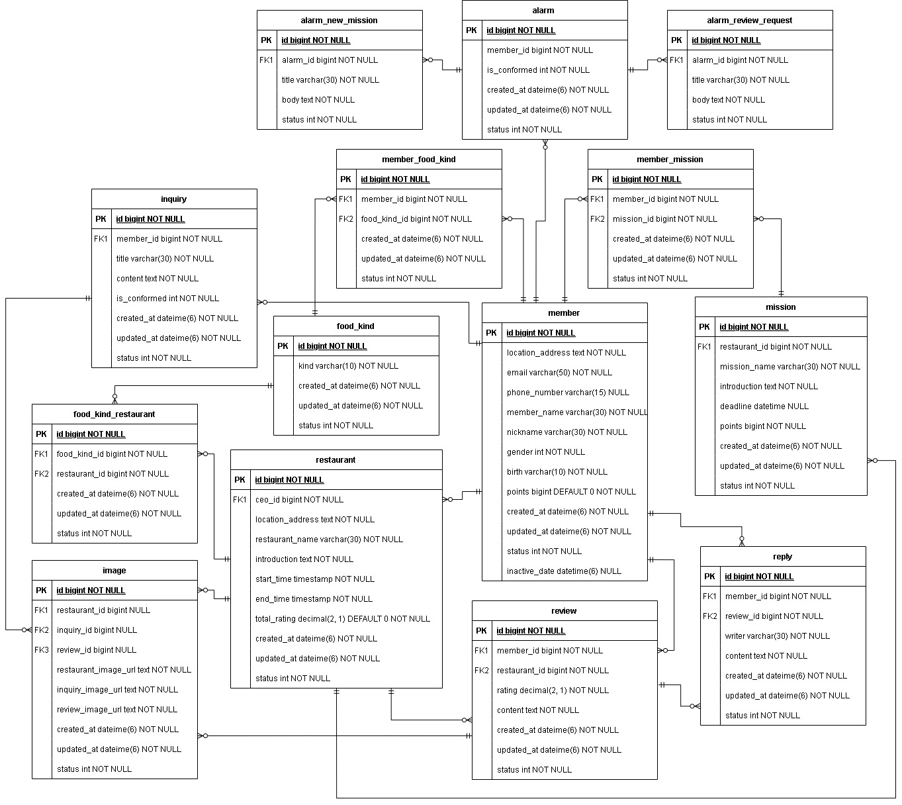
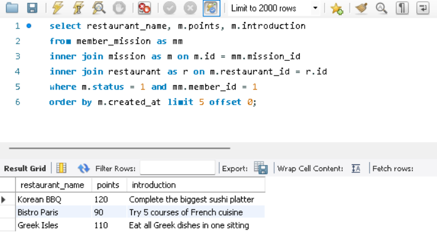
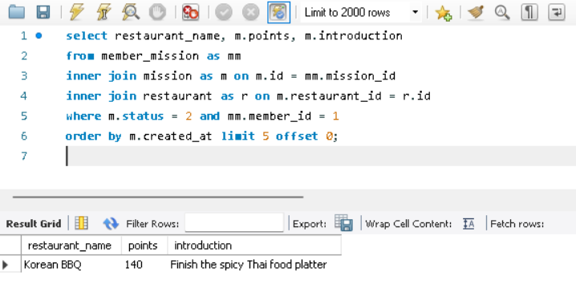
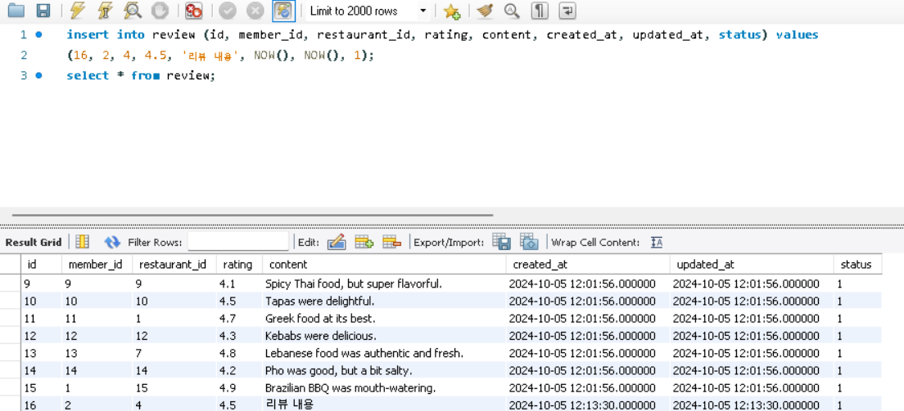
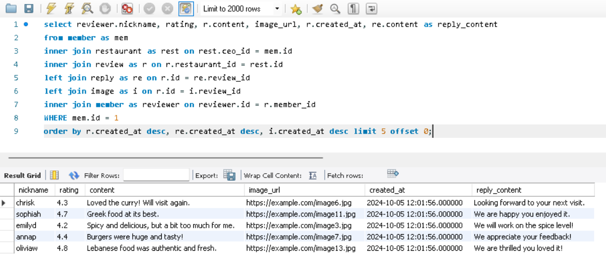
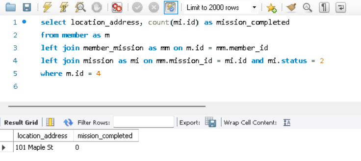
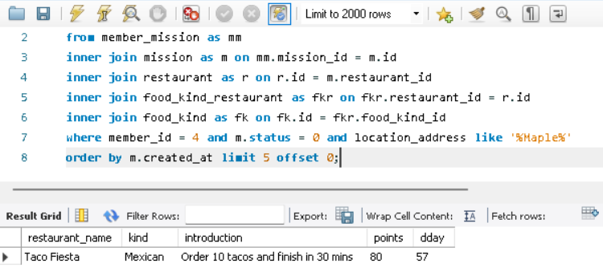
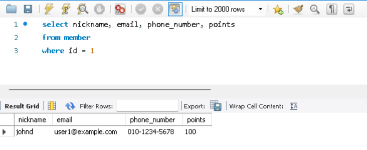

### **🔥 미션**
---
#### **스터디 전의 쿼리 작성**

임의의 값을 넣어서 쿼리를 작성하였다.

**내가 진행 중, 진행 완료한 미션을 모아서 보는 쿼리 (페이징 포함)**
1. 진행 중인 미션 목록
    ```sql
    select member_name, restaurant_name, rm.points, introduction from member as m
    inner join member_mission as mm on m.id = mm.member_id
    inner join (select m.*, restaurant_name from mission as m
        join (select restaurant.* from restaurant) as r
        on m.restaurant_id = r.id where ongoing = 1) as rm
    on rm.id = mm.mission_id
    where m.id = 1
    order by m.created_at limit 5 offset 0;
    
    ```
2. 진행 완료한 미션 목록
    ```sql
    select member_name, restaurant_name, rm.points, introduction from member as m
    inner join member_mission as mm on m.id = mm.member_id
    inner join (select restaurant_name, m.* from mission as m
        join (select restaurant.* from restaurant) as r
        on m.restaurant_id = r.id where is_completed = 1) as rm
    on rm.id = mm.mission_id
    where m.id = 1
    order by m.created_at limit 5 offset 0;
    
    ```
- id가 1인 사용자의 진행 중 및 진행 완료한 미션들을 조회한다.

**리뷰 작성하는 쿼리**
```sql
select nickname, restaurant_name, rating, content, image_url, rm.created_at, reply_content from restaurant as rest
join (select m.nickname, ri.* from member as m
	join (select i.image_url, i.created_at as image_created_at, rr.* from image as i
		right join (select re.writer, re.created_at as reply_created_at, r.*, re.content as reply_content from review as r
			left join reply as re
            on re.review_id = r.id) as rr
        on i.review_id = rr.id) as ri
    on m.id = ri.member_id) as rm
on rest.id = rm.restaurant_id and rest.id = 1
order by created_at desc, reply_created_at desc, image_created_at desc limit 5 offset 0;

```
- id가 1인 식당의 리뷰를 모아본다.

**홈 화면 쿼리 (현재 선택 된 지역에서 도전이 가능한 미션 목록, 페이징 포함)**
1. 현재 선택된 지역(사용자 거주지) 및 진행 완료한 미션의 개수
    ```sql
    select location, count(*) as mission_completed from
        (select m.id, ma.map_location as location from member as m
        join map as ma on ma.id = m.residence_id) as mma
            inner join member_mission as mm on mma.id = mm.member_id
                inner join mission as mi on mm.mission_id = mi.id
    where mi.is_completed = 1 and mma.id = 4;
    ```
    - 그러나, 진행 완료한 미션의 개수가 0일 경우엔 location 값이 NULL이 나오는 오류가 발생했다. inner join은 두 테이블 간에 일치하는 데이터가 있을 때만 결과를 반환하므로, “mi.is_completed = 1” 조건을 만족하는 미션이 없으면 해당 member와 관련된 데이터가 결과에서 제외되어 완료된 미션이 없는 경우 location도 결과에 포함되지 않고 NULL이 되는 것으로 보였다. 진행 완료한 미션이 없더라도 location은 NULL이 아닌 값이 나오도록 수정해야 한다.
2. 현재 선택 된 지역에서 도전이 가능한 미션 목록
    ```sql
    select restaurant_name, kind, introduction, frm.points, frm.dday from member as mem
    inner join member_mission as mm on mm.mission_id = mem.id
    inner join (select fr.kind, fr.restaurant_name, m.* from mission as m
        join (select r.id, r.restaurant_name, fk.kind from food_kind as fk
            inner join food_kind_restaurant as fkr on fkr.food_kind_id = fk.id
            inner join restaurant as r on fkr.restaurant_id = r.id) as fr on fr.id = m.restaurant_id
            where is_completed = 0 and ongoing = 0) as frm on frm.id = mm.mission_id
    where mem.id = 4
    order by frm.created_at limit 5 offset 0;
    ```
- id가 4인 사용자의 거주지와 진행 완료한 미션의 개수를 가져오고, 도전이 가능한 미션들을 조회한다.

**마이 페이지 화면 쿼리**
```sql
select nickname, email, phone_number, points
from member
where id = 1
```
- id가 1인 사용자의 정보를 가져온다.

#### **스터디 후의 쿼리 작성**

**스터디에서 배운 것 + 고칠 점**
1. 쿼리를 작성하기에 앞서서 추출하려는 데이터를 따져본다. 추출하려는 데이터를 바탕으로 어떤 테이블을 사용할 것인지 추측한다.
    - ex.
        ```sql
        select member_name, restaurant_name, review_content
        ```
        - 이 경우 member, restaurant, reveiew 테이블들을 join 해야겠구나 ~ 생각해본다.
2. 효율적인 데이터 상태 관리를 위해 각 테이블마다 속성으로 status를 설정하는 것이 좋다. 각 테이블에 따라 용도가 달라질 수 있다.
    - ex.
        - mission 테이블에서의 status → 진행 중 / 완료
        - member 테이블에서의 status → 활성화 / 비활성화
3. mission에 d-day를 계산하여 DB에 저장하는 것보다 deadline을 저장하고 deadline에서 현재 날짜를 빼서 d-day를 처리하는 것이 데이터 처리에 더 효율적일 것 같다.
4. 다대다 관계의 매핑(중간) 테이블에서 처리할 수 있는 데이터라면 굳이 inner join을 2번 쓸 필요 없이 한 번에 매핑 테이블에서 데이터를 추출한다.
    - ex.
        ```sql
        select mission_id, member_id from member_mission
        select book_id, count(*) from likes group by book_id
        ```
        - 위의 두 경우는 매핑 테이블에서 데이터를 한 번에 처리할 수 있다.
5. map 테이블에서 지도의 모든 위치에 대한 데이터를 저장해 사용자의 거주지와 식당의 위치가 참조하도록 했는데 이는 데이터를 과도하게 많이 저장하며 비효율적인 방식인 것 같다. 굳이 map 테이블을 따로 생성할 필요 없이 외부 api를 사용해 지도 정보를 처리하는 것이 낫겠다.
6. [미션 3]에서 위치는 사용자의 입력에 따라 달라질 수 있으므로 사용자의 입력 값으로 설정하는 것이 좋겠다.
7. [미션 2]는 단순히 한 식당의 리뷰를 모아보는 페이지가 아니라 식당 사장이 자신의 식당 리뷰를 모아보는 것이다. restaurant 테이블에 사장 id 속성을 추가하여 사용자 id가 사장 id와 일치하면 자신의 식당 리뷰를 모아볼 수 있도록 쿼리를 작성해야 한다. (사장의 식당은 1개 이상이 될 것이다)
8. 쿼리문을 가독성 있고 간결하게 나타나게 하기 위해 서브쿼리를 줄였다.
    - ex.
        ```sql
        -- 서브쿼리 사용 O
        select content, image_url
        from review as r
        join (select * from image) as i
        on r.id = i.review_id;   
        -- 서브쿼리 사용 X
        select content, image_url
        from review as r
        join image as i
        on r.id = i.review_id;
        ```

**수정한 ERD 설계 및 MySQL 쿼리**

```sql
CREATE TABLE member (
    id BIGINT NOT NULL AUTO_INCREMENT,
    location_address TEXT NOT NULL,
    email VARCHAR(50) NOT NULL,
    phone_number VARCHAR(15) NULL,
    member_name VARCHAR(30) NOT NULL,
    nickname VARCHAR(30) NOT NULL,
    gender INT NOT NULL,
    birth varchar(10) NOT NULL,
    points BIGINT DEFAULT 0 NOT NULL,
    created_at DATETIME(6) NOT NULL,
    updated_at DATETIME(6) NOT NULL,
    status INT NOT NULL,
    inactive_at datetime(6) NULL,
    PRIMARY KEY (id)
) ENGINE=InnoDB DEFAULT CHARSET=utf8mb3;

CREATE TABLE food_kind (
    id BIGINT NOT NULL AUTO_INCREMENT,
    kind VARCHAR(10) NOT NULL,
    created_at DATETIME(6) NOT NULL,
    updated_at DATETIME(6) NOT NULL,
		status INT NOT NULL,
    PRIMARY KEY (id)
) ENGINE=InnoDB DEFAULT CHARSET=utf8mb3;
  
CREATE TABLE member_food_kind (
    id BIGINT NOT NULL AUTO_INCREMENT,
    member_id BIGINT NOT NULL,
    food_kind_id BIGINT NOT NULL,
    created_at DATETIME(6) NOT NULL,
    updated_at DATETIME(6) NOT NULL,
		status INT NOT NULL,
    PRIMARY KEY (id),
    FOREIGN KEY (member_id) REFERENCES member(id) ON DELETE CASCADE,
    FOREIGN KEY (food_kind_id) REFERENCES food_kind(id) ON DELETE CASCADE
) ENGINE=InnoDB DEFAULT CHARSET=utf8mb3;

CREATE TABLE restaurant (
    id BIGINT NOT NULL AUTO_INCREMENT,
    ceo_id BIGINT NOT NULL,
    location_address TEXT NOT NULL,
    restaurant_name VARCHAR(30) NOT NULL,
    introduction TEXT NOT NULL,
    start_time TIMESTAMP NOT NULL,
    end_time TIMESTAMP NOT NULL,
    total_rating decimal(2, 1) DEFAULT 0 NOT NULL,
    created_at DATETIME(6) NOT NULL,
    updated_at DATETIME(6) NOT NULL,
    status INT NOT NULL,
    PRIMARY KEY (id),
    FOREIGN KEY (ceo_id) REFERENCES member(id) ON DELETE CASCADE
) ENGINE=InnoDB DEFAULT CHARSET=utf8mb3;

CREATE TABLE mission (
    id BIGINT NOT NULL AUTO_INCREMENT,
    restaurant_id BIGINT NOT NULL,
    mission_name VARCHAR(30) NOT NULL,
    introduction TEXT NOT NULL,
    deadline DATETIME NULL,
    points BIGINT NOT NULL,
    created_at DATETIME(6) NOT NULL,
    updated_at DATETIME(6) NOT NULL,
    status INT NOT NULL,
    PRIMARY KEY (id),
    FOREIGN KEY (restaurant_id) REFERENCES restaurant(id) ON DELETE CASCADE
) ENGINE=InnoDB DEFAULT CHARSET=utf8mb3;

CREATE TABLE member_mission (
    id BIGINT NOT NULL AUTO_INCREMENT,
    member_id BIGINT NOT NULL,
    mission_id BIGINT NOT NULL,
    created_at DATETIME(6) NOT NULL,
    updated_at DATETIME(6) NOT NULL,
    status INT NOT NULL,
    PRIMARY KEY (id),
    FOREIGN KEY (member_id) REFERENCES member(id) ON DELETE CASCADE,
    FOREIGN KEY (mission_id) REFERENCES mission(id) ON DELETE CASCADE
) ENGINE=InnoDB DEFAULT CHARSET=utf8mb3;

CREATE TABLE review (
    id BIGINT NOT NULL AUTO_INCREMENT,
    member_id BIGINT NOT NULL,
    restaurant_id BIGINT NOT NULL,
    rating decimal(2, 1) NOT NULL,
    content TEXT NOT NULL,
    created_at DATETIME(6) NOT NULL,
    updated_at DATETIME(6) NOT NULL,
    status INT NOT NULL,
    PRIMARY KEY (id),
    FOREIGN KEY (member_id) REFERENCES member(id) ON DELETE CASCADE,
    FOREIGN KEY (restaurant_id) REFERENCES restaurant(id) ON DELETE CASCADE
) ENGINE=InnoDB DEFAULT CHARSET=utf8mb3;

CREATE TABLE reply (
    id BIGINT NOT NULL AUTO_INCREMENT,
    member_id BIGINT NOT NULL,
    review_id BIGINT NOT NULL,
    writer VARCHAR(30) NOT NULL,
    content TEXT NOT NULL,
    created_at DATETIME(6) NOT NULL,
    updated_at DATETIME(6) NOT NULL,
    status INT NOT NULL,
    PRIMARY KEY (id),
    FOREIGN KEY (member_id) REFERENCES member(id) ON DELETE CASCADE,
    FOREIGN KEY (review_id) REFERENCES review(id) ON DELETE CASCADE
) ENGINE=InnoDB DEFAULT CHARSET=utf8mb3;

CREATE TABLE inquiry (
    id BIGINT NOT NULL AUTO_INCREMENT,
    member_id BIGINT NOT NULL,
    title VARCHAR(30) NOT NULL,
    content TEXT NOT NULL,
    is_conformed INT NOT NULL,
    created_at DATETIME(6) NOT NULL,
    updated_at DATETIME(6) NOT NULL,
    status INT NOT NULL,
    PRIMARY KEY (id),
    FOREIGN KEY (member_id) REFERENCES member(id) ON DELETE CASCADE
) ENGINE=InnoDB DEFAULT CHARSET=utf8mb3;

CREATE TABLE food_kind_restaurant (
    id BIGINT NOT NULL AUTO_INCREMENT,
    food_kind_id BIGINT NOT NULL,
    restaurant_id BIGINT NOT NULL,
    created_at DATETIME(6) NOT NULL,
    updated_at DATETIME(6) NOT NULL,
    status INT NOT NULL,
    PRIMARY KEY (id),
    FOREIGN KEY (food_kind_id) REFERENCES food_kind(id) ON DELETE CASCADE,
    FOREIGN KEY (restaurant_id) REFERENCES restaurant(id) ON DELETE CASCADE
) ENGINE=InnoDB DEFAULT CHARSET=utf8mb3;

CREATE TABLE image (
    id BIGINT NOT NULL AUTO_INCREMENT,
    restaurant_id BIGINT NULL,
    inquiry_id BIGINT NULL,
    review_id BIGINT NULL,
    image_url TEXT NOT NULL,
    created_at DATETIME(6) NOT NULL,
    updated_at DATETIME(6) NOT NULL,
    status INT NOT NULL,
    PRIMARY KEY (id),
    FOREIGN KEY (restaurant_id) REFERENCES restaurant(id) ON DELETE CASCADE,
    FOREIGN KEY (inquiry_id) REFERENCES inquiry(id) ON DELETE CASCADE,
    FOREIGN KEY (review_id) REFERENCES review(id) ON DELETE CASCADE
) ENGINE=InnoDB DEFAULT CHARSET=utf8mb3;

CREATE TABLE alarm (
    id BIGINT NOT NULL AUTO_INCREMENT,
    member_id BIGINT NOT NULL,
    is_conformed INT NOT NULL,
    created_at DATETIME(6) NOT NULL,
    updated_at DATETIME(6) NOT NULL,
    status INT NOT NULL,
    PRIMARY KEY (id),
    FOREIGN KEY (member_id) REFERENCES member(id) ON DELETE CASCADE
) ENGINE=InnoDB DEFAULT CHARSET=utf8mb3;

CREATE TABLE alarm_new_mission (
    id BIGINT NOT NULL AUTO_INCREMENT,
    alarm_id BIGINT NOT NULL,
    title VARCHAR(30) NOT NULL,
    body TEXT NOT NULL,
    status INT NOT NULL,
    PRIMARY KEY (id),
    FOREIGN KEY (alarm_id) REFERENCES alarm(id) ON DELETE CASCADE
) ENGINE=InnoDB DEFAULT CHARSET=utf8mb3;

CREATE TABLE alarm_review_request (
    id BIGINT NOT NULL AUTO_INCREMENT,
    alarm_id BIGINT NOT NULL,
    title VARCHAR(30) NOT NULL,
    body TEXT NOT NULL,
    status INT NOT NULL,
    PRIMARY KEY (id),
    FOREIGN KEY (alarm_id) REFERENCES alarm(id) ON DELETE CASCADE
) ENGINE=InnoDB DEFAULT CHARSET=utf8mb3;
```

**내가 진행 중, 진행 완료한 미션을 모아서 보는 쿼리 (페이징 포함)**
1. 진행 중인 미션 목록
    ```sql
    select restaurant_name, m.points, m.introduction 
    from member_mission as mm
    inner join mission as m on m.id = mm.mission_id
    inner join restaurant as r on m.restaurant_id = r.id 
    where m.status = 1 and mm.member_id = 1
    order by m.created_at limit 5 offset 0;
    ```
	- 테스트 결과
		
1. 진행 완료한 미션 목록
    ```sql
    select restaurant_name, m.points, m.introduction 
    from member_mission as mm
    inner join mission as m on m.id = mm.mission_id
    inner join restaurant as r on m.restaurant_id = r.id 
    where m.status = 2 and mm.member_id = 1
    order by m.created_at limit 5 offset 0;
    ```
	- 테스트 결과
		
(생성한 테이블에 임의의 데이터들을 삽입하여 테스트해보았다.)

**리뷰 작성하는 쿼리**
1. 리뷰를 작성하는 쿼리
    ```sql
    insert into review (id, member_id, restaurant_id, rating, content, created_at, updated_at, status) values
    (1, 1, 1, 4.5, '리뷰 내용', NOW(), NOW(), 1)
    ```
	- 테스트 결과
		
1. 식당 사장이 자신의 식당 리뷰를 모아보는 쿼리
    ```sql
    select reviewer.nickname, rating, r.content, image_url, r.created_at, re.content as reply_content
    from member as mem
    inner join restaurant as rest on rest.ceo_id = mem.id
    inner join review as r on r.restaurant_id = rest.id
    left join reply as re on r.id = re.review_id
    left join image as i on r.id = i.review_id
    inner join member as reviewer on reviewer.id = r.member_id
    WHERE mem.id = 1
    order by r.created_at desc, re.created_at desc, i.created_at desc limit 5 offset 0;
    ```
    - id가 1인 사용자(사장)가 자신의 식당들의 리뷰들을 모아본다.
    - 테스트 결과
		

**홈 화면 쿼리 (현재 선택 된 지역에서 도전이 가능한 미션 목록, 페이징 포함)**
1. 현재 선택된 지역(사용자 거주지) 및 진행 완료한 미션의 개수
    ```sql
	select location_address, count(mi.id) as mission_completed 
	from member as m
	left join member_mission as mm on m.id = mm.member_id
	left join mission as mi on mm.mission_id = mi.id and mi.status = 2
	where m.id = 4
    ```
    - left join을 사용해 사용자가 완료한 미션이 없더라도 member 테이블의 행은 유지되고 count(mi.id)으로 mi.status = 1인 mission만 집계함으로써 미션 완료 여부와 상관없이 location_address는 항상 가져올 수 있도록 하였다. 완료한 미션이 없는 경우에도 location_address는 유지되고 mission_completed는 0으로 표시된다. 
    - 테스트 결과
		
2. 현재 선택 된 지역(입력 값으로 넣은 지역)에서 도전이 가능한 미션 목록
    ```sql
    select restaurant_name, kind, m.introduction, m.points, datediff(m.deadline, now()) as dday
    from member_mission as mm 
    inner join mission as m on mm.mission_id = m.id
    inner join restaurant as r on r.id = m.restaurant_id
    inner join food_kind_restaurant as fkr on fkr.restaurant_id = r.id
    inner join food_kind as fk on fk.id = fkr.food_kind_id 
    where member_id = 4 and m.status = 0 and location_address like '%Maple%'
    order by m.created_at limit 5 offset 0;
    ```
    - id가 4인 사용자의 현재 선택된 지역인 Maple에서 도전이 가능한 미션을 조회한다.
        - Maple이라는 지역이 포함된 주소에 위치한 식당의 미션들을 가져오도록 작성하였다 .
	- 테스트 결과
		
	
**마이 페이지 화면 쿼리**
```sql
select nickname, email, phone_number, points 
from member 
where id = 1
```
- 테스트 결과
    

---
**후기**
- 처음 미션을 수행했을 때 왜 이렇게 머리가 아팠나 했더니 쓸데없이 join과 서브쿼리를 남발해서였다. 너무 복잡하게 작성해서 스터디원들에게 내가 쓴 쿼리를 설명할 때에도 힘이 부쳤다. 스터디원들이 해준 조언들을 바탕으로 쿼리문을 수정하니 훨씬 가독성있고 간결하게 작성할 수 있었다. 서로 토론하며 공부하는 스터디의 중요성을 다시 한 번 느낀다. 🥲