### 🔥 미션
---
1. 1주차 실습에서 세팅한 데이터베이스 인스턴스를 선택한다.<br>
    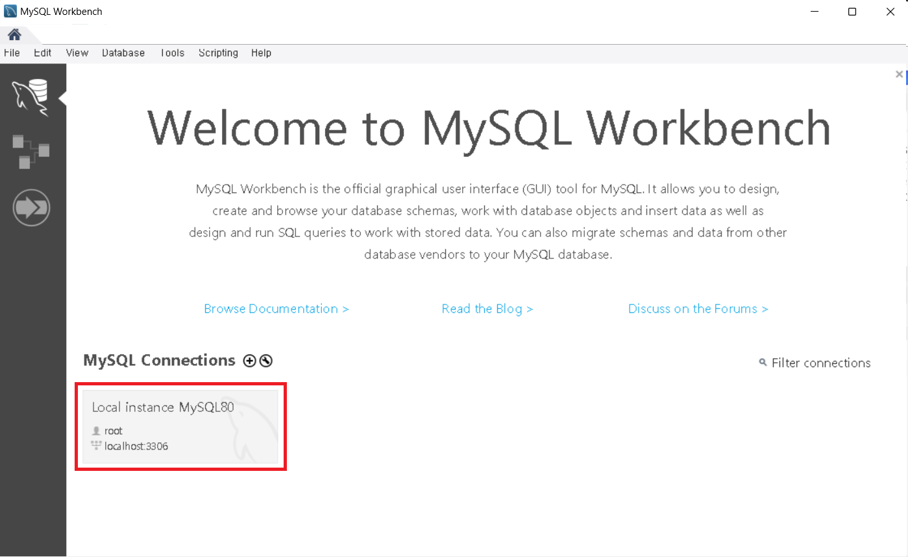
2. 데이터베이스 restaurant_service 생성한다.<br>
    ```sql
    CREATE DATABASE IF NOT EXISTS restaurant_service; // 데이터베이스(restaurant_service) 생성
    use restaurant_service; // restaurant_service 사용
    ```
    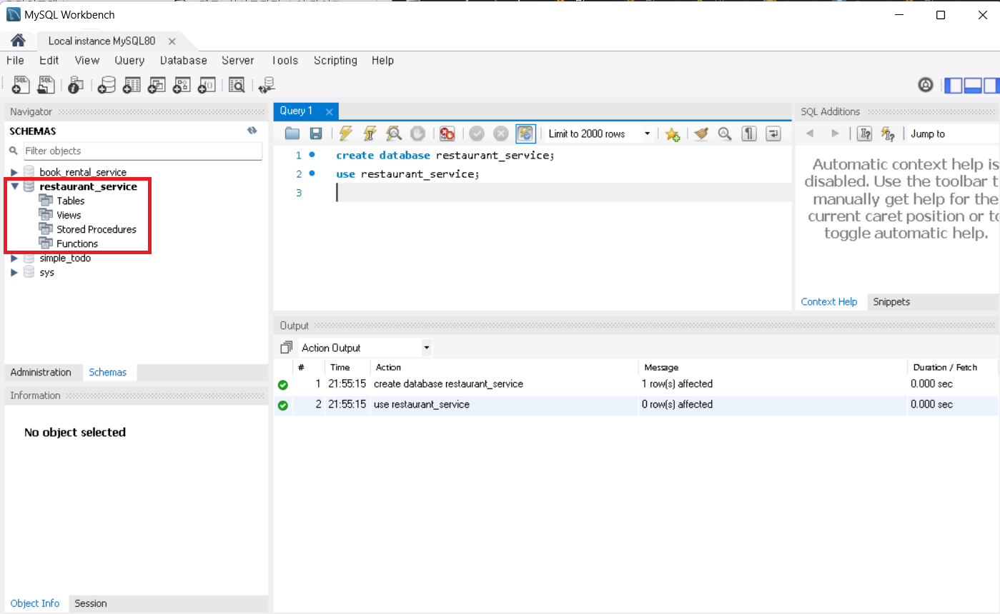
    - 동일한 이름의 데이터베이스가 존재하지 않는다면 데이터베이스를 생성한다. IF NOT EXISTS를 사용해 중복 생성 문제를 방지한다.
    - 현재 작업할 데이터베이스를 restaurant_service로 설정한다.
3. 필요한 테이블들을 생성한다.<br>
    ```sql
    CREATE TABLE member (
        id BIGINT NOT NULL AUTO_INCREMENT,
        location_address TEXT NOT NULL,
        email VARCHAR(50) NOT NULL,
        phone_number VARCHAR(15) NULL,
        member_name VARCHAR(30) NOT NULL,
        nickname VARCHAR(30) NOT NULL,
        gender INT NOT NULL,
        birth varchar(10) NOT NULL,
        points BIGINT DEFAULT 0 NOT NULL,
        created_at DATETIME(6) NOT NULL,
        updated_at DATETIME(6) NOT NULL,
        status INT NOT NULL,
        inactive_at datetime(6) NULL,
        PRIMARY KEY (id)
    ) ENGINE=InnoDB DEFAULT CHARSET=utf8mb3;

    CREATE TABLE food_kind (
        id BIGINT NOT NULL AUTO_INCREMENT,
        kind VARCHAR(10) NOT NULL,
        created_at DATETIME(6) NOT NULL,
        updated_at DATETIME(6) NOT NULL,
            status INT NOT NULL,
        PRIMARY KEY (id)
    ) ENGINE=InnoDB DEFAULT CHARSET=utf8mb3;
    
    CREATE TABLE member_food_kind (
        id BIGINT NOT NULL AUTO_INCREMENT,
        member_id BIGINT NOT NULL,
        food_kind_id BIGINT NOT NULL,
        created_at DATETIME(6) NOT NULL,
        updated_at DATETIME(6) NOT NULL,
            status INT NOT NULL,
        PRIMARY KEY (id),
        FOREIGN KEY (member_id) REFERENCES member(id) ON DELETE CASCADE,
        FOREIGN KEY (food_kind_id) REFERENCES food_kind(id) ON DELETE CASCADE
    ) ENGINE=InnoDB DEFAULT CHARSET=utf8mb3;

    CREATE TABLE restaurant (
        id BIGINT NOT NULL AUTO_INCREMENT,
        ceo_id BIGINT NOT NULL,
        location_address TEXT NOT NULL,
        restaurant_name VARCHAR(30) NOT NULL,
        introduction TEXT NOT NULL,
        start_time TIMESTAMP NOT NULL,
        end_time TIMESTAMP NOT NULL,
        total_rating decimal(2, 1) DEFAULT 0 NOT NULL,
        created_at DATETIME(6) NOT NULL,
        updated_at DATETIME(6) NOT NULL,
        status INT NOT NULL,
        PRIMARY KEY (id),
        FOREIGN KEY (ceo_id) REFERENCES member(id) ON DELETE CASCADE
    ) ENGINE=InnoDB DEFAULT CHARSET=utf8mb3;

    CREATE TABLE mission (
        id BIGINT NOT NULL AUTO_INCREMENT,
        restaurant_id BIGINT NOT NULL,
        mission_name VARCHAR(30) NOT NULL,
        introduction TEXT NOT NULL,
        deadline DATETIME NULL,
        points BIGINT NOT NULL,
        created_at DATETIME(6) NOT NULL,
        updated_at DATETIME(6) NOT NULL,
        status INT NOT NULL,
        PRIMARY KEY (id),
        FOREIGN KEY (restaurant_id) REFERENCES restaurant(id) ON DELETE CASCADE
    ) ENGINE=InnoDB DEFAULT CHARSET=utf8mb3;

    CREATE TABLE member_mission (
        id BIGINT NOT NULL AUTO_INCREMENT,
        member_id BIGINT NOT NULL,
        mission_id BIGINT NOT NULL,
        created_at DATETIME(6) NOT NULL,
        updated_at DATETIME(6) NOT NULL,
        status INT NOT NULL,
        PRIMARY KEY (id),
        FOREIGN KEY (member_id) REFERENCES member(id) ON DELETE CASCADE,
        FOREIGN KEY (mission_id) REFERENCES mission(id) ON DELETE CASCADE
    ) ENGINE=InnoDB DEFAULT CHARSET=utf8mb3;

    CREATE TABLE review (
        id BIGINT NOT NULL AUTO_INCREMENT,
        member_id BIGINT NOT NULL,
        restaurant_id BIGINT NOT NULL,
        rating decimal(2, 1) NOT NULL,
        content TEXT NOT NULL,
        created_at DATETIME(6) NOT NULL,
        updated_at DATETIME(6) NOT NULL,
        status INT NOT NULL,
        PRIMARY KEY (id),
        FOREIGN KEY (member_id) REFERENCES member(id) ON DELETE CASCADE,
        FOREIGN KEY (restaurant_id) REFERENCES restaurant(id) ON DELETE CASCADE
    ) ENGINE=InnoDB DEFAULT CHARSET=utf8mb3;

    CREATE TABLE reply (
        id BIGINT NOT NULL AUTO_INCREMENT,
        member_id BIGINT NOT NULL,
        review_id BIGINT NOT NULL,
        writer VARCHAR(30) NOT NULL,
        content TEXT NOT NULL,
        created_at DATETIME(6) NOT NULL,
        updated_at DATETIME(6) NOT NULL,
        status INT NOT NULL,
        PRIMARY KEY (id),
        FOREIGN KEY (member_id) REFERENCES member(id) ON DELETE CASCADE,
        FOREIGN KEY (review_id) REFERENCES review(id) ON DELETE CASCADE
    ) ENGINE=InnoDB DEFAULT CHARSET=utf8mb3;

    CREATE TABLE inquiry (
        id BIGINT NOT NULL AUTO_INCREMENT,
        member_id BIGINT NOT NULL,
        title VARCHAR(30) NOT NULL,
        content TEXT NOT NULL,
        is_conformed INT NOT NULL,
        created_at DATETIME(6) NOT NULL,
        updated_at DATETIME(6) NOT NULL,
        status INT NOT NULL,
        PRIMARY KEY (id),
        FOREIGN KEY (member_id) REFERENCES member(id) ON DELETE CASCADE
    ) ENGINE=InnoDB DEFAULT CHARSET=utf8mb3;

    CREATE TABLE food_kind_restaurant (
        id BIGINT NOT NULL AUTO_INCREMENT,
        food_kind_id BIGINT NOT NULL,
        restaurant_id BIGINT NOT NULL,
        created_at DATETIME(6) NOT NULL,
        updated_at DATETIME(6) NOT NULL,
        status INT NOT NULL,
        PRIMARY KEY (id),
        FOREIGN KEY (food_kind_id) REFERENCES food_kind(id) ON DELETE CASCADE,
        FOREIGN KEY (restaurant_id) REFERENCES restaurant(id) ON DELETE CASCADE
    ) ENGINE=InnoDB DEFAULT CHARSET=utf8mb3;

    CREATE TABLE image (
        id BIGINT NOT NULL AUTO_INCREMENT,
        restaurant_id BIGINT NULL,
        inquiry_id BIGINT NULL,
        review_id BIGINT NULL,
        image_url TEXT NOT NULL,
        created_at DATETIME(6) NOT NULL,
        updated_at DATETIME(6) NOT NULL,
        status INT NOT NULL,
        PRIMARY KEY (id),
        FOREIGN KEY (restaurant_id) REFERENCES restaurant(id) ON DELETE CASCADE,
        FOREIGN KEY (inquiry_id) REFERENCES inquiry(id) ON DELETE CASCADE,
        FOREIGN KEY (review_id) REFERENCES review(id) ON DELETE CASCADE
    ) ENGINE=InnoDB DEFAULT CHARSET=utf8mb3;

    CREATE TABLE alarm (
        id BIGINT NOT NULL AUTO_INCREMENT,
        member_id BIGINT NOT NULL,
        is_conformed INT NOT NULL,
        created_at DATETIME(6) NOT NULL,
        updated_at DATETIME(6) NOT NULL,
        status INT NOT NULL,
        PRIMARY KEY (id),
        FOREIGN KEY (member_id) REFERENCES member(id) ON DELETE CASCADE
    ) ENGINE=InnoDB DEFAULT CHARSET=utf8mb3;

    CREATE TABLE alarm_new_mission (
        id BIGINT NOT NULL AUTO_INCREMENT,
        alarm_id BIGINT NOT NULL,
        title VARCHAR(30) NOT NULL,
        body TEXT NOT NULL,
        status INT NOT NULL,
        PRIMARY KEY (id),
        FOREIGN KEY (alarm_id) REFERENCES alarm(id) ON DELETE CASCADE
    ) ENGINE=InnoDB DEFAULT CHARSET=utf8mb3;

    CREATE TABLE alarm_review_request (
        id BIGINT NOT NULL AUTO_INCREMENT,
        alarm_id BIGINT NOT NULL,
        title VARCHAR(30) NOT NULL,
        body TEXT NOT NULL,
        status INT NOT NULL,
        PRIMARY KEY (id),
        FOREIGN KEY (alarm_id) REFERENCES alarm(id) ON DELETE CASCADE
    ) ENGINE=InnoDB DEFAULT CHARSET=utf8mb3;
    ```
    <br>
    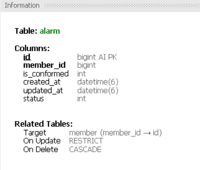
    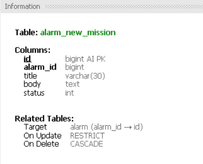<br>
    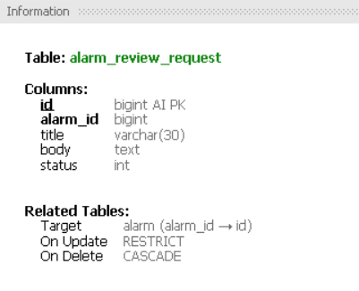
    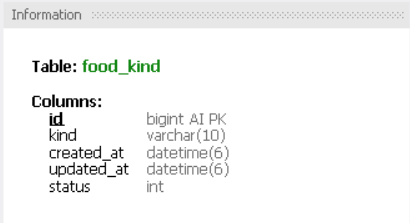<br>
    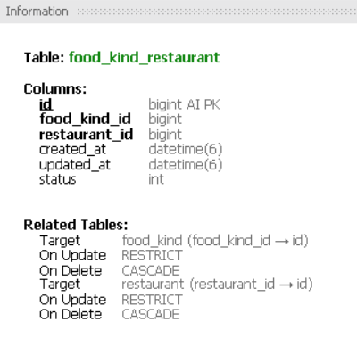
    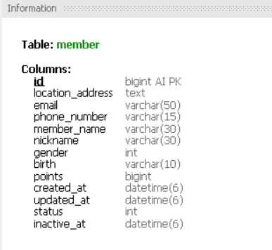<br>
    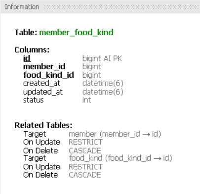
    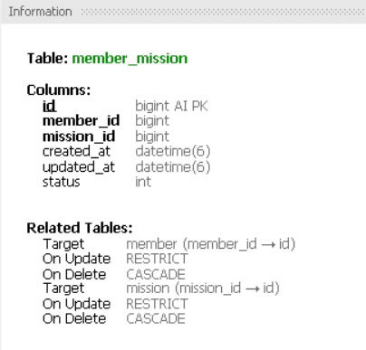<br>
    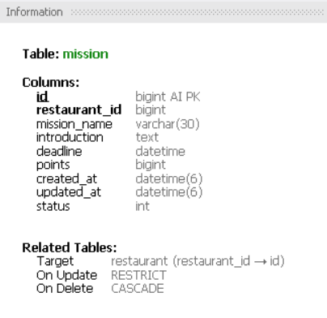
    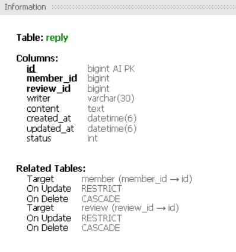<br>
    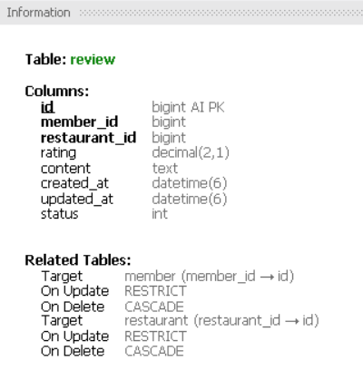
    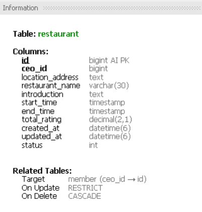<br>
    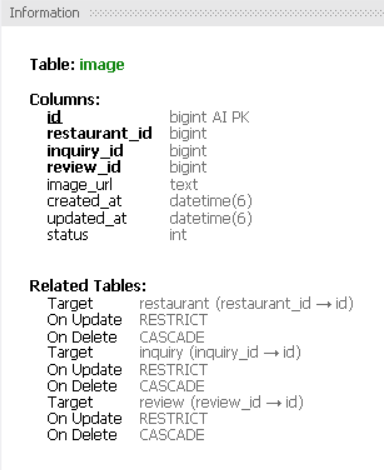
    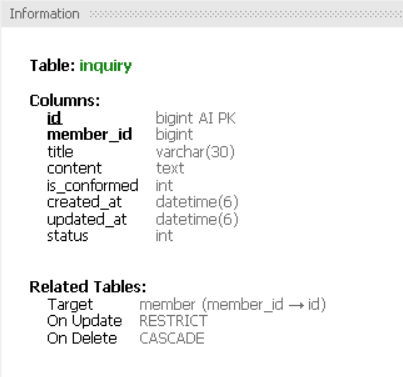<br><br>

> **깃허브 저장소 주소**
> 
> https://github.com/asjasj3964/UMC-7th-Node.js-Workbook
>
- 프로젝트 파일 구조<br>
    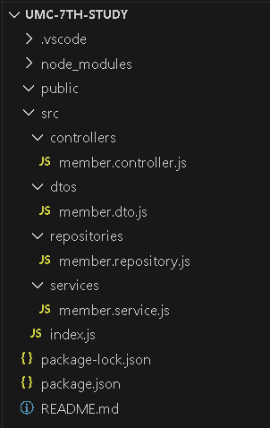
