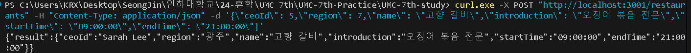
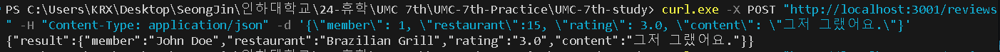
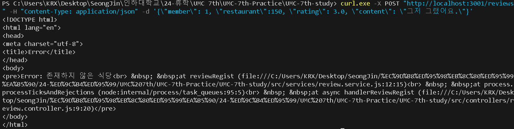
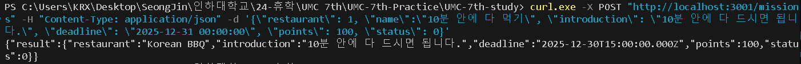
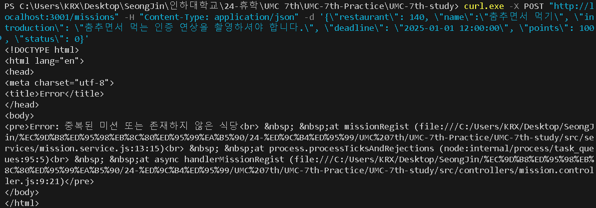
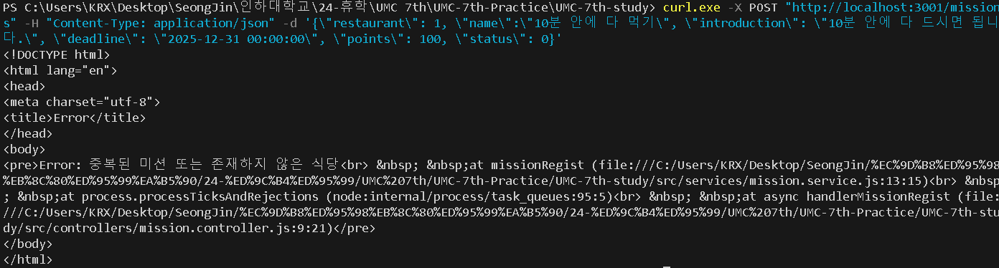
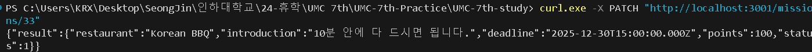
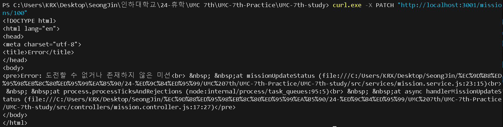

### 🔥 미션
---
> GitHub 저장소 주소<br/>
> [https://github.com/asjasj3964/UMC-7th-Node.js-Workbook](https://github.com/asjasj3964/UMC-7th-Node.js-Workbook)

<br/>모든 코드에 대해 설명을 하면 너무 길어질 것 같아 데이터 삽입 및 조회 과정이 있는 Repository 함수만 가져왔습니다.<br/>

1. 특정 지역에 식당 추가하기 API
    - Repository 함수
        ```javascript
        // 식당 데이터 삽입 (식당 등록) & 식당 ID 반환
        export const addRestaurant = async(data) => {
            const conn = await pool.getConnection();
            try{
                // 해당 위치의 식당(중복된 식당)의 사용자가 있는지 확인
                const [confirm] = await pool.query(
                    `SELECT EXISTS(SELECT 1 FROM restaurant WHERE region_id = ? and restaurant_name = ?) as isExistRestaurant`, 
                    [data.region, data.name] 
                );
                if (confirm[0].isExistRestaurant) { // 중복된 식당일 경우
                    return null;
                }
                // 식당 생성
                const [result] = await pool.query(
                    `INSERT INTO restaurant (ceo_id, region_id, restaurant_name, introduction, start_time, end_time) VALUES (?, ?, ?, ?, ?, ?);`,
                    [
                        data.ceoId,
                        data.region,
                        data.name,
                        data.introduction,
                        data.startTime,
                        data.endTime,
                    ]
                ); // 식당 데이터 삽입
                return result.insertId;
            }catch(err){
                throw new Error(`
                    🚫 오류 발생 🚫 
                    요청 파라미터 확인 바람 (${err})
                `);
            }finally{
                conn.release();
            }
        }

        // 식당 ID로 식당 조회
        export const getRestaurant = async(restaurantId) => {
            const conn = await pool.getConnection();
            try{
                const [restaurant] = await pool.query(
                    `SELECT * FROM restaurant WHERE id = ?`,
                    restaurantId
                )
                console.log(restaurant);
                if (restaurant.length == 0){
                    return null;
                }
                return restaurant;
            }catch (err){
                throw new Error(`
                    🚫 오류 발생 🚫 
                    요청 파라미터 확인 바람 (${err})
                `);
            }finally{
                conn.release();
            }
        }

        // 식당 - 지역 반환
        export const getrestaurantRegionByRestaurantId = async (restaurantId) => {
            const conn = await pool.getConnection();
            try{
                const [region] = await pool.query(`
                    SELECT rest.id, rest.region_id, re.address
                    FROM restaurant rest JOIN region re ON rest.region_id = re.id
                    WHERE rest.id = ?`,
                    restaurantId
                ); // restaurant 테이블과 region 테이블을 join해 해당 식당의 위치 정보를 조회한다. 
                return region;
            }catch(err){
                throw new Error(`
                    🚫 오류 발생 🚫 
                    요청 파라미터 확인 바람 (${err})
                `);
            }finally{
                conn.release();
            }
        }

        // 식당 ceo 반환
        export const getrestaurantCeoByCeoId = async (restaurantCeoId) => {
            const conn = await pool.getConnection();
            try{
                const [restaurantCeo] = await pool.query(`
                    SELECT rest.id, rest.ceo_id, mem.member_name
                    FROM restaurant rest JOIN member mem ON rest.ceo_id = mem.id
                    WHERE rest.ceo_id = ?`,
                    restaurantCeoId
                ); // restaurant 테이블과 member 테이블을 join해 해당 식당의 CEO(회원) 정보를 조회한다.
                return restaurantCeo;
            }catch(err){
                throw new Error(`
                    🚫 오류 발생 🚫 
                    요청 파라미터 확인 바람 (${err})
                `);
            }finally{
                conn.release();
            }
        }
        ```
    - 테스트 결과<br/>
        
    - 이미 등록된 식당을 등록할 경우<br/>
        
        - 같은 위치와 이름의 식당을 중복 등록할 수 없게 하였다.

2. 식당에 리뷰 추가하기 API
    - Repository 함수 
        ```javascript
        // 리뷰 데이터 삽입 (리뷰 등록) & 리뷰 ID 반환
        export const addReview = async(data) => {
            const conn = await pool.getConnection();
            try{
                // 리뷰를 추가하려는 가게가 존재하는지 검증
                const [confirm] = await pool.query(
                    `SELECT EXISTS(SELECT 1 FROM restaurant WHERE id = ?)as isExistRestaurant;`,
                    data.restaurant
                );
                if (!confirm[0].isExistRestaurant){ // 등록하려는 식당이 존재하지 않을 경우
                    return null;
                }
                // 리뷰 생성
                const [result] = await pool.query(
                    `INSERT INTO review (member_id, restaurant_id, rating, content) VALUES (?, ?, ?, ?);`,
                    [
                        data.member,
                        data.restaurant, 
                        data.rating,
                        data.content
                    ]
                ); // 리뷰 데이터 삽입
                return result.insertId;
            }catch(err){
                throw new Error(`
                    🚫 오류 발생 🚫 
                    요청 파라미터 확인 바람 (${err})
                `);
            }finally{
                conn.release();
            }
        }

        // 리뷰 ID로 리뷰 조회
        export const getReview = async(reviewId) => {
            const conn = await pool.getConnection();
            try{
                const[review] = await pool.query(
                    `SELECT * FROM review WHERE id = ?`,
                    reviewId
                )
                console.log(review);
                if (review.length == 0){
                    return null;
                }
                return review;
            }catch (err){
                throw new Error(`
                    🚫 오류 발생 🚫 
                    요청 파라미터 확인 바람 (${err})
                `);
            }finally{
                conn.release();
            }
        }

        // 리뷰 ID로 리뷰 등록한 식당의 이름 알아내기
        export const getReviewRestaurantByReviewId = async(reviewId) => {
            const conn = await pool.getConnection();
            try{
                const [review] = await pool.query(`
                    SELECT re.id, re.restaurant_id, rest.restaurant_name
                    FROM review as re JOIN restaurant rest ON re.restaurant_id = rest.id
                    WHERE re.id = ?`,
                    reviewId
                ); // review 테이블과 restaurant 테이블을 join해 해당 리뷰의 식당 정보를 조회한다.
                return review;
            }catch(err){
                throw new Error(`
                    🚫 오류 발생 🚫 
                    요청 파라미터 확인 바람 (${err})
                `);
            }finally{
                conn.release();
            }
        }

        // 리뷰 작성자 ID로 작성자의 이름 알아내기
        export const getReviewWriterByWriterId = async(reviewWriterId) => {
            const conn = await pool.getConnection();
            try{
                const [reviewWriter] = await pool.query(`
                    SELECT re.id, re.member_id, mem.member_name
                    FROM review as re JOIN member mem ON re.member_id = mem.id
                    WHERE re.member_id = ?`,
                    reviewWriterId
                ); // review 테이블과 member 테이블을 join해 해당 리뷰의 작성자(회원) 정보를 조회한다.
                return reviewWriter;
            }catch(err){
                throw new Error(`
                    🚫 오류 발생 🚫 
                    요청 파라미터 확인 바람 (${err})
                `);
            }finally{
                conn.release();
            }
        }
        ```
    - 테스트 결과<br/>
        
    - 존재하지 않는 식당에 등록할 경우<br/>
        
        - 존재하지 않는 ID(150)의 식당에 리뷰를 등록할 경우 에러를 발생시켰다. 
3. 식당에 미션 추가하기 API
    - Repository 함수 
        ```javascript
        // 미션 데이터 삽입 (미션 등록) & 미션 ID 반환 
        export const addMission = async(data) => {
            const conn = await pool.getConnection();
            try{
                // 등록하려는 식당 ID, 미션 이름, 미션 내용과 모두 일치하는 중복 미션이 존재하는지 확인
                const [confirm1] = await pool.query(
                    `SELECT EXISTS(SELECT 1 FROM mission WHERE restaurant_id = ? and mission_name = ? and introduction = ?) as isExistMission;`,
                    [data.restaurant, data.name, data.introduction]
                );
                // 등록하려는 식당이 존재하는지 확인
                const [confirm2] = await pool.query(
                    `SELECT EXISTS(SELECT 1 FROM restaurant WHERE id = ?) as isExistRestaurant;`,
                    data.restaurant
                );
                // 중복 미션이 있거나 식당이 존재하지 않을 시
                if (confirm1[0].isExistMission || (!confirm2[0].isExistRestaurant)){
                    return null;
                }
                // 미션 생성
                const [result] = await pool.query( 
                    `INSERT INTO mission (restaurant_id, mission_name, introduction, deadline, points) VALUES (?, ?, ?, ?, ?);`,
                    [data.restaurant, data.name, data.introduction, data.deadline, data.points]
                ); // 미션 데이터 삽입
                return result.insertId;
            }catch(err){
                throw new Error(`
                    🚫 오류 발생 🚫 
                    요청 파라미터 확인 바람 (${err})
                `);
            }finally{
                conn.release();
            }
        }

        // 미션 ID로 미션 조회
        export const getMission = async(missionId) => {
            const conn = await pool.getConnection();
            try{
                const[mission] = await pool.query(
                    `SELECT * FROM mission WHERE id = ?`,
                    missionId
                );
                console.log(mission);
                if (mission.length == 0){
                    return null;
                }
                return mission;
            }catch (err){
                throw new Error(`
                    🚫 오류 발생 🚫 
                    요청 파라미터 확인 바람 (${err})
                `);
            }finally{
                conn.release();
            }
        }

        // 미션 ID로 식당 조회
        export const getRestaurantByMissionId = async(missionId) => {
            const conn = await pool.getConnection();
            try{
                const [restaurant] = await pool.query(`
                    SELECT mi.id, mi.restaurant_id, rest.restaurant_name
                    FROM mission mi JOIN restaurant rest ON mi.restaurant_id = rest.id
                    WHERE mi.id = ?`,
                    missionId
                ); // mission 테이블과 restaurant 테이블을 join해 해당 회원의 식당 정보를 조회한다. 
                return restaurant;
            }catch(err){
                throw new Error(`
                    🚫 오류 발생 🚫 
                    요청 파라미터 확인 바람 (${err})
                `);
            }finally{
                conn.release();
            }
        }
        ```
    - 테스트 결과<br/>
        
    - 존재하지 않는 식당에 미션을 등록할 경우<br/>
        
        - 존재하지 않는 ID(140)의 식당에 미션을 등록할 경우 에러를 발생시켰다.
    - 이미 등록된 미션을 등록할 경우<br/>
        
        - 같은 식당, 미션명, 미션 설명의 미션을 중복 등록할 수 없게 하였다.
4. 가게의 미션을 도전 중인 미션에 추가하기 API
    - Repository 함수 
        ```javascript
        // 특정 미션 상태 업데이트(진행 X -> 진행 중)
        export const updateMissionStatus = async(missionId) => {
            const conn = await pool.getConnection();
            try{
                // 업데이트할 미션이 존재하는지 미션 ID로 조회하여 확인
                const [confirm1] = await pool.query(
                    `SELECT EXISTS(SELECT 1 FROM mission WHERE id = ?) as isExistMission;`,
                    missionId
                );
                // 해당 미션의 상태를 확인하기 위해 status 선택
                const [confirm2] = await pool.query(
                    `SELECT status FROM mission WHERE id = ?`,
                    missionId
                );
                // 해당 미션이 존재하지 않거나 상태가 진행 X가 아닐 경우
                if((!confirm1[0].isExistMission) || (confirm2[0].status != 0)){
                    return null;
                }
                // 해당 미션의 status 값을 1(진행 중)로 변경
                await pool.query(`
                    UPDATE mission SET status = 1 WHERE id = ?;`,
                    missionId
                );
                // 미션 ID로 조회해서 해당 미션 정보를 모두 조회한다.
                const [mission] = await pool.query(`
                    SELECT * FROM mission WHERE id = ?;`,
                    missionId
                )
                return mission;
            }catch(err){
                throw new Error(`
                    🚫 오류 발생 🚫 
                    요청 파라미터 확인 바람 (${err})
                `);
            }finally{
                conn.release();
            }
        }
        ```
    - 테스트 결과 <br/>
        
        - 미션 3에서 등록한 미션(도전하기 전의 상태(0))을 진행 중으로 업데이트 하였다. 
    - 도전할 수 없는 미션(이미 진행 중이거나 완료한 미션)의 경우
        
        - 방금 전에 업데이트 시킨 미션(이미 진행 중인 상태)을 또 테스트 해보았다.
        - 미션의 상태(status)가 0(진행하기 전)이 아닐 경우엔 에러를 발생시켰다. 
    - 존재하지 않는 미션을 업데이트할 경우
        
        - 업데이트 하려는 미션의 ID로 조회했을 때 존재하지 않을 경우엔 에러를 발생시켰다. 