### 🔥 미션
---
> GitHub 저장소 주소<br/>
> [https://github.com/asjasj3964/UMC-7th-Node.js-Workbook](https://github.com/asjasj3964/UMC-7th-Node.js-Workbook)

1. 5주차 때 작성했던 API를 Prisma ORM을 사용하여 구현하기
    1. 특정 지역에 식당 추가하기 API
        - Repository 함수 수정
            ```javascript
            // 식당 데이터 삽입 (식당 등록) & 식당 ID 반환 
            export const addRestaurant = async(data) => {
                // 등록하고자 하는 식당의 이름과 위치가 같은 중복 식당이 존재하는지 확인
                const restaurant = await prisma.restaurant.findFirst({
                    where: {
                        name: data.name, 
                        regionId: data.region
                    }
                });
                if (restaurant){ // 중복 식당일 경우
                    return null;
                }
                const created = await prisma.restaurant.create({
                    data: {
                        ...data,
                        region: {
                            connect: { id: data.region } // region 테이블 관계 연결
                        },
                        ceo: {
                            connect: { id: data.ceo }  // ceo(member) 테이블 관계 연결
                        }, 
                    }
                });
                return created.id;
            }

            // 식당 ID로 식당 조회
            export const getRestaurant = async(restaurantId) => {
                const restaurant = await prisma.restaurant.findFirstOrThrow({ 
                    select: {
                        id: true,
                        ceo: true,
                        region: true,
                        name: true,
                        introduction: true, 
                        startTime: true,
                        endTime: true,
                        totalRating: true,
                    },
                    where: { id: restaurantId }
                });
                    const formattedRestaurant = {
                        ...restaurant,
                        id: restaurant.id.toString(),
                        region: {
                            id: restaurant.region.id.toString(),
                            address: restaurant.region.address,
                        },
                        ceo: {
                            id: restaurant.ceo.id.toString(),
                            name: restaurant.ceo.name.toString()
                        }
                    };
                return formattedRestaurant;
            }
            ```
        - 테스트 결과<br/>
            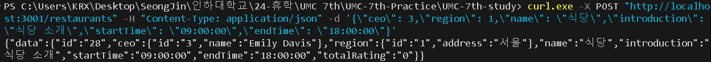
        - 이미 등록된 식당을 등록할 경우<br/>
            
            - 같은 위치와 이름의 식당을 중복 등록할 수 없게 하였다.

    2. 식당에 리뷰 추가하기 API
        - Repository 함수 수정
            ```javascript
            // 리뷰 데이터 삽입 (리뷰 등록) & 리뷰 ID 반환
            export const addReview = async(data) => {
                // 리뷰를 추가하려는 식당이 존재하는지 검증
                const restaurant = await prisma.restaurant.findFirst( {
                    where: {
                        id: data.restaurant // 등록할 식당의 ID를 가진 가게가 있는지 확인
                    }
                })
                if (restaurant == null){ // 해당 식당이 존재하지 않다면
                    return null;
                } 
                const created = await prisma.review.create({
                    data: {
                        ...data,
                        member: {
                            connect: { // member 테이블과 관계 연결
                                id: data.member
                            }
                        },
                        restaurant:{
                            connect: { // restaurant 테이블과 관계 연결
                                id: data.restaurant
                            }
                        }
                    }
                });
                return created.id;
            }

            // 리뷰 ID로 리뷰 조회
            export const getReview = async(reviewId) => {
                const review = await prisma.review.findFirstOrThrow({
                    select: {
                        id: true,
                        member: true,
                        restaurant: true,
                        rating: true,
                        content: true,
                        createdAt: true,
                        status: true
                    },
                    where: {
                        id: reviewId
                    }
                });
                const formattedReview = {
                    ...review,
                    id: review.id.toString(),
                    member: {
                        id: review.member.id.toString(),
                        name: review.member.name,
                    },
                    restaurant: {
                        id: review.restaurant.id.toString(),
                        name: review.restaurant.name,
                    },
                }
                return formattedReview;
            }
            ```
        - 테스트 결과<br/>
            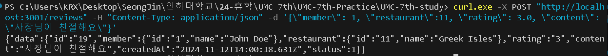
        - 존재하지 않는 식당에 등록할 경우<br/>
            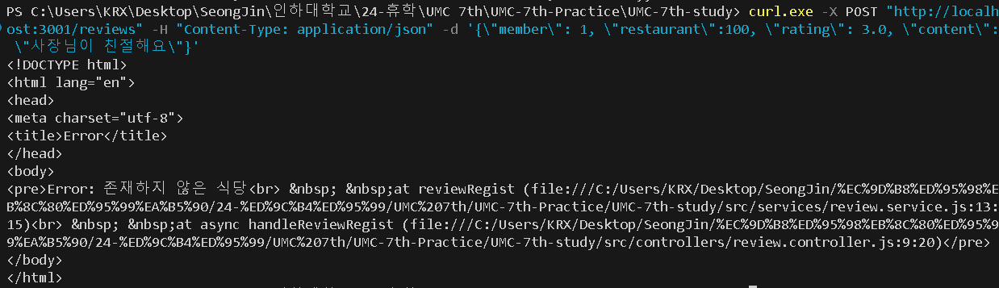
            - 존재하지 않는 ID(100)의 식당에 리뷰를 등록할 경우 에러를 발생시켰다. 
    3. 식당에 미션 추가하기 API
        - Repository 함수 수정
            ```javascript
            // 미션 데이터 삽입 (미션 등록) & 미션 ID 반환 
            export const addMission = async(data) => {
                // 등록하려는 식당 ID, 미션 이름, 미션 내용과 모두 일치하는 중복 미션이 존재하는지 확인
                const mission = await prisma.mission.findFirst({
                    where: {
                        restaurantId: data.restaurant, 
                        name: data.name, 
                        introduction: data.introduction
                    }
                });
                // 등록하려는 식당이 존재하는지 확인
                const restaurant = await prisma.restaurant.findFirst({
                    where: {
                        id: data.restaurant
                    }
                });
                if (mission != null || restaurant == null){ // 중복 미션이 있거나 식당이 존재하지 않을 시 
                    return null;
                }
                const created = await prisma.mission.create({ // 미션 생성
                    data: { // 생성할 데이터 객체
                        ...data, // 매개변수로 전달 받은 data 객체의 모든 속성을 복사한다.
                        restaurant: {
                            connect: { id: data.restaurant } // restaurant 테이블과 관계 연결
                        }
                    }
                });
                return created.id; // 생성된 미션 ID 반환
            }

            // 미션 ID로 미션 조회
            export const getMission = async(missionId) => {
                const mission = await prisma.mission.findFirstOrThrow({ 
                    select: {
                        id: true,
                        restaurant: true,
                        name: true,
                        introduction: true,
                        deadline: true,
                        points: true,
                        status: true
                    },
                    where: { id: missionId }});

                const formattedMission = {
                    ...mission,
                    id: mission.id.toString(),
                    points: mission.points.toString(),
                    restaurant: {
                        id: mission.restaurant.id.toString(),
                        name: mission.restaurant.name,
                    },
                };
                console.log(formattedMission);
                return formattedMission;
            }
            ```
        - 테스트 결과<br/>
            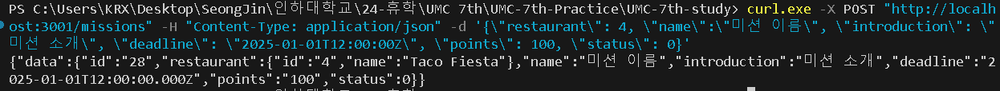
        - 존재하지 않는 식당에 미션을 등록할 경우<br/>
            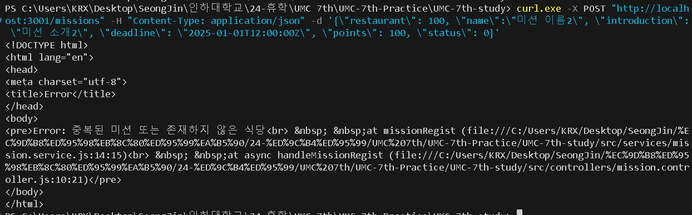
            - 존재하지 않는 ID(100)의 식당에 미션을 등록할 경우 에러를 발생시켰다.
        - 이미 등록된 미션을 등록할 경우<br/>
            
            - 같은 식당, 미션명, 미션 설명의 미션을 중복 등록할 수 없게 하였다.
    4. 가게의 미션을 도전 중인 미션에 추가하기 API
        - Repository 함수 수정
            ```javascript
            // 특정 미션 상태 업데이트(진행 X -> 진행 중)
            export const updateMissionStatus = async(missionId) => {
                // 업데이트할 미션이 존재하는지 확인
                const mission = await prisma.mission.findFirst({
                    where: {
                        id: missionId
                    }
                });
                // 해당 미션의 상태를 확인하기 위해 status 선택
                const missionStatus = await prisma.mission.findFirst({
                    select: {
                        status: true
                    },
                    where: {
                        id: missionId
                    }
                });
                // 해당 미션이 존재하지 않거나 상태가 진행 X가 아닐 경우
                if (mission == null || missionStatus.status != 0){
                    return null;
                }
                const missionUpdated = await prisma.mission.update({
                    where: {
                        id: missionId
                    },
                    data: {
                        status: 1 // status 값을 1(진행 중)로 변경
                    },
                    select: {
                        id: true, 
                        restaurant: true,
                        name: true,  
                        introduction: true, 
                        deadline: true, 
                        points: true,
                        status: true,
                    }
                });
                const formattedMission = {
                    ...missionUpdated,
                    id: missionUpdated.id.toString(),
                    points: missionUpdated.points.toString(),
                    restaurant: {
                        id: missionUpdated.restaurant.id.toString(),
                        name: missionUpdated.restaurant.name
                    },
                };

                return formattedMission;
            }
            ```
        - 업데이트하기 전(진행 X)의 데이터<br/> 
            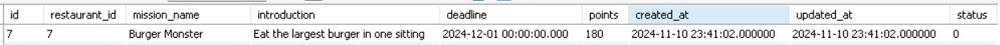
        - 테스트 결과 <br/>
            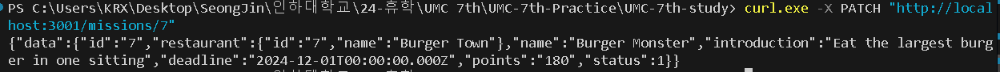
        - 도전할 수 없는 미션(이미 진행 중이거나 완료한 미션)의 경우
            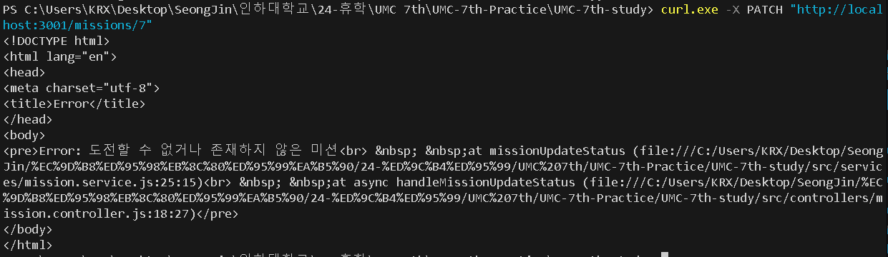
            - 방금 전에 업데이트 시킨 미션(이미 진행 중인 상태)을 또 테스트 해보았다.
            - 미션의 상태(status)가 0(진행하기 전)이 아닐 경우엔 에러를 발생시켰다. 
        - 존재하지 않는 미션을 업데이트할 경우
            
            - 업데이트 하려는 미션의 ID로 조회했을 때 존재하지 않을 경우엔 에러를 발생시켰다. 
2. 특정 회원이 작성한 리뷰 목록 조회 API
    - Repository 함수
        ```javascript
        // 특정 회원의 모든 리뷰 조회
        export const getAllMemberReviews = async(memberId, cursor) => {
            const reviews = await prisma.review.findMany({
                select: {
                    id: true,
                    member: true, // 참조하는 member 테이블
                    restaurant: true, // 참조하는 restaurantn 테이블
                    rating: true,
                    content: true,
                    status: true
                },
                where: { memberId: memberId, id: { gt: cursor }},
                // 리뷰의 ID가 cursor보다 큰 레코드만 가져온다. 
                // gt: "greater than", 값이 cursor보다 큰 데이터를 필터링한다. (페이징 구현)
                orderBy: { id: "asc"}, // ID 기준 오름차순 정렬
                take: 5, // 5개의 레코드만 조회
            })

            // review 객체의 형변환 (BigInt 처리를 위함)
            const formattedReviews = reviews.map(review => ({ // reviews(DB에서 추출한 리뷰 데이터) 배열을 map() 메서드로 각 review 객체 변환
                ...review, // review 객체의 모든 속성 복사
                id: review.id.toString(),
                // DB의 id 필드가 BigInt 타입으로 정의되어 있는데
                // javaScript에선 BigInt 타입은 JSON으로 변환할 수 없어
                // BigInt 타입의 id를 문자열로 변환해주었다. 
                member: { // 참조하는 member 테이블에서 추출할 속성
                    id: review.member.id.toString(),
                    name: review.member.name,
                    nickname: review.member.nickname,
                    birth: review.member.birth,
                    gender: review.member.gender,
                    location: review.member.location,
                    phoneNumber: review.member.phoneNumber
                },
                restaurant: { // 참조하는 restaurant 테이블에서 추출할 속성
                    id: review.restaurant.id.toString(),
                    name: review.restaurant.name
                },
            }));
            
            return formattedReviews;
        }
        ```
    - 테스트 결과<br/>
        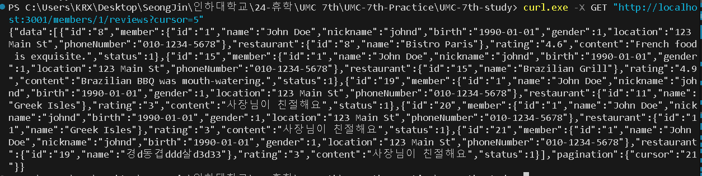
3. 특정 식당의 미션 목록 조회 API
    - Repository 함수
        ```javascript
        // 특정 식당의 모든 미션 조회
        export const getAllRestaurantMissions = async(restaurantId, cursor) => {
            const missions = await prisma.mission.findMany({
                select: {
                    id: true,
                    restaurant: true,
                    points: true,
                    name: true,
                    introduction: true,
                    status: true
                },
                where: { restaurantId: restaurantId, id: { gt: cursor }},
                orderBy: { id: "asc" },
                take: 5
            })
            const formattedMissions = missions.map(mission => ({
                ...mission,
                id: mission.id.toString(),
                points: mission.points.toString(),
                restaurant: {
                    id: mission.restaurant.id.toString(),
                    name: mission.restaurant.name
                },
            }));

            return formattedMissions;
        }
        ```
    - 테스트 결과<br/>
        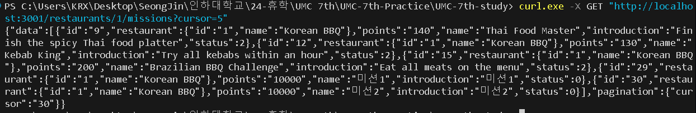
4. 특정 회원의 진행 중인 미션 목록 조회 API
    - Repository 함수
        ```javascript
        // 특정 회원의 모든 진행 중인 미션 조회
        export const getAllMemberMissions = async(memberId, cursor) => {
            const memberMissions = await prisma.memberMission.findMany({
                select: {
                    id: true,
                    member: true,
                    mission: true,
                },
                where: { 
                    memberId: memberId, 
                    mission: {
                        status: 1 // mission 객체의 status가 1(진행 중)인 미션들만 조회온다.
                    },
                    id: {gt: cursor}
                },
                orderBy: {id: "asc"},
                take: 5
            })

            const formattedMemberMissions = memberMissions.map(memberMission => ({
                ...memberMission,
                id: memberMission.id.toString(),
                member: {
                    id: memberMission.member.id.toString(),
                    nickname: memberMission.member.nickname,
                },
                mission: {
                    id: memberMission.mission.id.toString(),
                    restaurantId: memberMission.mission.restaurantId.toString(),
                    name: memberMission.mission.name,
                    introduction: memberMission.mission.introduction,
                    points: memberMission.mission.points.toString(),
                    deadline: memberMission.mission.deadline,
                    status: memberMission.mission.status,
                    
                },
            }));
            
            return formattedMemberMissions;
        }
        ```
    - 테스트 결과<br/>
        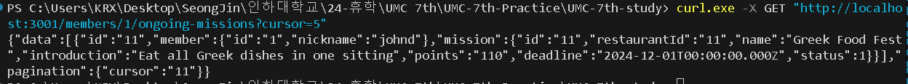
5. 특정 회원의 진행 중인 미션을 진행 완료로 바꾸기 API
    - Repository 함수
        ```javascript
        // 특정 회원의 특정 미션의 상태 업데이트(진행 중 -> 진행 완료)
        export const updateMissionCompleted = async(memberId, missionId) => {
            // 특정 회원에 주어진 특정 미션이 존재하는지 확인
            const confirmMemberMission = await prisma.memberMission.findFirst({
                where: {
                    missionId: missionId,
                    memberId: memberId
                }
            })

            // 해당 미션의 상태를 확인하기 위해 status 선택
            const missionStatus = await prisma.mission.findFirst({
                select: {
                    status: true
                },
                where: {
                    id: missionId
                }
            })

            // 해당 미션이 존재하지 않거나 미션의 상태가 1(진행 중)이 아닐 경우 에러 처리
            if (confirmMemberMission == null || missionStatus.status != 1){
                return null;
            }
            
            const memberMission = await prisma.memberMission.update({
                where: {
                    // update 메서드는 지정한 Unique key를 사용하여 레코드를 찾기 때문에 
                    // memberId, missionId로 이루어진 복합 고유 키인 memberId_missionId_unique을 만들어주었다. 
                    memberId_missionId_unique: {
                        memberId: memberId,
                        missionId: missionId
                    } 
                },
                data: { // 수정할 내용 정의
                    mission:{
                        update:{ // mission의 특정 속성 업데이트
                            status: 2 // 진행 완료로 업데이트
                        }
                }},
                select: { // 반환할 특정 속성 지정
                    id: true,
                    member: true,
                    mission: true,
                }
            })

            const formattedMemberMissions = {
                ...memberMission,
                id: memberMission.id.toString(),
                member: {
                    id: memberMission.member.id.toString(),
                    nickname: memberMission.member.nickname,
                },
                mission: {
                    id: memberMission.mission.id.toString(),
                    restaurantId: memberMission.mission.restaurantId.toString(),
                    name: memberMission.mission.name,
                    introduction: memberMission.mission.introduction,
                    points: memberMission.mission.points.toString(),
                    deadline: memberMission.mission.deadline,
                    status: memberMission.mission.status,
                },
            };

            return formattedMemberMissions;
        }
        ```
    - 업데이트하기 전(진행 중)의 데이터<br/> 
        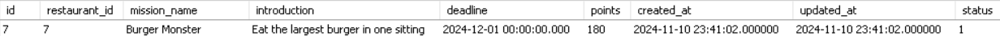
        - 미션 1-4에서 진행 중으로 바꾼 미션을 진행 완료로 업데이트 해보겠다. 
    - 테스트 결과 <br/>
        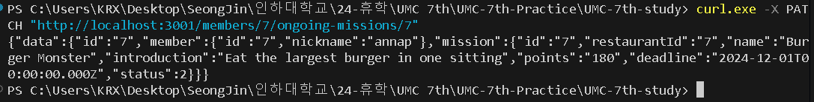
    - 완료할 수 없는 미션(진행하지도 않았거나 이미 완료한 미션)의 경우
        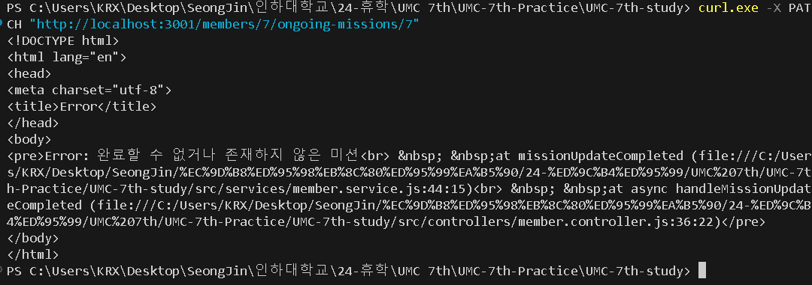
        - 방금 전에 업데이트 시킨 미션(이미 진행완료인 상태)을 또 테스트 해보았다. 
        - 미션의 상태(status)가 1(진행 중)이 아닐 경우엔 에러를 발생시켰다. 
    - 특정 회원에게 할당되지 않은 미션을 업데이트할 경우
        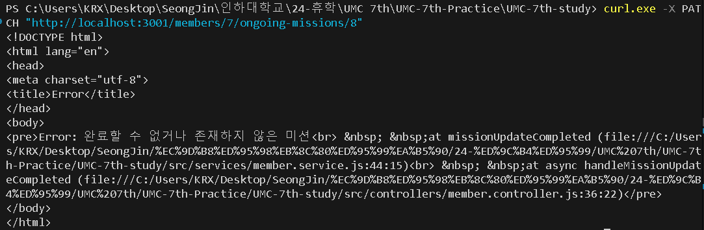
        - 회원의 ID 및 미션의 ID로 조회했을 때 존재하지 않을 경우엔 에러를 발생시켰다.