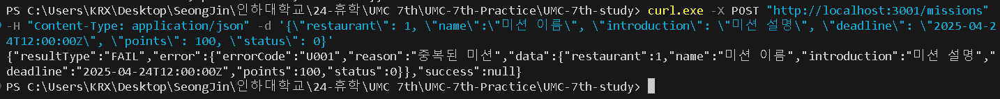
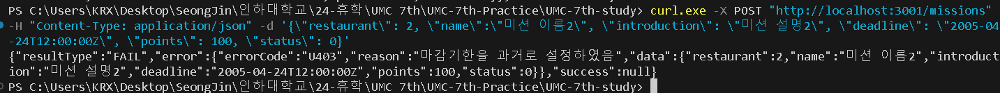
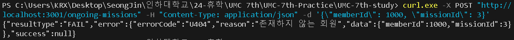
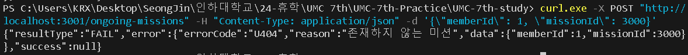
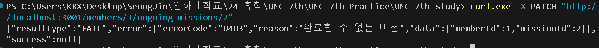
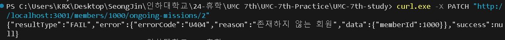

### 🔥 미션
---
> GitHub 저장소 7주차 브랜치 주소<br/>
> [https://github.com/asjasj3964/UMC-7th-Node.js-Workbook/tree/feature/express-middleware-handling](https://github.com/asjasj3964/UMC-7th-Node.js-Workbook/tree/feature/express-middleware-handling)

1. Error 객체 추가
    ```javascript
    // 중복 데이터 에러 처리
    export class DuplicateError extends Error{
        errorCode = "U001"; // 인증 문제 또는 잘못된 사용자 요청 (권한 부족)
        constructor(reason, data){
            super(reason);
            this.reason = reason;
            this.data = data;
        }
    }
    
    // 처리할 데이터의 특정 조건이 만족되지 않을 경우 에러 처리
    export class CannotHandleError extends Error{
        errorCode = "U403" // Forbidden, 클라이언트가 요청한 작업을 수행할 수 없을 때
        constructor(reason, data){
            super(reason);
            this.reason = reason;
            this.data = data;
        }
    }
    
    // 조회할 수 없는(정의되지 않은) 데이터 에러 처리
    export class NotExistError extends Error{
        errorCode = "U404" // 404 Not Found, 해당 리소스를 찾을 수 없음
        constructor(reason, data){
            super(reason);
            this.reason = reason;
            this.data = data;
        }
    }
    
    // 서버 내부의 에러 처리
    export class ServerError extends Error{
        errorCode = "U500" // Internal Server Error, 서버 내부에서 예상치 못한 오류 발생
        constructor(reason){
            super(reason);
            this.reason = reason;
        }
    }
    ```
    1. 403 Forbidden
        - 서버가 요청을 이해했으나 권한이 없어 접근이 금지될 경우에 발생한다.
        - 클라이언트가 요청한 작업을 수행할 수 없음을 나타낸다.
        - 이 API에서는 처리할 데이터의 특정 조건이 만족되지 않을 때 에러 처리하도록 적용하였다.
            - ex. 특정 회원의 미션 상태가 진행 중이 아닐 때 작업을 수행할 수 없다.
    2. 404 Not Found
        - 클라이언트가 요청한 리소스를 찾을 수 없다.
        - 이 API에서는 조회할 수 없는(정의되지 않은) 데이터를 에러 처리하도록 적용하였다.
            - ex. 존재하지 않는 회원 ID로 특정 회원의 정보를 조회할 경우
    3. 500 Internal Server Error
        - 서버에서 예상치 못한 오류가 발생하였다.
        - 이 API에서는 서버의 코드에 문제가 있어 요청을 처리할 수 없을 때 에러 처리하도록 적용하였다.
            - ex. 서버 코드에 오타가 있을 경우<br/>
                                
                - err.stack으로 오류의 스택 추적 정보를 출력하였다.
                - 위의 에러는 update를 uupdate로 잘못 써서 발생한 서버 내부 오류이다.
2. 실습 - 회원가입 에러 핸들링 추가
    1. 사용자가 유효하지 않은 음식 종류의 ID를 입력했을 경우 
        ```javascript
        // src/services/member.service.js
        
        export const memberSignUp = async(data) => {
        		// 등록하려는 음식 종류가 존재하지 않을 경우 에러 처리
            for (const foodKindId of data.favoriteFoodKinds){ // 입력한 음식 종류들을 각각 검사한다.
                const foodKind = await getFoodKind(foodKindId)
                if (foodKind === null){ // 존재하지 않는 음식 종류일 경우 
                    throw new NotExistError("존재하지 않는 음식 종류", data); 
                }
            }
        	...
        }
        ```
    2. 테스트 결과
        - 유효하지 않은 음식 종류를 입력했을 경우<br/>
            
3. 미션 - 기존에 구현했던 API의 응답 통일시키기
    - 모든 레파지토리의 getOOO 함수에서 특정 ID로 조회했을 때 데이터가 존재하지 않을 경우엔 null을 반환하도록 하였다.
    - DB의 데이터를 수정, 조회, 삽입하는 레파지토리에서 try/catch 문을 사용해 서버 내부 오류가 존재하는지 체크하였다. (사소한 오타, 잘못된 데이터 처리 등)
        - ex. 음식 종류 ID로 해당 음식 종류가 유효한지 검사
            ```javascript
            // 특정 음식 종류 조회
            export const getFoodKind = async(foodKindId) => {
                try{
                    // 음식 종류 ID로 조회했을 때 해당 음식 종류가 존재하는지 확인
                    const foodkind = await prisma.foodKind.findFirst({where: {id: foodKindId}}); 
                    if (foodkind == null){ // 해당 음식 종류가 없다면
                        return null;
                    }
                    return foodkind;
                }
                catch(err){
                    throw new ServerError(`서버 내부 오류: ${err.stack}`);
                }
            };
            ```
            - DB에서 해당 음식 종류 ID로 조회했을 때 존재하는지 검사
            - 존재하지 않다면 null을 반환하도록 한다.
            - 이외의 에러를 체크하기 위해 try/catch문으로 묶고 에러가 있다면 ServerError 객체를 던진다.
    - 유효 검사는 최대한 service에서 하도록 수정하였다.
    1. 식당을 등록할 경우
        1. 에러 핸들링
            ```javascript
            // src/repositories/restaurant.repository.js
            
            export const addRestaurant = async(data) => {
                try{
                    // 등록하고자 하는 식당의 이름과 위치가 같은 중복 식당이 존재하는지 확인
                    const restaurant = await prisma.restaurant.findFirst({
                        where: {
                            name: data.name, 
                            regionId: data.region
                        }
                    });
                    if (restaurant){ // 중복 식당일 경우
                        return null;
                    }
                    ...
                    return created.id;
                }
                catch(err){
                    throw new ServerError(`서버 내부 오류: ${err.stack}`);
                }
            }
            ```
            - 식당을 등록하기 이전에 restaurant 테이블에 동일한 위치와 이름을 가진 식당이 있는지 검사하고 중복 식당이 존재한다면 null을 반환하도록 하였다.
            ```javascript
            // src/services/restaurant.service.js
            
            export const restaurantRegist = async(data) => {
                // 해당 CEO가 등록되어있지 않을 경우 에러 처리
                const ceo = await getMember(data.ceo);
                if (ceo === null){
                    throw new NotExistError("존재하지 않는 CEO", data); // 동일한 식당을 등록하는 것을 방지
                }
                // 해당 위치가 유효하지 않을 경우 에러 처리
                const region = await getRegion(data.region);
                if (region === null){
                    throw new NotExistError("유효하지 않은 위치", data);
                }
                // 등록하려는 음식 종류가 존재하지 않을 경우 에러 처리
                for (const foodKind of data.foodKinds){
                    const confirmFoodKind = await getFoodKind(foodKind)
                    if (confirmFoodKind === null){ 
                        throw new NotExistError("존재하지 않는 음식 종류", data); 
                    }
                }
                const registRestaurantId = await addRestaurant({
                    ceo: data.ceo,
                    region: data.region,
                    name: data.name,
                    introduction: data.introduction,
                    startTime: data.startTime,
                    endTime: data.endTime
                })
                // 중복된 식당(동일한 위치, 이름의 식당)일 경우 에러 처리
                if (registRestaurantId === null){
                    throw new DuplicateError("중복된 식당", data); // 동일한 식당을 등록하는 것을 방지
                }
            		...
            }
            ```
            - getMember을 사용해 CEO ID로 조회했을 경우 null을 반환 받았다면(등록되어 있지 않은 CEO를 조회한 것) 에러 메시지와 그 데이터를 던져 에러 처리(NotExistError)하였다.
            - getRegion을 사용해 위치 ID로 조회했을 경우 null을 반환 받았다면(등록되어 있지 않은 위치로 조회한 것) 에러 처리하였다.
            - getFoodKind를 사용해 입력한 음식 종류들을 각각의 ID로 조회했을 경우 null을 반환 받았다면 에러 처리하였다.
            - addRestaurant에서 null을 반환받았다면 이미 동일한 식당이 있다는 것이므로 에러 처리(DuplicateError)하였다.
        2. 테스트 결과
            - 성공적으로 식당을 등록하였을 경우<br/>
                
            - 중복된 식당을 등록하려고 할 경우 (위에서 등록한 식당을 또 입력)<br/>
                
            - 유효하지 않은 위치(region:200)에 식당을 등록하려고 할 경우<br/>
                
            - 존재하지 않는 CEO(ceo: 1000)로 식당을 등록하려고 할 경우<br/>
                
    2. 리뷰를 등록할 경우
        1. 에러 핸들링
            ```javascript
            // src/services/review.service.js
            
            export const reviewRegist = async(data) => {
                // 리뷰를 추가하려는 식당이 존재하는지 검증
                const restaurant = await getRestaurant(data.restaurant);
                if (restaurant === null){ // 해당 식당이 존재하지 않다면
                    throw new NotExistError("존재하지 않은 식당", data); 
                }
                // 해당 회원이 존재하지 않을 경우 에러 처리
                const member = await getMember(data.member);
                if (member === null){
                    throw new NotExistError("존재하지 않는 회원", data)
                }
                ...
            }
            ```
            - 식당을 등록할 떄와 마찬가지로 레파지토리의 get 함수에서 리뷰를 추가할 식당과 해당 회원이 존재하는지 검사하였고 존재하지 않다면 NotExistError를 던져 에러 처리하였다.
        2. 테스트 결과
            - 성공적으로 리뷰를 등록하였을 경우<br/>
                
            - 존재하지 않은 회원으로 리뷰를 등록하려고 할 경우<br/>
                
            - 존재하지 않은 식당에 리뷰를 등록하려고 할 경우<br/>
                
    3. 미션을 등록할 경우
        1. 에러 핸들링
            ```javascript
            // src/repositories/mission.repository.js
            
            export const addMission = async(data) => {
                try{
                    const currentDateTime = new Date().toISOString(); // 현재 날짜 및 시간 (YYYY-MM-DDTHH:mm:ss.sssZ 형식)
                    if (currentDateTime > data.deadline){ // 설정한 마감기한이 현재 날짜 및 시간보다 이전일 경우
                        return -2
                    }
                    // 등록하려는 식당 ID, 미션 이름, 미션 내용, 미션 마감기한과 모두 일치하는 중복 미션이 존재하는지 확인
                    const mission = await prisma.mission.findFirst({
                        where: {
                            restaurantId: data.restaurant, 
                            name: data.name, 
                            introduction: data.introduction,
                            deadline: data.deadline,
                        }
                    });        
                    // 중복 미션이 있을 경우
                    if (mission != null) {
                        return -1;
                    }
                    ...
                    return created.id; // 생성된 미션 ID 반환
                }
                catch(err){
                    throw new ServerError(`서버 내부 오류: ${err.stack}`);
                }
            }
            ```
            - 미션을 등록하기 이전에 Date 객체로 현재 날짜 및 시간을 ISO 8601 형식으로 변환해 받고 등록하려는 미션의 마감기한이 현재 날짜보다 이전일 경우 -2를 반환한다.
            - mission 테이블에 동일한 식당 ID, 미션 이름, 미션 내용, 마감기한을 가진 미션이 있는지 검사하고 중복 미션이 존재한다면 -1을 반환하도록 하였다.
            ```javascript
            // src/services/mission.service.js
            
            export const missionRegist = async(data) => {
                // 해당 식당이 존재하지 않을 경우 에러 처리
                const confirmRestaurant = await getRestaurant(data.restaurant);
                if (confirmRestaurant === null){
                    throw new NotExistError("존재하지 않은 식당", data); 
                }
                const registMissionId = await addMission({
                    restaurant: data.restaurant,
                    name: data.name,
                    introduction: data.introduction,
                    deadline: data.deadline,
                    points: data.points
                })
                // 미션의 마감기한을 과거로 설정하였을 경우 에러 처리
                if (registMissionId === -2){
                    throw new CannotHandleError("마감기한을 과거로 설정하였음", data); 
                }
                // 중복된 미션(동일한 식당, 미션명, 미션 설명, 마감기한)일 경우 에러 처리
                if (registMissionId === -1){
                    throw new DuplicateError("중복된 미션", data); 
                }
                ...
            }
            ```
            - 마찬가지로 레파지토리의 get 함수에서 미션을 추가할 식당이 존재하는지 검사하였고 존재하지 않다면 NotExistError를 던져 에러 처리하였다.
            - 마감기한을 과거로 설정해서 -2를 반환 받으면 CannotHandleError를, 중복된 미션이 있을 경우 -1을 반환 받으면 DuplicateError를 던져 에러 처리하였다.
        2. 테스트 결과
            - 미션 등록에 성공하였을 경우<br/>
                
            - 중복된 미션을 등록하려고 할 경우 (위에서 등록한 미션을 또 입력)<br/>
                
            - 존재하지 않는 식당에 미션을 등록하려고 할 경우<br/>
                
            - 마감기한을 과거로 설정하였을 경우<br/>
                
    4. 특정 미션을 진행 중인 미션에 추가할 경우
        1. 에러 핸들링
            ```javascript
            // src/repositories/member.repository.js
            
            export const registMemberMission = async(data) => {
                try{
                    // 이미 해당 회원에게 등록되어 있는 미션인지 확인한다. 
                    const memberMission = await prisma.memberMission.findFirst({where: {memberId: data.memberId, missionId: data.missionId}}); 
                    if (memberMission){ // 이미 회원에게 할당된 미션일 경우
                        return null;
                    }
                    ...
                    return created.id; // 생성된 미션 ID 반환
                }
                catch(err){
                    throw new ServerError(`서버 내부 오류: ${err.stack}`);
                }
            }
            ```
            - memberMission 테이블에 동일한 회원 ID, 미션 ID를 가진 데이터가 있는지 검사하고 중복된 데이터이 존재한다면 null을 반환하도록 하였다.
            ```javascript
            // src/services/member.service.js
            
            export const memberMissionRegist = async(data) => {
                // 해당 회원이 존재하지 않을 경우 에러 처리
                const confirmMember = await getMember(data.memberId);
                if (confirmMember === null){
                    throw new NotExistError("존재하지 않는 회원", data);
                }
                // 해당 미션이 존재하지 않을 경우 에러 처리
                const confirmMission = await getMission(data.missionId);
                if (confirmMission === null){
                    throw new NotExistError("존재하지 않는 미션", data);
                }
                // 마감기한이 현재 날짜 및 시간보다 이전일 경우 에러 처리
                const currentDateTime = new Date().toISOString(); // 현재 날짜 및 시간 (YYYY-MM-DDTHH:mm:ss.sssZ 형식)
                if (currentDateTime > confirmMission.deadline){ 
                    throw new CannotHandleError("이미 종료된 미션", confirmMission); 
                }
                // 회원이 이미 할당 받은 미션일 경우 에러 처리
                const registMemberMissionId = await registMemberMission(data);
                if (registMemberMissionId == null){
                    throw new DuplicateError("이미 도전 중인 미션", data);
                }
                ...
            }
            ```
            - 마찬가지로 회원과 미션을 각각 ID로 조회했을 때 존재하지 않다면 NotExistError를, 마감기한을 과거로 설정했을 때는 CannotHandleError를 던져 에러 처리하였다.
            - 입력한 회원 ID, 미션 ID로 이미 등록되어 있을 경우, 즉, 해당 회원이 해당 미션을 이미 진행하고 있거나 완료하였다면 DuplicateError를 던져 에러 처리하였다.
        2. 테스트 결과
            - 진행 중인 미션에 성공적으로 추가할 경우<br/>
                                
            - 이미 회원이 도전 중(혹은 완료)인 미션을 추가하려고 할 경우<br/>
                                    
            - 존재하지 않는 회원으로 등록하려고 할 경우<br/>
                                   
            - 존재하지 않는 미션으로 등록하려고 할 경우<br/>
                    
    5. 특정 식당의 리뷰 목록을 조회할 경우
        1. 에러 핸들링
            ```javascript
            // src/services/restaurant.service.js
            
            export const listRestaurantReviews = async(restaurantId, cursor) => {
                // 해당 식당이 존재하지 않을 경우 에러 처리
                const restaurant = await getRestaurant(restaurantId);
                if (restaurant === null){
                    throw new NotExistError("존재하지 않은 식당", {restaurantId: restaurantId}); 
                }
                ...
            }
            ```
            - 위에서 계속 했던 방식이다. get 함수에서 식당 ID로 조회했을 때 해당 식당 데이터가 없을 경우엔 NotExistError를 던져 에러 처리한다.
        2. 테스트 결과
            - 특정 식당의 리뷰 목록을 성공적으로 조회하였을 경우<br/>
                
            - 조회할 식당이 존재하지 않은 식당일 경우<br/>
                
    6. 특정 식당의 미션 목록을 조회할 경우
        1. 에러 핸들링 (위의 방식과 같다)
            ```javascript
            // src/services/restaurant.service.js
            
            export const listRestaurantMissions = async(restaurantId, cursor) => {
                // 해당 식당이 존재하지 않을 경우 에러 처리
                const restaurant = await getRestaurant(restaurantId);
                if (restaurant === null){
                    throw new NotExistError("존재하지 않은 식당", {restaurantId: restaurantId}); 
                }
                ...
            }
            ```
        2. 테스트 결과
            - 특정 식당의 미션 목록을 성공적으로 조회할 경우<br/>
                
            - 조회할 식당이 존재하지 않은 식당일 경우<br/>
                
    7. 특정 회원의 진행 중인 미션 목록을 조회할 경우
        1. 에러 핸들링
            ```javascript
            // src/services/mission.service.js
            
            export const listMemberMissions = async(memberId, cursor) => {
                // 해당 회원이 존재하지 않을 경우 에러 처리
                const member = await getMember(memberId);
                if (member === null){
                    throw new NotExistError("존재하지 않는 회원", { memberId: memberId });
                }
                ...
            }
            ```
            - get 함수에서 회원 ID로 조회했을 때 해당 회원 데이터가 없을 경우엔 NotExistError를 던져 에러 처리한다.
        2. 테스트 결과
            - 특정 회원의 진행 중인 미션 목록을 성공적으로 조회할 경우<br/>
                
            - 조회할 회원이 존재하지 않은 회원일 경우<br/>
                
    8. 특정 회원의 리뷰 목록을 조회할 경우
        1. 에러 핸들링
            ```javascript
            // src/services/mission.service.js
            
            export const listMemberReviews = async(memberId, cursor) => {
                // 해당 회원이 존재하지 않을 경우 에러 처리
                const member = await getMember(memberId);
                if (member === null){
                    throw new NotExistError("존재하지 않는 회원", { memberId: memberId });
                }
                ...
            } 
            ```
        2. 테스트 결과
            - 특정 회원의 리뷰 목록을 성공적으로 조회할 경우<br/>
                
            - 조회할 회원이 존재하지 않은 회원일 경우<br/>
                
    9. 특정 회원의 특정 미션을 완료로 업데이트할 경우
        1. 에러 핸들링
            ```javascript
            // src/repositories/member.repository.js
            
            export const updateMemberMissionCompleted = async(memberId, missionId) => {
                try{
                    const memberMission = await prisma.memberMission.findFirst({where: {memberId: memberId, missionId: missionId}}); 
                    if (memberMission == null){ // 해당 회원에게 할당된 미션이 아닐 경우
                        return null;
                    }
                    if (memberMission.status != 0){
                        return -1;
                    }
                    ...
                    return memberMissionUpdated;
                }
                catch(err){
                    throw new ServerError(`서버 내부 오류: ${err.stack}`);
                }
            }
            ```
            - memberMission테이블에 동일한 회원 ID, 미션 ID의 가진 데이터가 있는지 검사하고 존재하지 않는다면 null을 반환하도록 하였다.
            - 회원이 미션을 도전하고 있는 상태(status: 0, 완료시킬 수 없는 상태)가 아니라면 -1을 반환하도록 하였다.
            ```javascript
            // src/services/member.service.js
            
            export const memberMissionUpdateCompleted = async(memberId, missionId) => {
                // 해당 회원이 존재하지 않을 경우 에러 처리
                const confirmMember = await getMember(memberId);
                if (confirmMember === null){
                    throw new NotExistError("존재하지 않는 회원", {memberId: memberId});
                }
                // 해당 미션이 존재하지 않을 경우 에러 처리
                const confirmMission = await getMission(missionId);
                if (confirmMission === null){
                    throw new NotExistError("존재하지 않는 미션", {missionId: missionId});
                }
                // 마감기한이 현재 날짜 및 시간보다 이전일 경우 에러 처리
                const currentDateTime = new Date().toISOString(); // 현재 날짜 및 시간 (YYYY-MM-DDTHH:mm:ss.sssZ 형식)
                if (currentDateTime > confirmMission.deadline){ 
                    throw new CannotHandleError("이미 종료된 미션", confirmMission); 
                }
                const memberMission = await updateMemberMissionCompleted(memberId, missionId);
                // 해당 회원에게 등록되어 있는 미션이 아닐 경우 에러 처리
                if (memberMission === null){
                    throw new NotExistError("회원에게 할당되지 않은 미션", {memberId: memberId, missionId: missionId});
                }
                // 진행 중(status: 0)인 미션이 아닐 경우 에러 처리
                if (memberMission === -1){
                    throw new CannotHandleError("완료할 수 없는 미션", {memberId: memberId, missionId: missionId});
                }
                const updatedMemberMission = await getMemberMission(memberMission.id);
                return responseFromMemberMission(updatedMemberMission);
            }
            ```
            - 위에서 계속 했던 방식과 비슷하고, updateMemberMissionCompleted로 반환받은 값이 -1일 경우엔 해당 회원의 미션이 완료되어서 업데이트할 수 없다는 의미로 CannotHandleError를 던져 에러 처리하였다.
        2. 테스트 결과
            - 특정 회원이 도전하고 있는 미션을 성공적으로 완료시킬 경우<br/>
                                
            - 완료시킬 수 없는 미션(status ≠ 0)일 경우 (위에서 완료시킨 미션을 또 입력)<br/>
                                
            - 존재하지 않은 회원일 경우<br/>
                                
            - 존재하지 않은 미션일 경우<br/>
                