### 🔥 미션
---
1. Google 로그인 외의 다른 소셜 로그인 연동하기
    1. 카카오 로그인 연동
        1. 카카오 로그인 OAuth 신청
            1. 애플리케이션 추가하기<br/>
                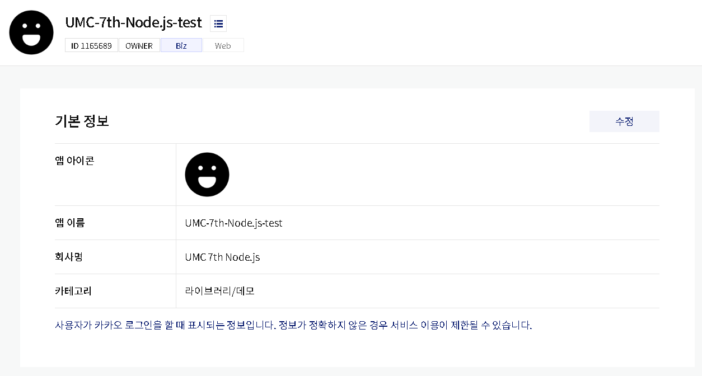
                - [카카오 디벨로버](https://developers.kakao.com)에 접속해 기존의 카카오 계정으로 로그인했다.
                - 애플리케이션을 추가해 아이콘(비즈앱 전환을 위함), 이름, 사업자명을 명시해주었다.
            2. 도메인 등록하기<br/>
                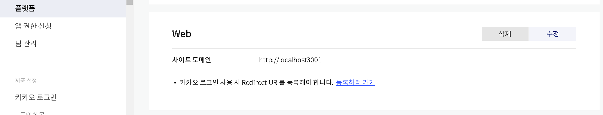
                - 먼저 플랫폼을 선택하고(Web) 사이트 도메인을 지정해주었다.
                - 콜백 받을 도메인을 등록해야 카카오 서버로부터 카카오 계정 정보를 받을 수 있다.
            3. 카카오 로그인 활성화 및 Redirect URI 지정<br/>
                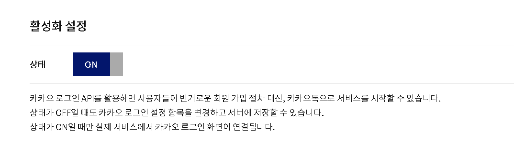<br/>
                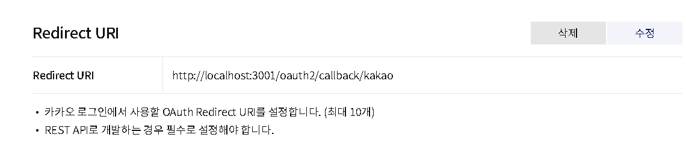
                - 카카오 서버에서 REST API GET 요청을 보낼 Redirect URI를 명시해주었다.
            4. 카카오 동의 항목 설정<br/>
                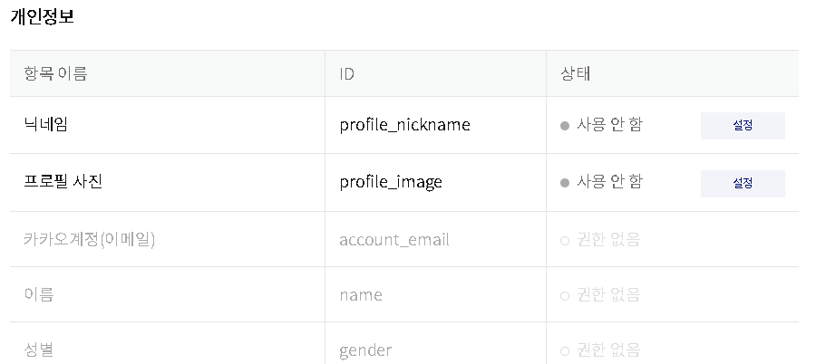
                - 동의 항목 설정을 할 때 처음엔 위와 같이 이메일을 동의 항목에 추가할 수 없다고 되어 있었다. 그렇지만 내가 설계한 회원가입은 이메일로 사용자를 식별해야 됐기 때문에 카카오에서 이메일을 받아와야 했다.
                - 동의 항목에 이메일과 같은 기타 정보를 추가하려면 해당 애플리캐이션을 비즈 앱으로 전환해야 됐는데 이를 위해선 사업자 정보를 등록해야 했다. 그러나 이 애플리케이션을 사업을 목적으로 만든 것도 아니고 단지 카카오 로그인 연동을 위한 테스트 용이었기에 사업자 정보를 등록하지 않고 비즈앱으로 전환하는  방법을 찾아보았다.<br/>
                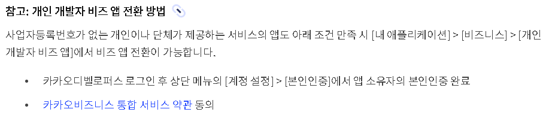
                - 다행히도 사업자 등록 번호 없이 개인 개발자 비즈 앱으로 전환하는 방법이 있었는데 이를 위해 카카오 비즈니스에 가입해야 했다.<br/>
                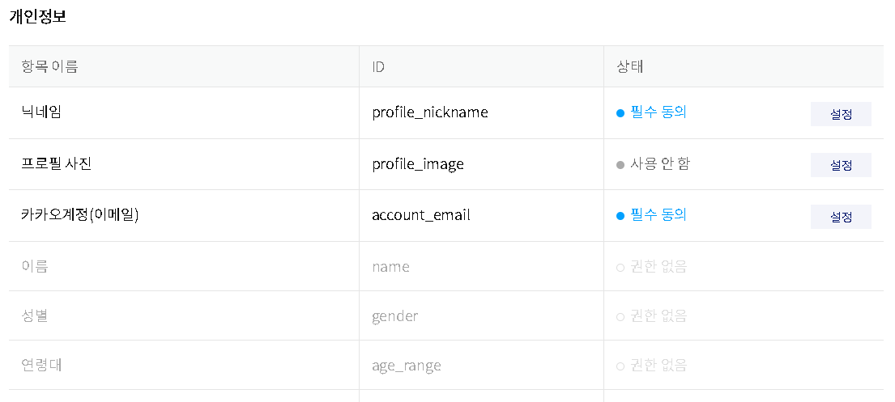
                - 비즈 앱 전환 목적을 이메일 필수 동의로 체크해두니, 이메일을 정보 동의 항목에 추가할 수 있었다.
            5. 카카오 REST API 키(Client ID)를 확인한다.<br/> 
                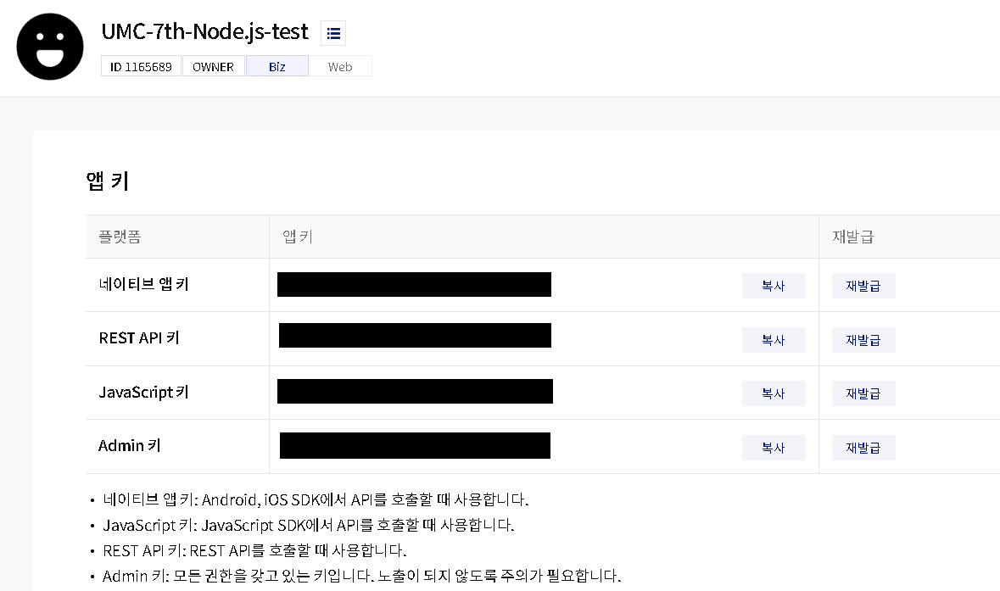
                - REST API KEY
                    - REST API를 호출하기 위해 발급되는 인증 키
                    - API 서버에서 클라이언트의 요청을 인증하고 승인한다.
                    - 주로 서버 간의 통신이나 특정 서비스의 API를 호출할 때 사용된다.
        2. 인증을 위한 코드 작성
            ```javascript
            // src/auth.config.js
            
            import dotenv from "dotenv";
            import { prisma } from "./db.config.js";
            import { Strategy as KakaoStrategy } from "passport-kakao";
            
            export const kakaoStrategy = new KakaoStrategy(
                {
                    clientID: process.env.PASSPORT_KAKAO_CLIENT_ID, // REST API Key
                    callbackURL: "http://localhost:3001/auth/kakao/callback",
                    scope: ["account_email"],
                    state: true,
                },
                (accessToken, refreshToken, profile, cb) => {
                    return kakaoVerify(profile)
                    .then((member) => cb(null, member))
                    .catch((err) => cb(err));
                }
            );
            
            const kakaoVerify = async(profile) => {
                const email = profile._json.kakao_account.email; // 프로필 정보에 이메일이 포함되어 있는지 확인
                console.log("email: ", email);
                if (!email){
                    throw new Error(`profile.email was not found: ${profile}`);
                }
                const member = await prisma.member.findFirst({where: { email }}); // 이메일로 사용자 조회
                if (member !== null){ 
                    return { id: member.id.toString(), email: member.email, name: member.name };
                }
                const created = await prisma.member.create({ // 사용자가 존재하지 않을 시 기본값으로 사용자 정보를 자동 생성한다.
                    data: {
                        email,
                        name: profile.displayName,
                        nickname: "추후 수정",
                        gender: 0,
                        birth: new Date(2000, 4, 24),
                        location: "추후 수정",
                        phoneNumber: "추후 수정",
                    },
                });
                console.log(created);
                return { id: created.id.toString(), email: created.email, name: created.name };
            };
            ```
            ```javascript
            # Kakao Developer에서 발급 받은 값
            PASSPORT_KAKAO_CLIENT_ID="79d4d1db9a703ff7..."
            ```
            - 카카오 로그인에 특화된 방식으로 확장하기 위해 passport-kakao를 설치하였다.
            - clientID, callbackURL은 카카오 디벨로퍼에서 설정한 것과 같이 지정해주었고 scope은 이메일(account_email)로 지정해 인증 과정에서 사용자의 이메일만 요청하도록 하였다.<br/>
                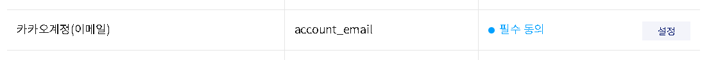
                - 여기선 카카오 계정(이메일)이라는 항목의 ID가 “account_email”이라는 점을 유의해야 했다. (”email (X))
            - 검증 함수에서 kakaoVerify를 통해 사용자 프로필 정보를 받아 이메일을 조회한다.
            - 이때 이메일 정보가 존재하지 않다면 구글 계정에 이메일 주소가 연결되어 있지 않거나 이메일 정보를 제공하지 않은 상태이므로 구글 계정이 활성화되어 있는지, 요청한 사용자 정보 범위에 이메일이 포함되어 있는지 살펴보아야 한다.
            - 또한 여기서 주의해야 할 점은 카카오의 profile 객체의 형태가 구글과 다르다는 점이다. passport 마다 profile 객체의 형태가 다르니 profile을 출력해 확인해보는 게 좋을 것 같다.
                ```javascript
                {
                  provider: 'kakao',
                  id: 3807560827,
                  username: '안성진',
                  displayName: '안성진',
                  _raw: '{"id":3807560827,"connected_at":"2024-11-25T14:13:58Z","properties":{"nickname":"안성진"},"kakao_account":{"profile_nickname_needs_agreement":false,"profile":{"nickname":"안성진","is_default_nickname":false},"has_email":true,"email_needs_agreement":false,"is_email_valid":true,"is_email_verified":true,"email":"anseongjinasj@gmail.com"}}',  
                  _json: {
                    id: 3807560827,
                    connected_at: '2024-11-25T14:13:58Z',
                    properties: { nickname: '안성진' },
                    kakao_account: {
                      profile_nickname_needs_agreement: false,    
                      profile: [Object],
                      has_email: true,
                      email_needs_agreement: false,
                      is_email_valid: true,
                      is_email_verified: true,
                      email: 'anseongjinasj@gmail.com'
                    }
                  }
                }
                ```
                - email 값은 profile 객체 > _json 객체 > kakao_account 객체 > email 값에 있음을 확인할 수 있다.
        3. Session 설정 및 DB 생성
            - 실습과 같다.
        4. Route 설정
            ```javascript
            // src/index.js
            
            app.get("/oauth2/login/kakao", passport.authenticate("kakao"));
            app.get(
              "/oauth2/callback/kakao",
              passport.authenticate("kakao", {
                failureRedirect: "/oauth2/login/kakao",
                failureMessage: true,
              }),
              (req, res) => res.redirect("/")
            );
            ```
            - “/oauth2/login/kakao” 경로로 접속 시 자동으로 Kakao 로그인 페이지로 이동하고 사용자가 로그인 및 동의를 하면 callbackURL(/oauth2/callback/kakao)에서 인증 과정을 거치게 된다. 인증에 성공할 경우엔 “/” 경로로, 실패할 경우엔 다시 로그인 페이지로 리디렉션 된다.
        5. 미들웨어 설정
            ```javascript
            // src/index.js
            
            import { naverStrategy } from './auth.config.js';
            ...
            passport.use(kakaoStrategy);
            passport.serializeUser((member, done) => done(null, member)); // 인증 성공 후 세션에 회원 정보(member) 저장, done(에러, 세션에 저장할 데이터)
            passport.deserializeUser((member, done) => done(null, member)); // 세션의 정보(member)를 가져와 req.user에 할당
            ```
            - 정의한 kakao 로그인 전략을 passport에 등록한다.
        6. 테스트<br/>
            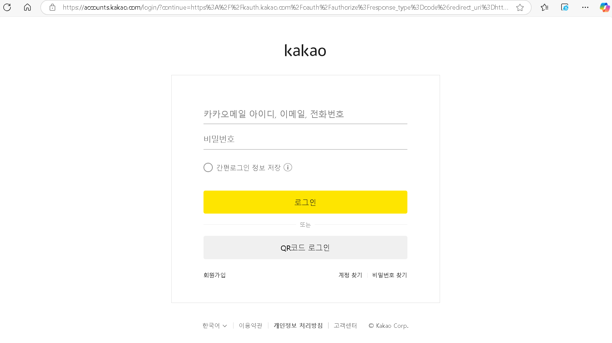<br/>
            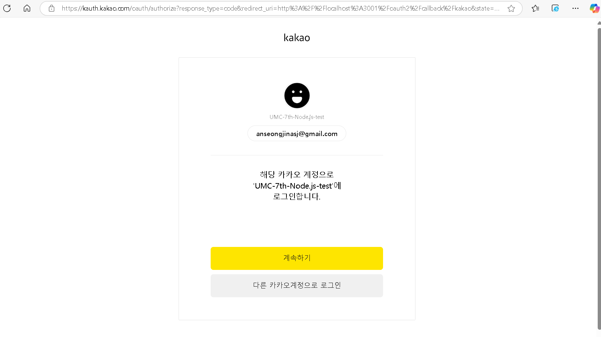
            - localhost:3001/oauth2/login/kakao 에 접속해 카카오 로그인을 진행한다.<br/>
            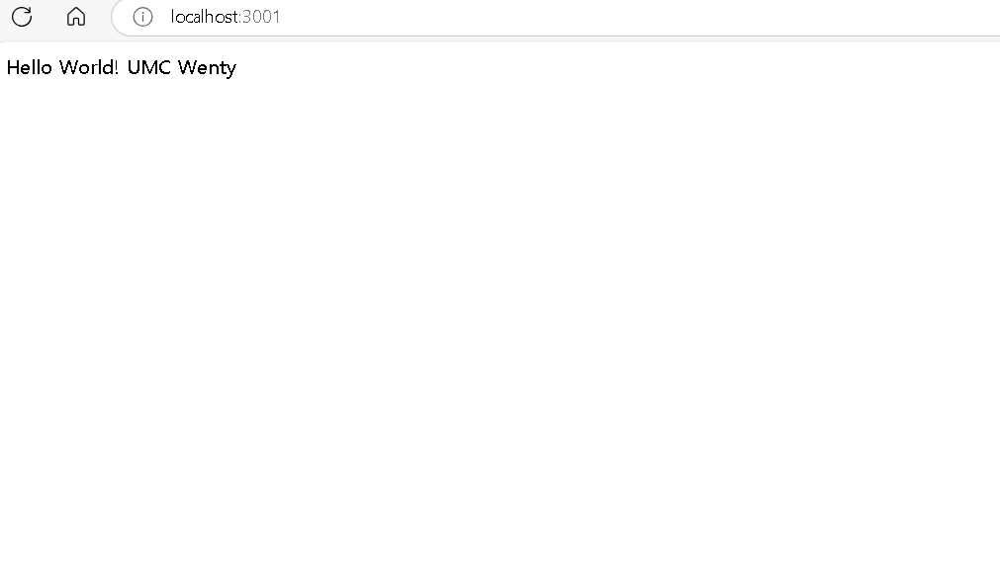
            - 로그인이 완료되면 아래와 같이 “localhost:3001/” 경로로 리디렉션 된다.<br/>
            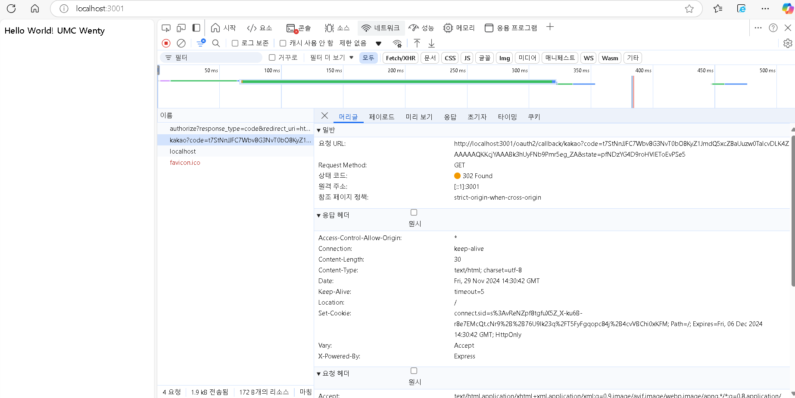
            - 로그인(인증 성공)을 하고 네트워크를 확인한다.
            - Kakao OAuth 인증의 콜백 엔드포인트(http://localhost:3001/oauth2/callback/kakao)와 쿼리 파라미터(state, code, scope)를 확인할 수 있다. 이 URL을 거쳐 인증을 마치고 “/”로 리디렉션 된다.<br/>
            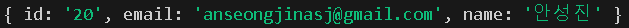
            - “/” 경로에서 req.user가 잘 설정되어 인증된 것도 확인할 수 있다.
        7. session, member 테이블 확인
            - session 테이블<br/>
                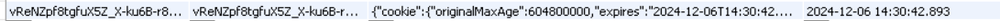
                - 세션 관련 데이터가 session 테이블에 잘 저장되어 있음을 확인할 수 있다.
                - data
                    ```javascript
                    {
                    	"cookie":{
                    		"originalMaxAge":604800000,
                    		"expires":"2024-12-06T14:30:42.893Z",
                    		"httpOnly":true,
                    		"path":"/"
                    	},
                    	"passport":{
                    		"user":{
                    			"id":"20",
                    			"email":"anseongjinasj@gmail.com",
                    			"name":"안성진"
                    		}
                    	}
                    }
                    ```
            - member 테이블<br/>
                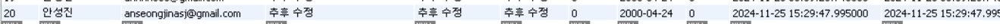
                - 사용자 데이터 또한 잘 추가되었다.
    2. 네이버 로그인 연동
        1. 네이버 로그인 OAuth 신청
            1. 애플리케이션 등록하기<br/>
                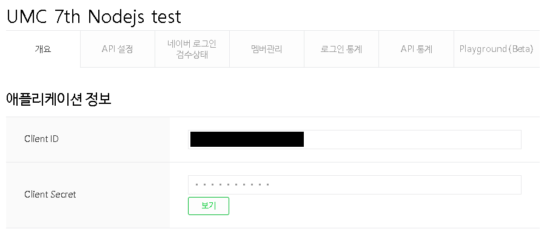
                - [네이버 디벨로버](https://developers.naver.com/main/)에 접속해 기존의 네이버 계정으로 로그인했다.
                - 발급 받은 Client ID 및 Client Secrete Key를 확인한다.<br/>
                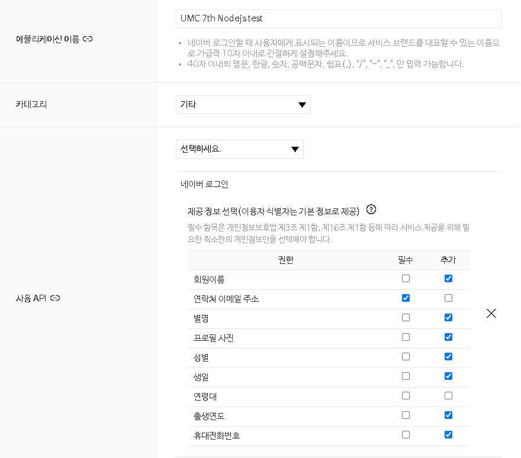
                - 제공 정보를 선택한다. 사용자 식별을 위해 네이버에서 이메일 정보를 받아와야 하므로 연락처 이메일 주소를 필수로 체크하였다.<br/>
                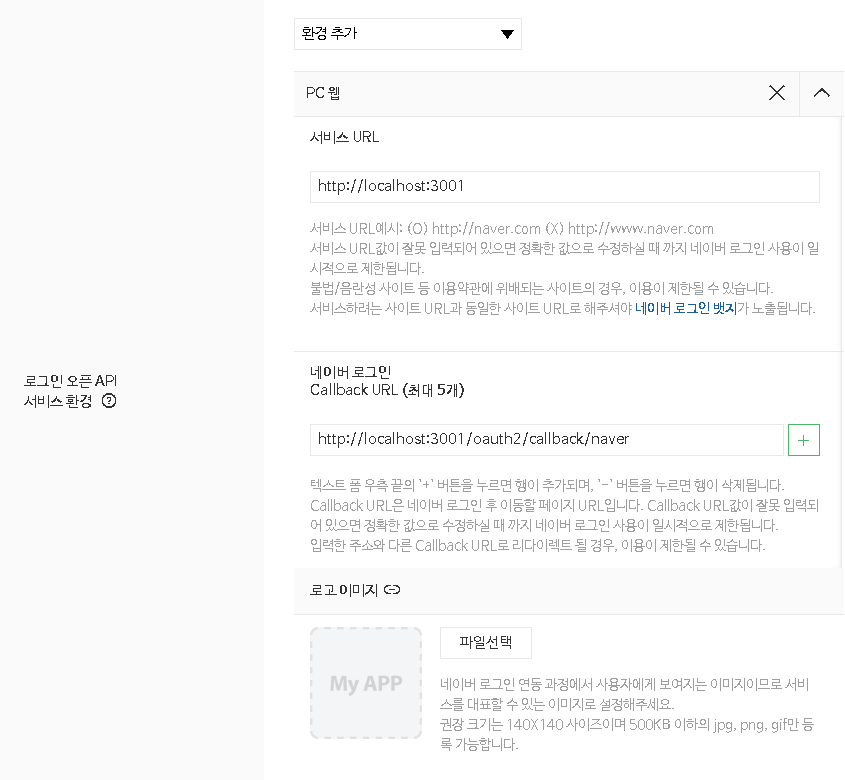
                - Authorized Redirect URI를 지정한다.
        2. 인증을 위한 코드 작성
            ```javascript
            import dotenv from "dotenv";
            import { prisma } from "./db.config.js";
            import { Strategy as NaverStrategy } from "passport-naver-v2";
            
            export const naverStrategy = new NaverStrategy(
                {
                    clientID: process.env.PASSPORT_NAVER_CLIENT_ID,
                    clientSecret: process.env.PASSPORT_NAVER_CLIENT_SECRET,
                    callbackURL: "http://localhost:3001/oauth2/callback/naver",
                    scope: ["email"],
                    state: true,
                },
                (accessToken, refreshToken, profile, cb) => {
                    console.log(profile);
                    return naverVerify(profile)
                    .then((member) => cb(null, member))
                    .catch((err) => cb(err));
                }
            );
            
            const naverVerify = async(profile) => {
                const email = profile.email;
                console.log("email: ", email);
                if (!email){
                    throw new Error(`profile.email was not found: ${profile}`);
                }
                const member = await prisma.member.findFirst({ where: { email }});
                if (member !== null){
                    return { id: member.id.toString(), email: member.email, name: member.name };
                }
                const created = await prisma.member.create({
                    data: {
                        email,
                        name: profile.displayName,
                        nickname: "추후 수정",
                        gender: 0,
                        birth: new Date(2000, 4, 24),
                        location: "추후 수정",
                        phoneNumber: "추후 수정",
                    },
                });
                console.log(created);
                return { id: created.id.toString(), email: created.email, name: created.name };
            }
            ```
            ```javascript
            # Naver Developer에서 발급 받은 값
            PASSPORT_NAVER_CLIENT_ID="3d0xqaPgb3P41cBzoGVg"
            PASSPORT_NAVER_CLIENT_SECRET="W8ZKc1ZFkc"
            ```
            - naver 로그인 연동 최신 라이브러리인 passport-naver-v2를 설치하였다.
                - 네이버에서 구현한 passport-naver가 있으나 5-6년 전 개발 이후로 더 이상 진전이 없고 프로필 데이터도 한정적으로 제공하고 있어 새로 개인이 개발한 모듈이라고 한다.
            - clientID, callbackURL은 네이버 디벨로퍼에서 설정한 것과 같이 지정해주었고 scope은 이메일(email)로 지정해 인증 과정에서 사용자의 이메일만 요청하도록 하였다.
            - 검증 함수에서 NaverVerify를 통해 사용자 프로필 정보를 받아 이메일을 조회하였다.
            - 여기서도 profile 객체의 형태를 확인하여 profile에서 이메일 주소를 잘 가져오도록 해야 한다.
                ```javascript
                {
                  provider: 'naver',
                  id: 'or9z2kRMIaX1I7qsZQzH30mohU2MAP5wGkvmz61cyDo',
                  nickname: 'asj',
                  profileImage: 'https://ssl.pstatic.net/static/pwe/address/img_profile.png',       
                  age: undefined,
                  gender: 'F',
                  email: 'asjasj3964@naver.com',
                  mobile: '010-9836-3964',
                  mobileE164: '+821098363964',
                  name: '안성진',
                  birthday: '04-24',
                  birthYear: '2000',
                  _raw: '{"resultcode":"00","message":"success","response":{"id":"or9z2kRMIaX1I7qsZQzH30mohU2MAP5wGkvmz61cyDo","nickname":"asj","profile_image":"https:\\/\\/ssl.pstatic.net\\/static\\/pwe\\/address\\/img_profile.png","gender":"F","email":"asjasj3964@naver.com","mobile":"010-9836-3964","mobile_e164":"+821098363964","name":"\\uc548\\uc131\\uc9c4","birthday":"04-24","birthyear":"2000"}}',
                  _json: {
                    resultcode: '00',
                    message: 'success',
                    response: {
                      id: 'or9z2kRMIaX1I7qsZQzH30mohU2MAP5wGkvmz61cyDo',
                      nickname: 'asj',
                      profile_image: 'https://ssl.pstatic.net/static/pwe/address/img_profile.png',  
                      gender: 'F',
                      email: 'asjasj3964@naver.com',
                      mobile: '010-9836-3964',
                      mobile_e164: '+821098363964',
                      name: '안성진',
                      birthday: '04-24',
                      birthyear: '2000'
                    }
                  }
                }
                ```
                - email 값은 profile 객체 > email 값에 있음을 확인할 수 있다.
        3. Session 설정 및 DB 생성
            - 실습과 같다.
        4. Route 설정
            ```javascript
            app.get("/oauth2/login/naver", passport.authenticate("naver"));
            app.get(
              "/oauth2/callback/naver",
              passport.authenticate("naver", {
                failureRedirect: "/oauth2/login/naver",
                failureMessage: true,
              }),
              (req, res) => res.redirect("/")
            );
            ```
            - “/oauth2/login/naver” 경로로 접속 시 자동으로 Naver 로그인 페이지로 이동하고 사용자가 로그인 및 동의를 하면 callbackURL(/oauth2/callback/naver)에서 인증 과정을 거치게 된다. 인증에 성공할 경우엔 “/” 경로로, 실패할 경우엔 다시 로그인 페이지로 리디렉션 된다.
        5. 미들웨어 설정
            ```javascript
            // src/index.js
            
            import { naverStrategy } from './auth.config.js';
            ...
            passport.use(naverStrategy);
            passport.serializeUser((member, done) => done(null, member)); // 인증 성공 후 세션에 회원 정보(member) 저장, done(에러, 세션에 저장할 데이터)
            passport.deserializeUser((member, done) => done(null, member)); // 세션의 정보(member)를 가져와 req.user에 할당
            ```
            - 정의한 kakao 로그인 전략을 passport에 등록한다.
        6. 테스트<br/>
            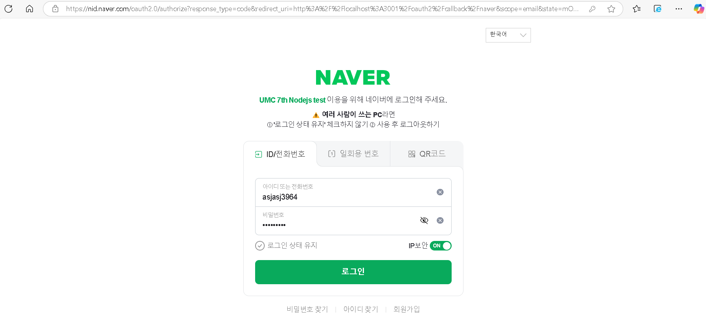
            - localhost:3001/oauth2/login/naver 에 접속해 네이버 로그인을 진행한다.<br/>
            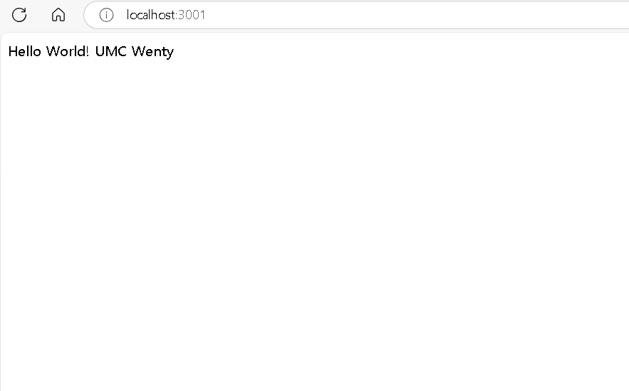
            - 로그인이 완료되면 아래와 같이 “localhost:3001/” 경로로 리디렉션 된다.<br/>
            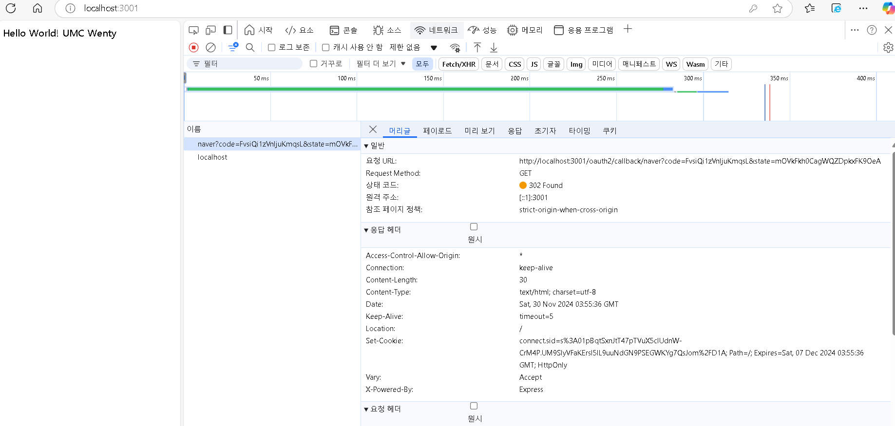
            - Kakao OAuth 인증의 콜백 엔드포인트와 쿼리 파라미터를 확인할 수 있다.
        7. session, member 테이블 확인
            - session 테이블<br/>
                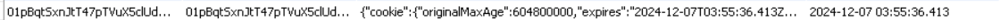
                - data
                    ```javascript
                    {
                    	"cookie":{
                    		"originalMaxAge":604800000,
                    		"expires":"2024-12-07T03:55:36.413Z",
                    		"httpOnly":true,
                    		"path":"/"
                    	},
                    	"passport":{
                    		"user":{
                    			"id":"1",
                    			"email":"asjasj3964@naver.com",
                    			"name":"안성진"
                    		}
                    	}
                    }
                    ```
            - member 테이블<br/>
                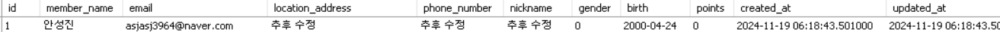
2. 기존의 하드 코딩 했던 사용자의 정보를 수정하기
    1. 식당을 등록하는 API
        - 기존에는 식당을 등록할 때 request body에 CEO ID를 일일이 지정해주는 식으로 하드코딩 하였다. 이를 수정해 소셜 로그인을 할 때 인증 성공 시 passport가 req.user에 사용자 정보를 저장한 것을 이용하였다.
            ```javascript
            // src/controllers/restaurant.controller.js
            
            export const handleRestaurantRegist = async(req, res, next) => {
                const memberId = req.user.id; // 소셜 로그인한 사용자의 ID를 가져온다.
                const restaurant = await restaurantRegist(memberId, bodyToRestaurant(req.body));
                res.status(StatusCodes.OK).success(restaurant);
            }
            ```
            ```javascript
            // src/services/restaurant.service.js
            
            export const restaurantRegist = async(memberId, data) => {
                const ceo = await getMember(memberId);
                if (ceo === null){
                    throw new NotExistError("존재하지 않는 CEO", data);
                }
                ...
                const registRestaurantId = await addRestaurant({
                    ceo: memberId,
                    region: data.regionId,
                    name: data.name,
                    introduction: data.introduction,
                    startTime: data.startTime,
                    endTime: data.endTime
                })
                ...
            }
            ```
            - req.user.id로 소셜 로그인한 사용자의 ID를 가져와 식당의 CEO를 지정해주었다.
        - Swagger 테스트<br/>
            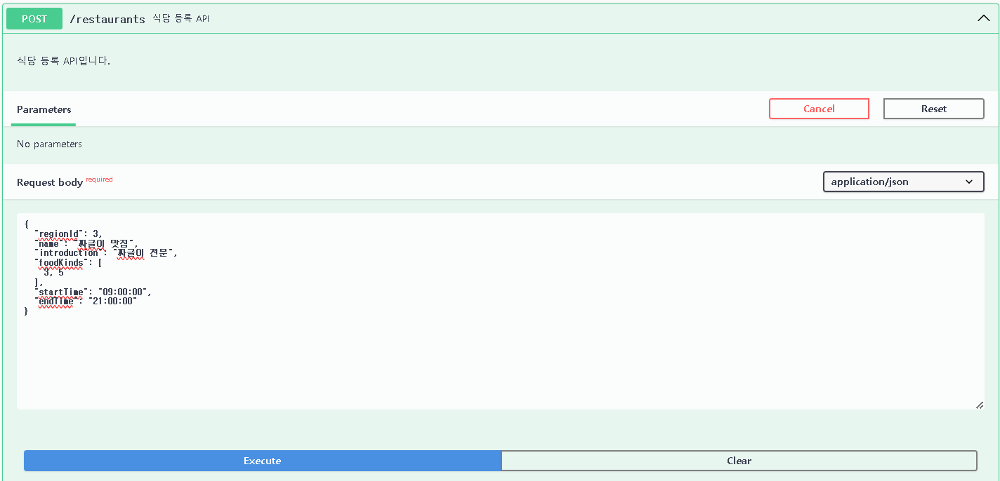<br/>
            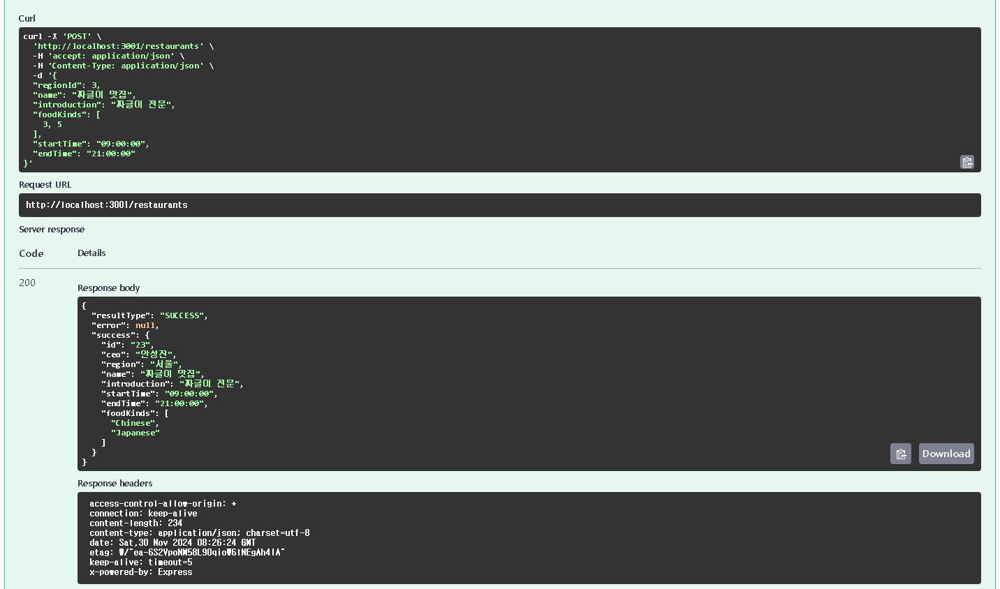
            - CEO ID를 주지 않아도 식당을 등록하면 자동으로 소셜 로그인 한 사용자가 CEO로 지정된 것을 확인할 수 있다.
    2. 리뷰를 등록하는 API
        - 기존에는 리뷰을 등록할 때 writer ID를 직접 주었는데 이를 수정해 소셜 로그인한 사용자의 ID(req.user.id)를 가져와 writer로 지정해주었다.
            ```javascript
            // src/controllers/review.controller.js
            
            export const handleReviewRegist = async(req, res, next) => {
                const memberId = req.user.id;
                const review = await reviewRegist(memberId, bodyToReview(req.body));
                res.status(StatusCodes.OK).success(review)
            }
            ```
            ```javascript
            // src/services/review.service.js
            
            export const reviewRegist = async(memberId, data) => {
                ...
                const member = await getMember(memberId);
                if (member === null){
                    throw new NotExistError("존재하지 않는 회원", {memberId: memberId})
                }
                const registReviewId = await addReview({
                    member: memberId,
                    restaurant: data.restaurantId,
                    rating: data.rating,
                    content: data.content
                })
                ...
            }
            ```
        - Swagger 테스트<br/>
            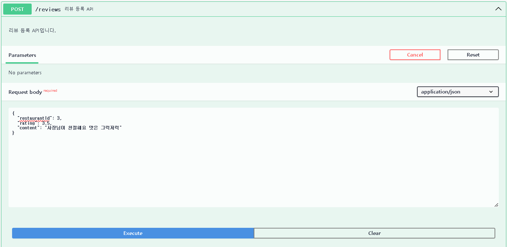<br/>
            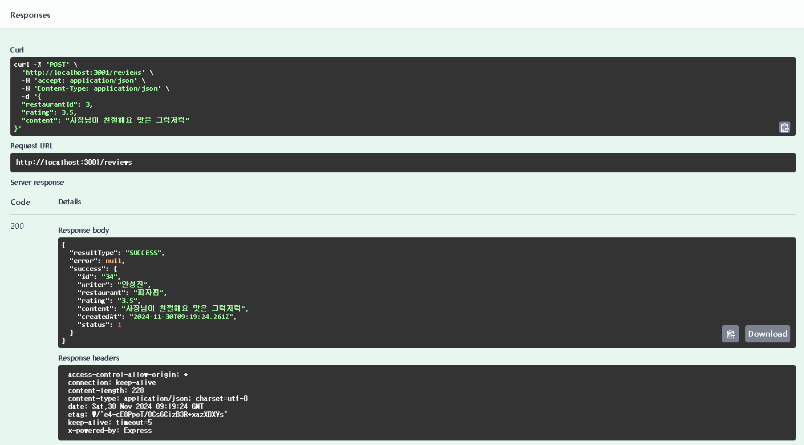
            - writer ID를 주지 않아도 리뷰를 등록하면 자동으로 소셜 로그인 한 사용자가 writer로 지정된다.
    3. 참여 미션을 등록하는 API
        - 기존에는 참여 미션 등록 시 해당 미션에 참여할 회원의 ID를 직접 주었는데 이를 수정해 소셜 로그인한 사용자의 ID(req.user.id)를 가져와 참여자로 지정해주었다.
            ```javascript
            // src/controllers/participated-mission.controller.js
            
            export const handleMemberMissionRegist = async(req, res, next) => {
                const memberId = req.user.id;
                const memberMission = await memberMissionRegist(memberId, bodyToMemberMission(req.body)); // 요청 데이터를 DTO로 변환 (member 객체 생성)
                res.status(StatusCodes.OK).success(memberMission); 
            }
            ```
            ```javascript
            // src/services/participated-mission.service.js
            
            export const memberMissionRegist = async(memberId, data) => {
                const confirmMember = await getMember(memberId);
                if (confirmMember === null){
                    throw new NotExistError("존재하지 않는 회원", { memberId: memberId });
                }
                ...
                const registMemberMissionId = await registMemberMission(memberId, data);
                if (registMemberMissionId == null){
                    throw new DuplicateError("이미 참여한 미션", data);
                }
                ...
            }
            ```
        - Swagger 테스트<br/>
            <br/>
            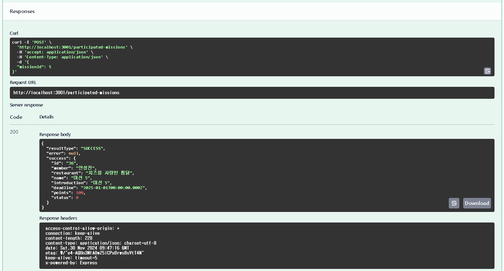
    4. 나의 리뷰 목록을 조회하는 API
        - 작성자 ID를 주지 않아도 소셜 로그인한 사용자의 ID(req.user.id)를 가져와 그 회원의 리뷰 목록을 가져오도록 하였다.
            ```javascript
            // src/controllers/review.controller.js
            
            export const handleListReviews = async(req, res, next) => {
                const memberId = req.user.id;
                const reviews = await listReviews(
                    memberId,
                    typeof req.query.cursor === "string"? parseInt(req.query.cursor) : 0
                )
                res.status(StatusCodes.OK).success(reviews);
            }
            ```
            ```javascript
            // src/services/review.service.js
            
            export const listReviews = async(memberId, cursor) => {
                const member = await getMember(memberId);
                if (member === null){
                    throw new NotExistError("존재하지 않는 회원", { memberId: memberId });
                }
                const reviews = await getAllReviews(memberId, cursor);
                return responseFromReviews(reviews);
            } 
            ```
        - Swagger 테스트<br/>
            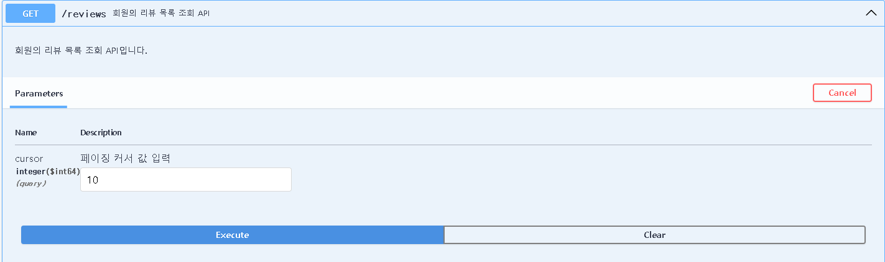<br/>
            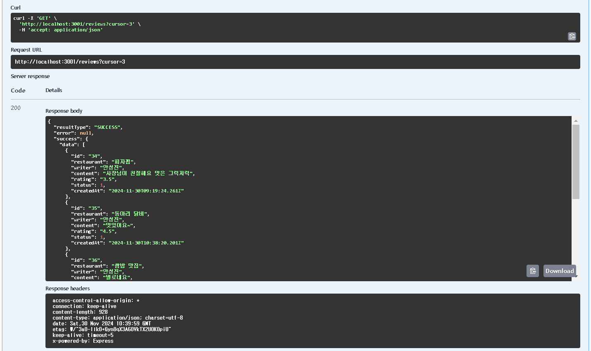
            - writer ID를 주지 않고 나의 리뷰 목록들을 조회할 수 있다.
    5. 나의 참여 미션 목록을 조회하는 API
        - 회원의 ID를 주지 않고도 해당 회원의 참여 미션 목록을 조회하도록 하였다.
            ```javascript
            // src/controllers/participated-mission.controller.js
            
            export const handleMissionUpdateCompleted = async(req, res, next) => {
                const memberId = req.user.id;
                const missions = await memberMissionUpdateCompleted(
                    memberId,
                    parseInt(req.params.participatedMissionId),
                )
                res.status(StatusCodes.OK).success(missions);
            }
            ```
            ```javascript
            // src/services/participated-mission.service.js
            
            export const listMemberMissions = async(memberId, cursor) => {
                // 해당 회원이 존재하지 않을 경우 에러 처리
                const member = await getMember(memberId);
                if (member === null){
                    throw new NotExistError("존재하지 않는 회원", { memberId: memberId });
                }
                const missions = await getAllMemberMissions(memberId, cursor);
                return responseFromMemberMissions(missions);
            }
            ```
        - Swagger 테스트<br/>
            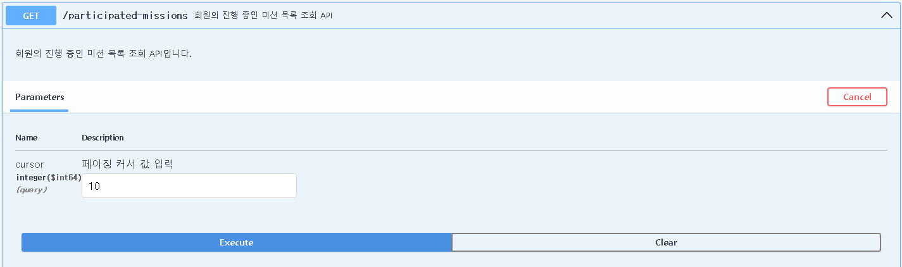<br/>
            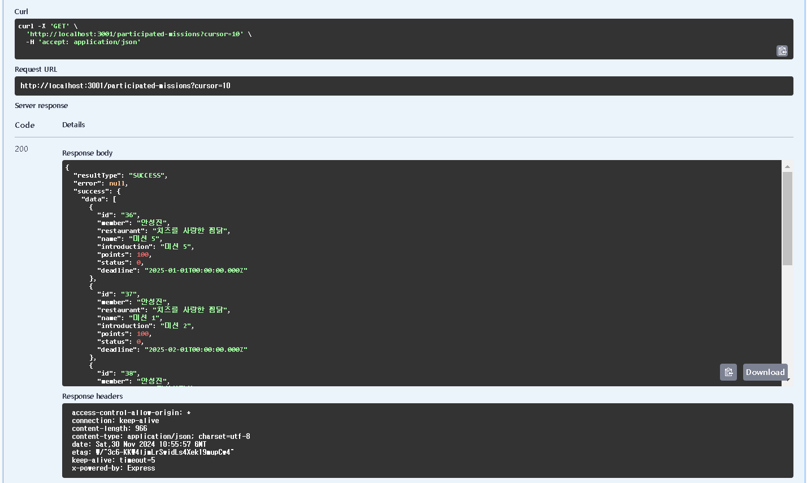
    6. 나의 특정 참여 미션을 업데이트 하는 API
        - 기존의 API는 참여 미션 ID만 주면 업데이트 하기 때문에 사용자가 참여하지 않은 미션까지도 업데이트 할 수 있게 된다. 이를 수정해 소셜 로그인한 사용자의 ID(req.user.id)를 가져와 회원의 ID를 따로 주지 않고도 회원이 참여하지 않은(매핑되지 않은) 미션은 “참여하지 않은 미션”이라는 에러 메시지가 발생하도록 하였다.
            ```javascript
            // src/controllers/participated-mission.controller.js
            
            export const handleListMemberMission = async(req, res, next) => {
                const memberId = req.user.id;
                const missions = await listMemberMissions(
                    memberId,
                    typeof req.query.cursor === "string"? parseInt(req.query.cursor) : 0
                )
                res.status(StatusCodes.OK).success(missions);
            }
            ```
            ```javascript
            // src/services/participated-mission.service.js
            
            export const memberMissionUpdateCompleted = async(memberId, participatedMissionId) => {
                // 회원이 참여하지 않은 미션일 경우 에러 처리
                const confirmMemberMission = await getMemberMission(participatedMissionId);
                if (confirmMemberMission == null || confirmMemberMission.member.id != memberId){
                    throw new NotExistError("회원이 참여하지 않은 미션", {participatedMissionId: participatedMissionId});
                }
                ...
            }
            ```
        - Swagger 테스트 - 회원이 참여하지 않은 미션 ID를 줄 경우<br/>
            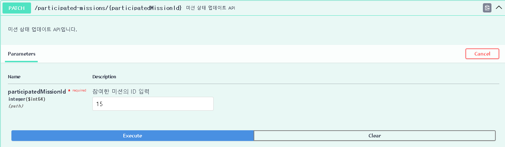<br/>
            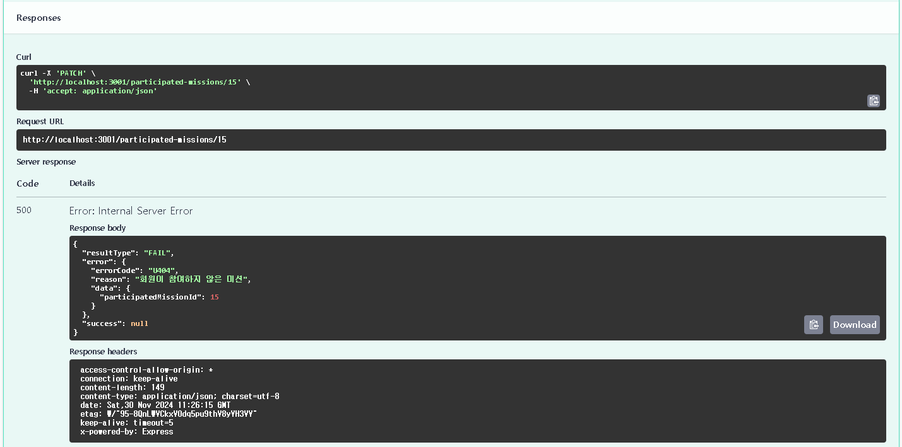
            - 회원이 참여하지 않은 미션은 에러 메시지를 띄운다.
3. 사용자의 정보를 수정하는 API를 만들기<br/>
    
    - 첫 네이버 로그인을 하면 사용자의 데이터가 strategy의 검증함수에서 지정한 디폴트 값으로 지정된다. 이를 수정하기 위한 API를 따로 만들어주었다.
        ```javascript
        // src/controllers/member.controller.js
        
        export const handleMemberUpdate = async(req, res, next) => {
            const memberId = req.user.id;
            const member = await memberUpdate(memberId, bodyToUpdateMember(req.body));
            res.status(StatusCodes.OK).success(member);
        }
        ```
        ```javascript
        // src/services/member.service.js
        
        export const memberUpdate = async(memberId, data) => {
            const member = await getMember(memberId);
            if (member === null){
                throw new NotExistError("존재하지 않는 회원", { memberId: memberId });
            }
            await updateMember(memberId, data);
            const updatedMember = await getMember(memberId);
            return ResponseFromUpdatedMember(updatedMember);
        }
        ```
        ```javascript
        // src/repositories/member.repository.js
        
        // 나의 정보 업데이트
        export const updateMember = async(memberId, data) => {
            try{
                const memberUpdated = await prisma.member.update({
                    where: {
                        id: memberId
                    },
                    data: {
                        name: data.name,
                        nickname: data.nickname,
                        gender: data.gender,
                        birth: data.birth,
                        location: data.location,
                        phoneNumber: data.phoneNumber
                    }
                });
                return memberUpdated;
            }
            catch(err){
                throw new ServerError(`서버 내부 오류: ${err.stack}`);
            }
        }
        ```
        - req.user.id에서 로그인 한 사용자의 ID를 가져와 해당 사용자가 존재하는지 유효 검사를 하고 존재한다면 입력한 값으로 사용자의 정보를 업데이트하도록 만들어주었다.
    - Swagger 테스트<br/>
        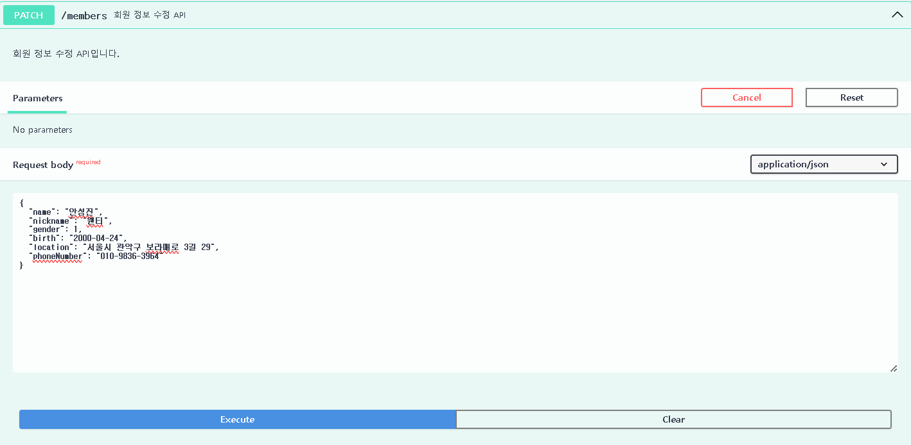<br/>
        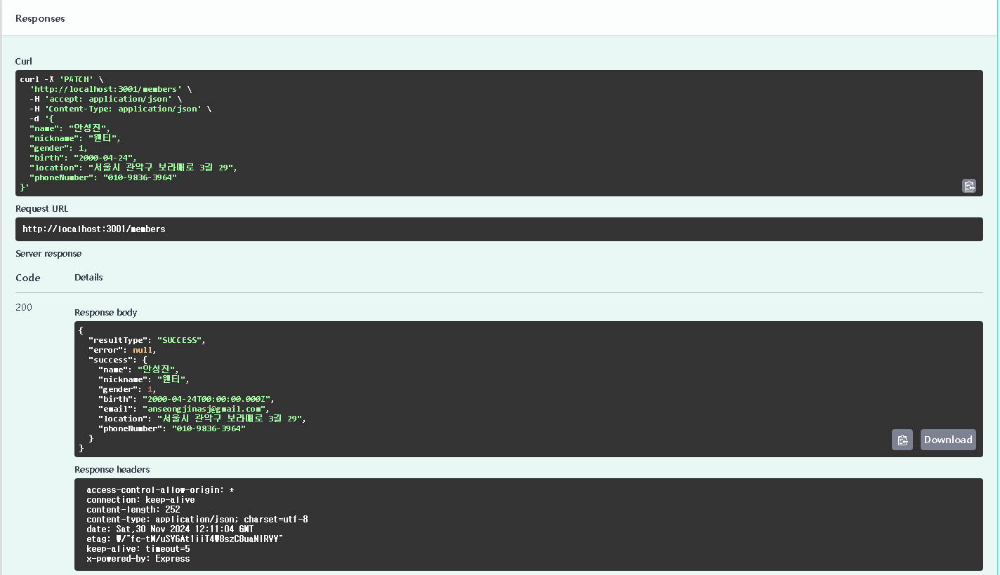
        - 회원의 정보가 성공적으로 수정되었고 이는 member 테이블에서도 확인할 수 있다.<br/>
            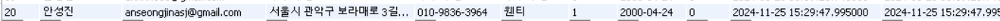