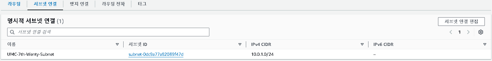
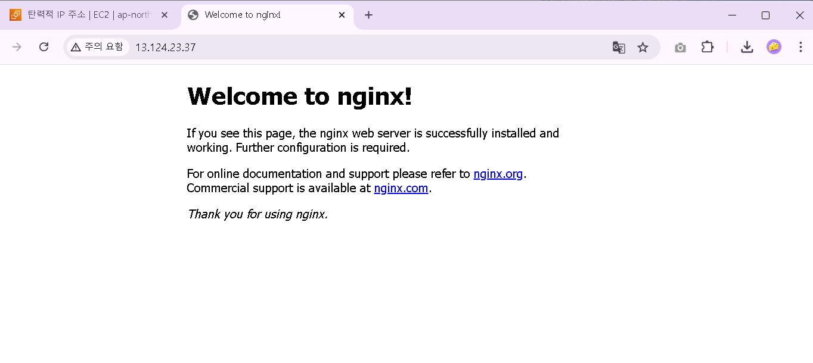

### 🔥 미션
---
1. VPC 생성 
    
    - “UMC-7th-Wenty-VPC” VPC를 생성하였다. 이는 AWS에서 제공하는 가상 네트워크 환경이다.
    - IP 대역(**CIDR**)은 AWS에서 많이 사용되는 기본 설정인 10.0.0.0/16으로 설정한다.
2. 서브넷 생성 
    
    - 앞서 만든 UMC-7th-Wenty-VPC에 서브넷 “UMC-7th-Wenty-Subnet”을 생성하였다. 이는 VPC를 더 작은 네트워크 단위로 나누어 리소스를 배치한다.
    - 서브넷 CIDR은 10.0.1.0/24로 설정하였다.
3. 인터넷 게이트웨이 생성 
    
    - VPC 안의 컴퓨터(EC2 서버)를 외부 인터넷과 통신할 수 있게 하기 위해 인터넷 게이트웨이 “UMC-7th-Wenty-IG”를 생성한다.
    - 앞서 만든 UMC-7th-Wenty-VPC에 이 인터넷 게이트웨이를 연결한다.
4. 라우팅 테이블 설정 
    
    - VPC를 생성할 때 자동으로 만들어진 라우팅 테이블을 수정한다. 
    
    - 라우팅 테이블에 UMC-7th-Wenty-IG(0.0.0.0/0)로 연결된 경로를 추가한다. 
    
    - 또한 이를 UMC-7th-Wenty-Subnet과 연결해 외부 인터넷과 통신이 가능하도록 만든다. 즉, UMC-7th-Wenty-Subnet를 퍼블릭 서브넷으로 만들어준다.
5. 보안 그룹 생성 
    
    - “UMC-7th-Wenty-SG” 보안 그룹을 생성하였다. 
    
    - 인바운드 규칙을 설정한다.
        - 인바운드: 외부에서 서버(VPC 안의 컴퓨터)로 들어오는 네트워크 트래픽
        - 인바운드 규칙: 서버가 어떤 요청을 받을지 허용하는 설정
        1. SSH (port: 22): 서버에 원격으로 접속(SSH)해 관리 작업을 할 수 있도록 허용한다. 
        2. HTTP (port: 80): 일반 웹 트래픽을 허용해 서버가 HTTP 요청을 처리할 수 있도록 한다. 
        3. HTTPS (port: 443): HTTPS를 통해 안전한 웹 트래픽 처리를 허용한다.
        4. MySQL/Aurora (port: 3306): 외부에서 데이터베이스에 접근할 수 있도록 허용한다. 
        5. 사용자 지정 TCP (port: 3000): 사용자 지정 애플리케이션(ex. Node.js, React)에서 사용하는 포트를 열어둔다.
6. EC2 생성 
    
    - “UMC-7th-Wenty” 인스턴스를 생성한다.
    - VPC를 UMC-7th-Wenty-VPC로, 서브넷을 UMC-7th-Wenty-Subnet으로 설정해주었다.
    - 이 인스턴스가 외부 인터넷과 통신하기 위해 퍼블릭 아이피를 부여 받도록 하였다.
    - 또한 “UMC-7th-Wenty-KeyPair” 키 페어를 생성해주었다. 이는 AWS에서 EC2 인스턴스에 안전하게 접근하기 위한 인증 방식으로 SSH 프로토콜을 기반으로 한다. 
        
        - 키 페어를 생성하면 이렇게 자동으로 키 페어 파일이 다운로드 된다. 이를 Users/사용자/.ssh으로 이동시켰다. 
    
    - 또한 보안 그룹을 UMC-7th-Wenty-SG로 설정해주었다.
7. 탄력적 IP 설정 
    
    - 탄력적 IP 주소를 할당 받는다.
    - 이는 인스턴스의 인터넷 게이트웨이를 거쳐 통신할 때 부여 받을 IP 주소를 고정시킨다. (중지 후 재실행해도 IP 주소가 바뀌지 않는다)
8. VSCode로 원격 접속 
    
    - SSH 설정 파일(config 파일)을 작성한다.
        - HostName은 앞서 할당 받은 탄력적 IP로 지정한다.
        - IdentityFile은 앞에서 생성하여 다운로드 한 키 페어 파일 경로로 적어준다.
        - User는 EC2의 운영체제인 Ubuntu로 설정한다. 
    
    - UMC-7th-Wenty 서버에 연결(connected)되었는지 확인한다.
9. NGINX 설치 및 브라우저에서 접속 
    
    - NGINX를 설치하고 브라우저에서 탄력적 IP 주소로 접속하면 위와 같은 화면이 보인다.
        - NGINX
            - 클라이언트의 HTTP 요청을 받아 정적 콘텐츠(ex. HTML, CSS, JS)를 제공하는 고성능 웹 서버
            - 클라이언트 요청을 백엔드 서버로 전달하고 응답을 반환하여 서버를 보호하고 부하를 줄이는 리버스 프록시 서버